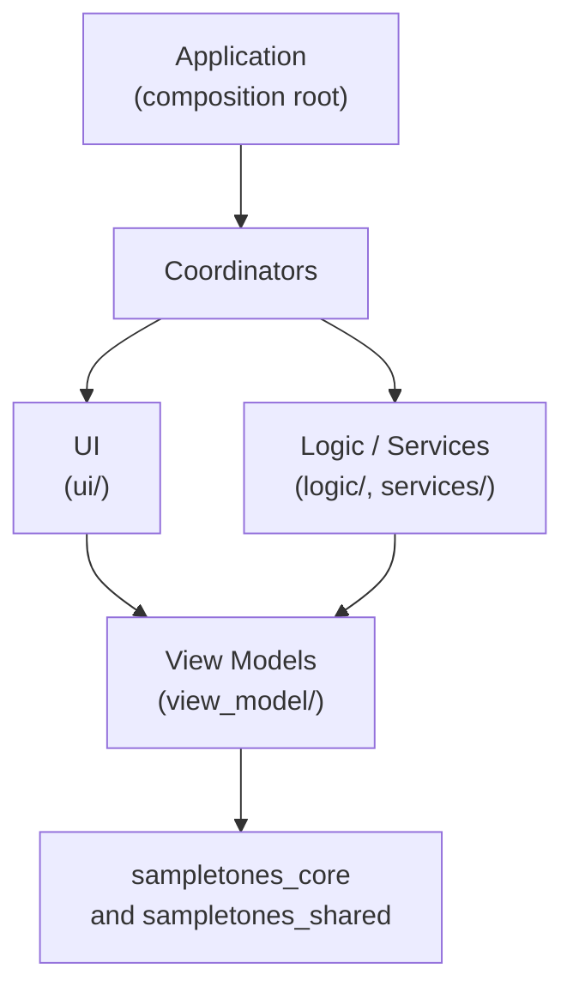
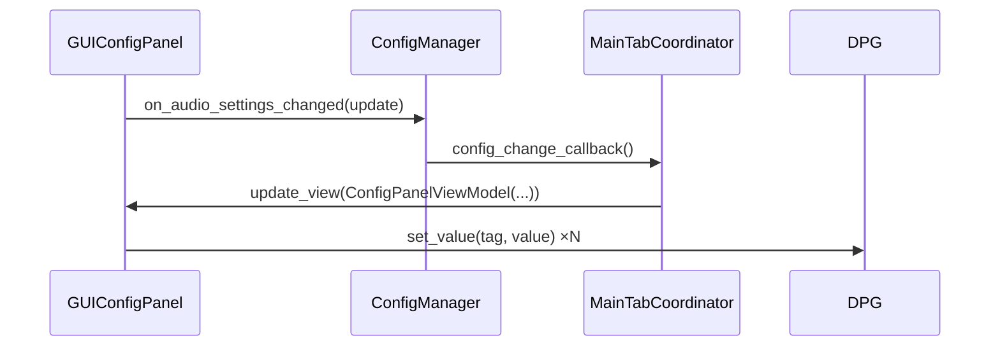
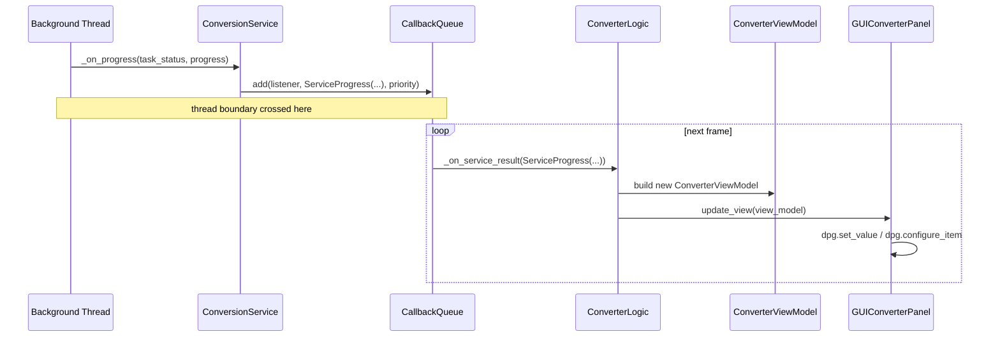
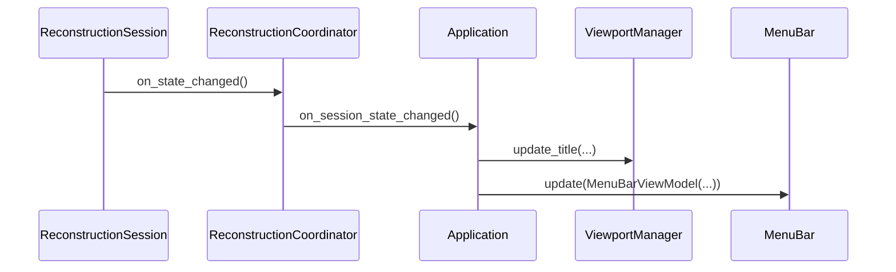
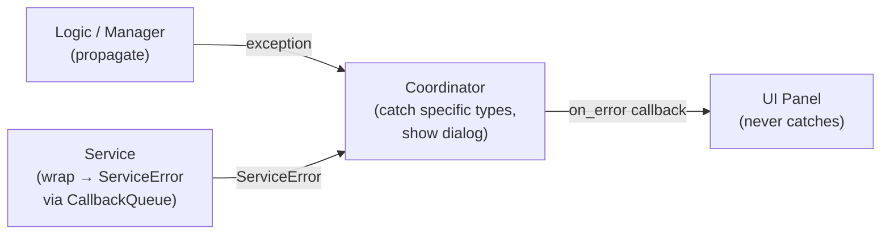

# Application Architecture

This document describes the design of `sampletones_application` — the GUI front-end of SampleToNES. It is prescriptive, not merely descriptive: it states the contracts each layer must honour, the rules that govern naming and wiring, and the rationale behind those decisions. Use it as the reference when making structural decisions about where new code belongs.

---

## Overview

`sampletones_application` is a [DearPyGui](https://github.com/hoffstadt/DearPyGui) application that exposes the `sampletones_core` audio-reconstruction engine through a multi-tab GUI. The application follows a strict four-layer architecture — **UI → ViewModel → Coordinators → Logic/Services** — in which each layer has clearly bounded responsibilities and data flows in one direction only. A single composition root (`Application`) constructs and wires all components at startup; there are no global singletons or service locators.

---

## Design Philosophy

These principles govern every structural decision in the codebase. Violations are tracked in `docs/bugs-and-todos.md § Architecture`.

### 1. Layering: dependencies flow inward

Each layer may only import from the layer *below* it. The UI layer knows about view models; view models know about domain types; logic knows only about the core library and shared utilities.



Concretely: nothing in `logic/` or `services/` may import from `ui/`, `view_model/`, or `coordinators/`. Violations of this rule compromise testability and create hidden coupling.

### 2. No DPG or visual utilities in the non-visual layers

Calls to `dearpygui` (`dpg.*`) are confined to:
- `ui/` — widget construction and update
- `shell.py` — context and viewport management
- Coordinator `create_tab()` methods — the single entry point where a coordinator assembles its top-level tab container

The `logic/`, `services/`, `view_model/`, and `config/` layers must remain DPG-free so they can be
instantiated and tested without a running GUI context. This extends past `import dearpygui`: the
dpg-bound helpers (`DialogsRenderer`, the `dpg_*` wrappers, fonts, tooltips, shortcuts, …) are grouped
under `utils/gui/`, and the non-visual layers must not import that subpackage either — they may use
only the dpg-free helpers that remain directly under `utils/` (e.g. `utils/callbacks/`).

This boundary is enforced, not merely documented: `scripts/check_import_boundary.py` (run as a
pre-commit hook and via `make check-import-boundary`) fails when a non-visual layer imports
`dearpygui`, `sampletones_application.ui`, or `sampletones_application.utils.gui`. `config/` is
additionally forbidden from importing `coordinators/` or `application.py`. The `ui/` layer is
held to its own contract by the same script: a `ui/**` rule forbids importing `coordinators/`,
`logic/`, `services/`, `config/`, `application.py`, and `shell.py`. The pre-commit hook audits
the entire source tree on every commit, so a rule change surfaces violations in files a commit
never touched.

### 3. No UI state in logic

Managers and controllers hold domain state only: file paths, dirty flags, domain objects. They do not know about widget visibility, button labels, or progress percentages. All UI-ready projections are computed by view models.

### 4. View models are immutable snapshots

A view model is a Pydantic `frozen=True` model produced by the logic layer and consumed by a panel's `update_view()` method. It captures the exact state needed to render one panel at one moment in time. Derived UI flags (button enabled, sub-panel visible) are `@property` computations on the view model, not stored fields.

This means the UI layer can never be in an inconsistent state: it always reflects the last view model it received, and the view model is self-consistent by construction.

### 5. Panels communicate via optional callback hooks

A panel never calls coordinator or logic methods directly. Instead it exposes public optional callback attributes (`on_x: Optional[Callback] = None`) that coordinators set during wiring. The panel invokes them through `CallbackMixin.call()`, which silently no-ops when the hook is `None`.

This decouples widget construction (which happens during `create_panel()`) from the moment wiring takes place (which happens in the coordinator's constructor), and lets panels be instantiated without any coordinator being present.

### 6. Background threads deliver results through `CallbackQueue`

Services execute long-running work on background threads. Their results are never applied directly to UI state from that thread. Instead they are posted to `CallbackQueue` with a priority, and the main-thread event loop processes them on the next frame. This is the only safe mechanism for crossing the thread boundary.

### 7. `Application` is the sole composition root

`Application.__init__` is the one place in the codebase where all objects are constructed and all callbacks are wired. No component may create another major component internally, and no component may obtain a dependency it was not given at construction time. Coordinator constructors accept callbacks as keyword arguments; panels accept view models and layout configuration.

### 8. All display text comes from `LanguageManager`

String literals must never appear in panel or coordinator code. Every visible string is looked up via `LanguageManager[Page, Panel, TextType, Element]`, where `Element` is a `StrEnum` member defined under `categories/elements/`. This makes the text system the single source of truth and enables future localisation.

### 9. `constants/` holds only DPG identifiers

After the constants-to-YAML refactor (`docs/application-refactor.md`), the `constants/` package contains only `TAG_*` values (DPG widget string identifiers) and `SUF_*` values (suffix fragments used to compose tags programmatically). Dimensions, colours, timings, and display strings all live in YAML configuration files loaded at startup.

Tag naming convention:
```
TAG_<MODULE>_<WIDGET_TYPE>[_<DETAIL>]
```
`MODULE` is the feature area (`GLOBAL`, `MAIN`, `RECONSTRUCTIONS`, `SEQUENCER`, `INSTRUCTIONS`, `PLAYER`, `SETTINGS`); `WIDGET_TYPE` is the DPG element kind (`WINDOW`, `PANEL`, `TREE`, `TABLE`, `BUTTON`, `INPUT`, `TABS`, `TAB`, `THEME`, `FONT`, `MENU`); `DETAIL` disambiguates multiple instances of the same type in the same module.

### 10. Exclusive operations expose a lifecycle-accurate active state

Some operations are mutually exclusive — typically because they are resource-intensive (background worker pools) and running two at once would exhaust memory or contend for a device. Each such operation exposes an `is_active` signal derived from its **own state machine**, true from the moment the operation is *requested* through to its teardown — including any preparatory phase that runs before the background work begins. Deriving "active" from a downstream signal (such as whether a worker has actually started) understates the operation's true span and opens a window in which a competing operation can begin.

The composition root composes the per-operation `is_active` signals into a single *busy authority*. That authority is the one source of truth, consulted in two places:

- **UI enablement** — panels disable the controls that would start a competing operation.
- **Start-time guards** — each operation's entry point consults the authority and declines to start while another operation is active, so exclusivity holds even when a control is reached outside the normal UI path.

A new exclusive operation joins by contributing its `is_active` to the authority and adding a start-time guard; no per-call-site bookkeeping is needed. The authority stores nothing — it is recomputed from the live operations on demand. If exclusive operations proliferate, promote the authority into a dedicated cross-cutting coordinator that registers operation predicates.

---

## Layer Reference

### `ui/` — View layer

**Purpose:** Constructs and updates the DearPyGui widget tree. Panels own their DPG tags and the widget subtree rooted at `self.tag`.

**Contracts:**
- A panel creates its entire widget tree in one call to `create_panel()` and does not call DPG outside it (except in `update_view()` and event callbacks wired by DPG itself).
- Panels hold only visual state: their tag, their child widget references, and layout dimensions. They do not hold domain objects.
- Every mutation from outside goes through `update_view(view_model)` or through a direct DPG call (`dpg_configure_item`, `dpg_set_value`) triggered by an `update_*` method.
- Callback wiring from coordinators sets public `on_x` attributes *after* construction; panels must therefore tolerate `None` hooks until wiring is complete.
- A widget whose rendering needs synchronous per-item queries declares a consumer-owned `Protocol` of exactly that surface (`TreeLogicProtocol` for the file trees' per-node favorite and playability checks, `ExplorerLogicProtocol`, `LibraryLogicProtocol`); the owning coordinator constructs the real logic object and injects it, and the panel types against the Protocol without ever importing the implementation. Hooks and view models remain the default — the Protocol is the exception for query-heavy widgets where projecting a whole tree per repaint would be disproportionate.

**Sub-structure:**

| Path | Role |
|------|------|
| `ui/elements/` | Reusable low-level widgets: `GUIPanel` (base), `GUIWindow` (modal variant), `GUIButton`, `GUITable`, `GUIGraph`, status bar, path widget, tree, fonts |
| `ui/panels/` | Domain-level composite panels, organised by feature area (`main/`, `reconstruction/`, `sequencer/`, `instruction/`) |
| `ui/themes/` | DPG themes and per-widget style helpers |
| `ui/resources/` | Icons and image resources loaded at startup |
| `ui/menu.py` | `MenuBar` — the application's top menu bar |

**May import:** `view_model/`, `utils/`, `categories/`, `constants/`, `layout/`, `sampletones_core` types, `sampletones_shared`.
**Must not import:** `coordinators/`, `logic/`, `services/`, `config/`.

---

### `view_model/` — Projection layer

**Purpose:** Bridges the logic layer and the UI layer. A view model is the UI's contract with the logic layer: it specifies exactly what data a panel needs to render itself, pre-computed and immutable.

**Contracts:**
- All view model classes are `BaseModel, frozen=True`. Fields are never mutated; a new instance is produced on each logical state change.
- Derived UI flags (`button_enabled`, `panel_visible`, `is_done`) are `@property` computations, not stored fields, to prevent inconsistency.
- View models carry only what is needed for rendering. They must not expose raw domain objects that a panel could mutate.
- Edit payloads — frozen `*Update` models a panel emits through its `on_*_changed` hooks (`ReconstructionUpdate`, `AudioSettingsUpdate`, …) — also live here: they are the UI's outbound contract, the mirror of view models.
- Domain data containers (frozen dataclasses that wrap core types and are used across logic and services) belong in `logic/`, not here. A type belongs in `view_model/` only if its purpose is to carry data across the UI boundary — a panel-feeding snapshot, an edit payload, or a projection a display renders (`WaveformData`).

**Naming convention:** `<Feature><Component>ViewModel`, e.g. `ConverterViewModel`, `ReconstructionDetailsViewModel`, `SequencerGridViewModel`.

**May import:** `sampletones_core` types, `sampletones_shared`, Python standard library.
**Must not import:** `ui/`, `coordinators/`, `logic/`, `services/`.

---

### `logic/` — Domain layer

**Purpose:** Owns domain state and implements the state-machine transitions that govern it. No knowledge of the UI framework.

**Key concepts:**

*Managers* own a domain object's lifecycle (load, save, close). They hold the current object, a `Session` that tracks dirty state, and fire `CallbackMixin` callbacks when the state changes.

*Controllers* are thin mutation façades over a manager. `ProjectController` exposes named, typed mutation methods (`set_title`, `add_sample`, …) and emits a finer-grained callback per mutation kind (`on_info_changed`, `on_samples_changed`, …). This lets the UI respond precisely to what changed without polling.

*Logic objects* (e.g. `ConverterLogic`, `ExplorerLogic`) orchestrate multi-step workflows within a feature area. They subscribe to services and translate service results into view model updates.

**Contracts:**
- Logic classes do not import from `ui/`, `view_model/`, or `coordinators/`.
- Logic classes do not call DPG.
- Callbacks are declared as optional attributes and invoked via `CallbackMixin.call()`.
- Session objects are simple state machines; they fire `on_state_changed` when they transition, but do not know who is listening.

**May import:** `sampletones_core`, `sampletones_shared`, `view_model/` (to produce snapshots), `utils/`, `categories/`, `layout/`, `config/`, and the service **result contract modules** (`services/result.py`, `services/*/result.py`) so handlers can type the tagged unions they match on.
**Must not import:** `ui/`, `coordinators/`, service implementation modules. A logic object that drives a service declares a logic-side `Protocol` of the calls it needs (`ConversionServiceProtocol`, `SongPlayerServiceProtocol`, …) and receives the real service from the composition root or its coordinator; structural typing keeps the dependency inverted.

---

### `services/` — Async worker layer

**Purpose:** Executes long-running operations (file conversion, waveform regeneration, export) on background threads and delivers typed results to the main thread via `CallbackQueue`.

**Contracts:**
- Every service inherits `ServiceBase[ResultType]`, which provides `subscribe(handler)`, `unsubscribe(handler)`, and `_emit(result)`.
- `_emit` always posts the result to `CallbackQueue`; it never calls a handler directly from the background thread.
- Result types are a tagged union of `ServiceStarted`, `ServiceProgress`, `ServiceIntermediate`, `ServiceSuccess`, `ServiceError`, `ServiceCancelled`, enabling exhaustive `match` handling by subscribers.
- Services do not hold references to panels or view models.

**May import:** `sampletones_core`, `sampletones_shared`, `utils/callbacks/`.
**Must not import:** `ui/`, `view_model/`, `coordinators/`, `logic/`.

---

### `coordinators/` — Orchestration layer

**Purpose:** Coordinators are the glue between the UI, logic, and service layers. They own the panels and logic objects for one feature area, wire their callbacks, and handle cross-cutting concerns (dialogs, navigation, session state).

There are two coordinator kinds:

*Domain coordinators* manage a cross-cutting concern that spans the whole application lifecycle: `ProjectCoordinator` (project file I/O, save confirmations), `ReconstructionCoordinator` (reconstruction I/O, regeneration, session tracking), `ConfigCoordinator` (generation config I/O), `PlaybackRouter` (routes play/pause/stop to the active tab's player).

*Tab coordinators* own everything for one tab: they instantiate the panels and logic objects, wire their callbacks together, and provide `create_tab()` — the single method that builds the DPG widget tree for that tab. Tab coordinators do not expose their internal panels or logic objects; they present a narrow public API of intent-level methods (`set_input_path`, `refresh_browser`, `display_reconstruction`, …).

**Contracts:**
- A coordinator may call `dpg.*` only inside `create_tab()` and in file-dialog callbacks decorated with `@file_dialog_handler`.
- A coordinator does not hold domain state. It delegates reads and writes to the managers and controllers it was given.
- Callbacks received from `Application` as constructor parameters are stored as-is and forwarded; they are not re-wrapped.
- A coordinator does not expose internal logic objects or panels as public attributes.

**May import:** `ui/`, `view_model/`, `logic/`, `services/`, `utils/`, `categories/`, `layout/`, `config/`.
**Must not import:** `application.py`, `shell.py`.

---

### `application.py` — Composition root

**Purpose:** Creates every object in the application and wires all callbacks. Nothing else.

`Application.__init__` is the only constructor that may create multiple different coordinator types. After construction it calls `_setup_gui()` to trigger DPG setup and initial view emission, then `run()` starts the event loop.

`Application` does not implement domain logic; it delegates everything. Its private methods are either event listeners that forward to coordinators (`_on_project_state_changed`, `_on_close`) or helpers that coordinate two coordinators that cannot reference each other directly (`_reconstruct_file`, `_editing_project_sample`).

**May import:** everything.

---

### `shell.py` — UI shell

**Purpose:** Manages the DPG context lifecycle, the primary window, the tab bar, the shortcut system, and UI utilities (status bar, FPS timer, audio settings window). It does not perform domain operations.

`ApplicationShell.setup()` creates the DPG context, registers shortcuts, builds the main window (menu bar + tab bar + status bar), and starts the `CallbackQueue` worker thread. Tab coordinators are passed to the shell so it can call their `create_tab()` methods in sequence.

**Must not:** hold references to domain managers, access coordinator internals, or call domain methods directly.

---

### Supporting packages

| Package | Purpose |
|---------|---------|
| `config/` | `ConfigManager` (domain generation config), `SessionManager` (runtime session: last paths, audio device, window geometry, autoplay state). Presentation-free: it records a `ConfigLoadOutcome` (recovery or failure) for `ConfigCoordinator` to present, and holds no `DialogsRenderer` or `LanguageManager` |
| `categories/` | `LanguageManager` and the `Page / Panel / TextType / Element` enum hierarchy used as lookup keys |
| `layout/` | Pydantic models loaded from YAML at startup; injected into coordinators and panels as `LayoutConfig` |
| `constants/` | DPG widget tags (`TAG_*`) and tag suffix fragments (`SUF_*`) |
| `utils/` | dpg-free helpers usable by any layer (`utils/callbacks/` `CallbackQueue`, file helpers, colour, threading). DPG-bound helpers live in `utils/gui/` (`DialogsRenderer`, `dpg_*` wrappers, fonts, tooltips, shortcuts, frame callbacks) and are off-limits to the non-visual layers |
| `viewport.py` | Manages DPG viewport geometry and fullscreen state |

---

## Data Flow Patterns

### Pattern A: User action → UI update (synchronous)

User interaction in a panel fires a DPG callback. The panel invokes its own `on_x` hook, which was wired by the coordinator to a logic method. The logic method mutates state and, if needed, produces a new view model and calls `on_view_changed`. The coordinator (or the logic object itself) calls `panel.update_view(new_view_model)`, which drives DPG calls.



### Pattern B: Background service result → UI update (asynchronous)

A service running on a background thread emits a result. `ServiceBase._emit()` posts it to `CallbackQueue` with the configured priority. On the next main-thread frame, `CallbackQueue.process()` dispatches it to the logic object's handler. The handler produces a new view model and the panel updates.



### Pattern C: Manager session state change → title/menu update

A manager's session transitions (e.g. reconstruction loaded, project saved) fire `on_state_changed`. The coordinator forwards this to `Application._on_reconstruction_state_changed()`, which recomputes the title and menu bar view model and pushes updates to the shell.



---

## History & Undo

Undo/redo is session-scoped and owned by `HistoryManager` (`logic/history/`). It
upholds two invariants:

1. **Completeness** — every mutation of project state belongs to the history.
2. **Reversibility determinism** — any composition of undos and redos that returns
   the cursor to an index reproduces that index's exact state.

### Engine: snapshot + cursor

`HistoryManager` holds an ordered list of whole-project snapshots and a cursor;
the live project always equals a restoration of `entries[cursor]`. Undo and redo
move the cursor and reinstall the snapshot there — they never mutate a stored
snapshot, so reversibility determinism holds by construction. Restore installs a
fresh copy through `ProjectController.replace_project`, which fires
`on_project_replaced` to rebuild the tabs exactly as loading a project does.

A snapshot (`snapshot_project`) deep-copies the light structure (song, settings,
metadata, sample shells) but **shares each `Reconstruction` by reference**.
Reconstruction edits are copy-on-write: `RegenerationService` emits a *new*
reconstruction and the apply path installs it via
`ProjectController.replace_sample_reconstruction`, so a shared reconstruction
never mutates in place and snapshots never duplicate the multi-megabyte audio
arrays. Producing the fresh reconstruction deep-copies the edited one once, on
the regeneration worker's background thread.

### Grouping vs. detection

- **Grouping — coordinators.** Each state-changing coordinator intent runs inside
  `HistoryManager.transaction(HistoryAction.X)` (the sequencer wraps its hooks via
  `_undoable`). All controller calls a gesture makes collapse into one entry;
  nested transactions coalesce. A transaction may also carry a *coalesce key*
  naming the gesture's target (a grid cell, a sample, a module setting):
  consecutive commits sharing the same action and key replace the top entry
  instead of appending, so a continuous interaction — a graph drag, repeated
  edits of one cell — records a single entry. Any undo, redo, or jump breaks
  the run, so a state the user navigated to is always preserved.
- **Detection — the controller.** `ProjectController._touch()` fires `on_mutation`
  on every fine-grained mutation. `HistoryManager.handle_mutation` counts those
  inside a transaction and rejects any that occur outside one: under strict
  deployment it raises `UntrackedMutationError`; otherwise it self-heals by
  recording the mutation as its own entry. This makes completeness a checkable
  property. Under strict deployment each committed snapshot also carries a
  fingerprint, and every restore verifies the reproduced project matches it.
  Capture-time fingerprints memoize each reconstruction's hash by object
  identity (copy-on-write keeps the content fixed for the object's lifetime),
  collapsing the per-gesture cost to the light structure; restore-time
  verification always hashes fresh, so an in-place mutation of shared state is
  caught rather than masked by the memo.

### Save point and lifecycle

The manager records the cursor of the last successful save (wired from
`ProjectController.on_saved`); a restore that lands exactly on that index
reinstates the on-disk content, so the session reports the document clean
again. A commit that truncates the saved entry away — or budget eviction that
drops it — invalidates the save point, and the session stays dirty until the
next save. Coalescing always preserves the saved entry by appending. The stack
follows the project lifecycle: an open project seeds a baseline entry, and
closing every project empties the stack, so the panel reports no history.

### Configuration

The entry budget is a persisted user preference
(`ApplicationConfig.history.budget`, default 500, lower bound 1). Strict
checking and log level are deployment knobs
(`behavior/deployment.yaml` → `DeploymentConfig`); the deployment model is
authoritative from YAML with no field defaults. The history panel renders a
window of `layout.sequencer.history.max_rendered_entries` rows around the
cursor and repaints rows in place via an index-keyed diff.

Standalone reconstruction documents (a reconstruction loaded from disk that is not
a project sample) will gain their own history later, reusing the same engine.

---

## Error Handling Policy

Each layer has a distinct role in the error-handling chain. The rule of thumb is: **errors propagate up until they reach a layer that can recover meaningfully and communicate the result to the user.**

### Logic and manager classes — propagate, don't catch

Logic classes and managers do not catch exceptions unless they can take a concrete recovery action in place (e.g. retrying with a fallback path). I/O errors (`OSError` and subclasses) from file operations propagate directly to the caller. Catching and repackaging an exception without recovery is forbidden by the coding guidelines.

When a manager does recover, it records *what happened* as domain data and lets a coordinator present it — it never renders a dialog itself. For example `ConfigManager` recovers a malformed configuration by loading defaults and appending a `ConfigLoadOutcome` (`ConfigRecovered` or `ConfigLoadFailure`, carrying only domain values and a failure category); `ConfigCoordinator.present_pending_load_outcomes()` later turns each outcome into the matching dialog with text from `LanguageManager`.

### Services — the only legitimate broad catch

Services run tasks on background threads. If an unhandled exception escapes the worker, the thread dies silently and `CallbackQueue` never delivers the result. For this reason, `ServiceBase` subclasses must catch the exception at the outer boundary of the async task, wrap it in `ServiceError`, and emit it through `CallbackQueue`. This is the **only** place where catching non-specific exception types is permitted, and it must be limited to the top-level task wrapper, not buried in helper methods.

### Coordinators — the recovery boundary

Coordinators own the decision of what to do when an operation fails. They:

- Catch **specific exception types** named by the domain or I/O layer (`OSError`, `LoadReconstructionError`, etc.).
- Present failures to the user via `DialogsRenderer` rather than propagating them further.
- Handle `ServiceError` results from the tagged union returned by async services.

A coordinator must not catch `Exception` or use bare `except`. The correct exception type for every catch site must be identified; `# TODO: specify exception type` is a guideline violation.

### UI layer — never catches

Panels do not perform error handling. All error conditions arrive as data through coordinator-wired callbacks (`on_error: Optional[Callable[[Exception], None]]`). A panel may display an error state derived from a view model, but it never catches exceptions directly.

### Summary



---

## File Layout

```
sampletones_application/
├── application.py          ← composition root; owns and wires every component
├── shell.py                ← DPG context, main window, tabs, shortcuts
├── viewport.py             ← viewport geometry + fullscreen
├── paths.py                ← single source of truth for filesystem paths
│
├── ui/
│   ├── elements/           ← reusable widgets: GUIPanel, GUIWindow, GUIButton, …
│   │   ├── panel.py        ← base class for all panels
│   │   ├── window.py       ← modal window variant
│   │   ├── button.py
│   │   ├── status.py
│   │   ├── tree/
│   │   ├── table/
│   │   ├── graphs/
│   │   └── fonts/
│   ├── panels/             ← domain-level composite panels
│   │   ├── main/
│   │   ├── reconstruction/
│   │   ├── sequencer/
│   │   ├── instruction/
│   │   ├── player.py
│   │   └── settings.py
│   ├── themes/             ← DPG themes and style helpers
│   ├── resources/          ← icons and images
│   └── menu.py             ← MenuBar
│
├── view_model/             ← immutable Pydantic snapshots; one subdirectory per tab
│   ├── main/
│   ├── reconstruction/
│   ├── sequencer/
│   ├── instruction/
│   └── shared/
│
├── coordinators/           ← orchestration: one file per coordinator
│   ├── main.py             ← MainTabCoordinator
│   ├── reconstructions.py  ← ReconstructionsTabCoordinator
│   ├── sequencer.py        ← SequencerTabCoordinator
│   ├── instructions.py     ← InstructionsTabCoordinator
│   ├── reconstruction.py   ← ReconstructionCoordinator (cross-cutting)
│   ├── project.py          ← ProjectCoordinator (cross-cutting)
│   ├── playback.py         ← PlaybackRouter (cross-cutting)
│   └── config.py           ← ConfigCoordinator
│
├── logic/                  ← domain state-machines; no DPG
│   ├── project/            ← ProjectManager + ProjectController + ProjectSession
│   ├── reconstruction/     ← ReconstructionManager + ReconstructionSession
│   ├── instruction/        ← InstructionsLibraryManager
│   ├── main/               ← ConverterLogic + ExplorerLogic
│   ├── sequencer/          ← grid, samples, browser
│   └── shared/             ← AudioPlayer, tree
│
├── services/               ← async background workers
│   ├── base.py             ← ServiceBase[T]
│   ├── result.py           ← ServiceStarted, ServiceProgress, ServiceSuccess, …
│   ├── conversion.py       ← ConversionService
│   ├── regeneration.py     ← RegenerationService
│   └── export.py           ← ExportService
│
├── config/                 ← ConfigManager + SessionManager
├── categories/             ← LanguageManager + Page/Panel/TextType/Element enums
├── layout/                 ← LayoutConfig (Pydantic) + YAML loaders
├── constants/              ← TAG_* and SUF_* identifiers only
└── utils/                  ← dpg-free helpers (callbacks/, file, color, thread, …)
    └── gui/                ← dpg-bound helpers (dialogs, dpg wrappers, fonts, tooltips, shortcuts/, frame)
```

---

## Component Hierarchy

The diagram shows ownership (solid arrows) and the callbacks/protocol boundary (dashed arrows) between the shell and coordinators.

```mermaid
graph TD
    APP["Application\n(composition root)"]

    SHELL["ApplicationShell\n(DPG shell)"]
    VPORT["ViewportManager"]
    MENU["MenuBar"]
    STATUS["GUIStatusBar"]
    ASWIN["GUIAudioSettingsWindow"]

    CFG["ConfigManager"]
    SES["SessionManager"]
    LANG["LanguageManager"]
    LAYOUT["LayoutConfig"]

    PMGR["ProjectManager"]
    PCTRL["ProjectController"]
    RMGR["ReconstructionManager"]
    LMGR["InstructionsLibraryManager"]
    BMGR["BrowserManager"]

    CSVC["ConversionService"]
    RSVC["RegenerationService"]
    ESVC["ExportService"]

    PCOO["ProjectCoordinator"]
    RCOO["ReconstructionCoordinator"]
    PBRT["PlaybackRouter"]
    CCOO["ConfigCoordinator"]

    MTAB["MainTabCoordinator"]
    RTAB["ReconstructionsTabCoordinator"]
    STAB["SequencerTabCoordinator"]
    ITAB["InstructionsTabCoordinator"]

    APP --> SHELL
    APP --> CFG
    APP --> SES
    APP --> LANG
    APP --> LAYOUT
    APP --> PMGR
    APP --> PCTRL
    APP --> RMGR
    APP --> LMGR
    APP --> BMGR
    APP --> CSVC
    APP --> RSVC
    APP --> ESVC
    APP --> PCOO
    APP --> RCOO
    APP --> PBRT
    APP --> CCOO
    APP --> MTAB
    APP --> RTAB
    APP --> STAB
    APP --> ITAB

    SHELL --> VPORT
    SHELL --> MENU
    SHELL --> STATUS
    SHELL --> ASWIN
    SHELL -.->|create_tab| MTAB
    SHELL -.->|create_tab| RTAB
    SHELL -.->|create_tab| STAB
    SHELL -.->|create_tab| ITAB
```



---

## Naming Conventions Summary

| Kind | Convention | Example |
|------|-----------|---------|
| Panel class | `GUI<Feature><Role>Panel` | `GUIConverterPanel`, `GUIReconstructorPanel` |
| Window class | `GUI<Feature>Window` | `GUIAudioSettingsWindow` |
| ViewModel class | `<Feature><Component>ViewModel` | `ConverterViewModel`, `ReconstructorPanelViewModel` |
| Coordinator class | `<Feature>Coordinator` or `<Feature>TabCoordinator` | `ProjectCoordinator`, `MainTabCoordinator` |
| Manager class | `<Domain>Manager` | `ReconstructionManager`, `InstructionsLibraryManager` |
| Controller class | `<Domain>Controller` | `ProjectController` |
| Service class | `<Domain>Service` | `ConversionService`, `RegenerationService` |
| DPG widget tag | `TAG_<MODULE>_<WIDGET>[_<DETAIL>]` | `TAG_MAIN_PANEL_CONFIG`, `TAG_GLOBAL_TAB_MAIN` |
| Tag suffix | `SUF_<ROLE>` | `SUF_PANEL_LEFT`, `SUF_GRAPH_PLOT` |
| Panel callback hook | `on_<event>` attribute | `on_convert_requested`, `on_audio_settings_changed` |
| Logic callback | `on_<event>` attribute | `on_view_changed`, `on_reconstruction_loaded` |
