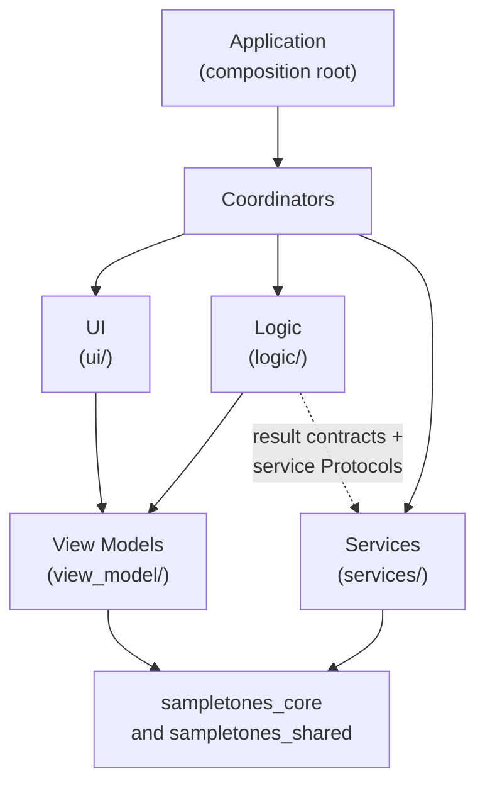
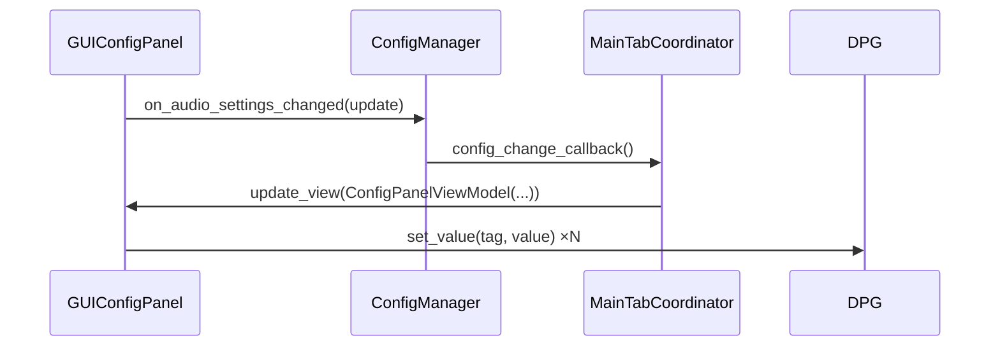
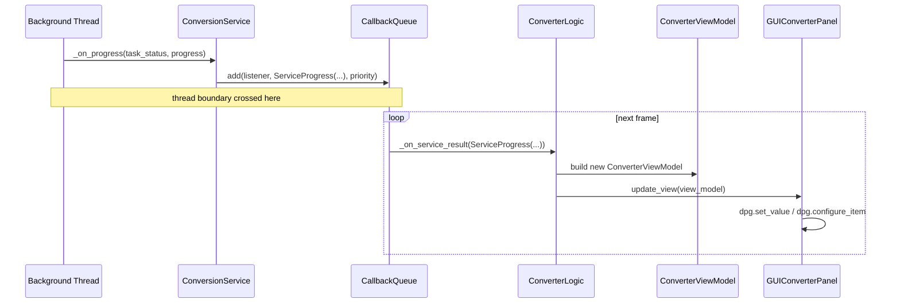
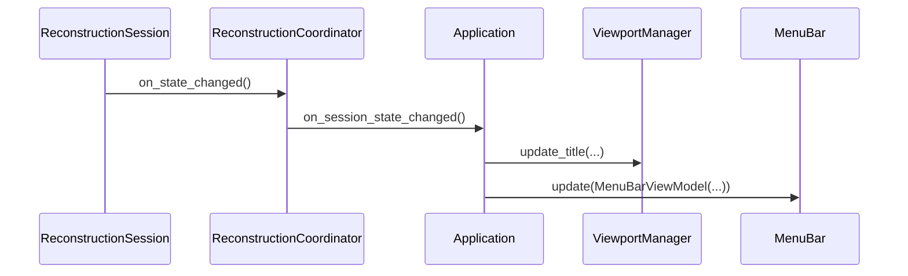
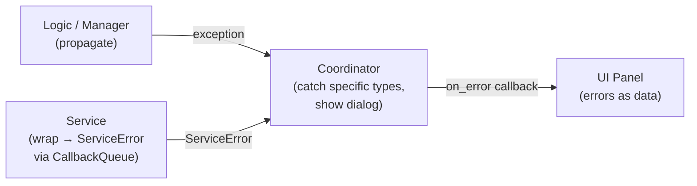

# Application Architecture

This document describes the design of `sampletones_application` — the GUI front-end of _SampleToNES_. It is prescriptive: it states the contracts each layer must honour, in the form they are enforced, and the rationale behind them. Use it as the reference when deciding where new code belongs.

Concrete classes and modules appear throughout as **examples** that anchor a rule; the rules bind every instance, named or not. Known deviations from these contracts are tracked in `docs/development/bugs-and-todos.md § Architecture`. Coding-level rules live in `docs/development/guidelines.md`; the undo subsystem has its own design document, `docs/development/undo.md`, the audio transport has `docs/development/playback.md`, and the YAML configuration package has `docs/development/config-organization.md`.

---

## Overview

`sampletones_application` is a [DearPyGui](https://github.com/hoffstadt/DearPyGui) application that exposes the `sampletones_core` audio-reconstruction engine through a multi-tab GUI. Four layers with clearly bounded responsibilities structure the code — **UI** (widget construction), **view models** (immutable projections), **logic and services** (domain state and background work), and **coordinators** (orchestration) — with dependencies flowing in one direction only. A single composition root (`Application`) constructs and wires all components at startup.



---

## Design Principles

These principles govern every structural decision in the codebase.

### 1. Layering: dependencies flow inward

Each layer imports only from the layers below it. Coordinators, at the top, reach every layer they orchestrate. The UI layer knows only view models and shared utilities. Logic owns domain state and produces view models. Services, at the bottom of the application stack, know only the core libraries and thread-safe utilities — a service is driven through a logic-side `Protocol` and reports through its result-contract types, so even logic reaches a service only through inversion.

The load-bearing prohibitions: nothing in `logic/` or `services/` imports `ui/` or `coordinators/`, and `services/` imports neither `logic/` nor `view_model/`. The authoritative import matrix is the **May import / Must not import** pair in each Layer Reference section below; the boundary script enforces it (see Enforcement).

### 2. DPG stays in the visual layers

Calls into `dearpygui` are confined to `ui/`, `shell.py`, and the narrow coordinator surface defined in the Layer Reference. The `logic/`, `services/`, `view_model/`, and `config/` layers remain DPG-free so they can be instantiated and tested without a running GUI context. This extends past `import dearpygui`: the dpg-bound helpers (`DialogsRenderer`, the `dpg_*` wrappers, fonts, tooltips, shortcuts, keyboard routing, frame callbacks) are grouped under `utils/gui/`, and the non-visual layers may use only the dpg-free helpers that live directly under `utils/` (e.g. `utils/callbacks/`).

### 3. No UI state in logic

Managers and controllers hold domain state only: file paths, dirty flags, domain objects. Widget visibility, button labels, and progress percentages are UI state, and every UI-ready projection is computed by a view model at the moment it is built.

### 4. View models are immutable snapshots

A view model captures the exact state needed to render one panel at one moment in time — a Pydantic `frozen=True` model produced by the logic layer and consumed by a panel's `update_view()` method. Derived UI flags (button enabled, sub-panel visible) are `@property` computations on the view model, not stored fields. A frozen dataclass is acceptable where the payload does not suit Pydantic validation (`WaveformData` carries numpy arrays).

This means the UI layer can never be in an inconsistent state: it always reflects the last view model it received, and the view model is self-consistent by construction.

### 5. Panels communicate via optional callback hooks

A panel never calls coordinator or logic methods directly. Instead it exposes public optional callback attributes (`on_x: Optional[Callback] = None`) that coordinators set during wiring. The panel invokes them through `CallbackMixin.call()`, which silently no-ops when the hook is `None`.

This decouples widget construction (which happens during `create_panel()`) from the moment wiring takes place (which happens in the coordinator's constructor), and lets panels be instantiated without any coordinator present.

### 6. Background threads deliver results through `CallbackQueue`

Services execute long-running work on background threads. Their results are posted to `CallbackQueue` with a priority, and the main-thread render loop drains the due results each frame within a per-frame time budget (`scheduling.queue_budget_seconds`), so a large backlog spreads across frames while rendering continues. Draining on the render thread keeps every callback's DPG work on the thread that owns the context. This is the only mechanism for crossing the thread boundary; applying a background result to UI state directly from the worker thread is forbidden.

### 7. Construction flows from the composition root

`Application.__init__` constructs the application graph — managers, controllers, shared services, coordinators, the shell — and wires their callbacks. A tab coordinator in turn constructs the panels, logic objects, and tab-scoped services it owns. Beyond these two sites, no component constructs another major component: every dependency arrives as a constructor argument, and none is obtained through a global lookup.

### 8. All display text comes from `LanguageManager`

Every user-visible string is looked up via `LanguageManager[Page, Panel, TextType, Element]`, where `Element` is a `StrEnum` member defined under `categories/elements/`. This makes the text system the single source of truth and enables future localisation. Log messages are developer-facing and exempt.

### 9. `constants/` holds only DPG identifiers

The `constants/` package contains only `TAG_*` values (DPG widget string identifiers) and `SUF_*` values (suffix fragments used to compose tags programmatically). Dimensions, colours, timings, and display strings live in YAML configuration loaded at startup (`layout/`).

Tag naming convention:
```
TAG_<MODULE>_<WIDGET_TYPE>[_<DETAIL>]
```
`MODULE` is the feature area (`GLOBAL`, `MAIN`, `RECONSTRUCTIONS`, `SEQUENCER`, `INSTRUCTIONS`, `PLAYER`, `SETTINGS`); `WIDGET_TYPE` is the DPG element kind (`WINDOW`, `PANEL`, `TREE`, `TABLE`, `BUTTON`, `INPUT`, `TABS`, `TAB`, `THEME`, `FONT`, `MENU`); `DETAIL` disambiguates multiple instances of the same type in the same module.

### 10. Exclusive operations expose a lifecycle-accurate active state

Some operations are mutually exclusive — typically because they are resource-intensive (background worker pools) and running two at once would exhaust memory or contend for a device. Each such operation exposes an `is_active` signal derived from its **own state machine**, true from the moment the operation is *requested* through to its teardown, including any preparatory phase before the background work begins. A signal that starts at the moment of request is the only one that covers the operation's full span; anything derived downstream (such as whether a worker has actually started) opens a window in which a competing operation can slip in.

The composition root composes the per-operation signals into a single *busy authority* — the one source of truth, consulted in two places:

- **UI enablement** — panels disable the controls that would start a competing operation.
- **Start-time guards** — each operation's entry point consults the authority and declines to start while another operation is active, so exclusivity holds even when a control is reached outside the normal UI path.

A new exclusive operation joins by contributing its `is_active` to the authority and adding a start-time guard; no per-call-site bookkeeping is needed. The authority stores nothing — it is recomputed from the live operations on demand.

### 11. Platform and external-tool differences hide behind a backend Protocol

Where behaviour depends on the operating system, the desktop environment, or an external command-line tool, that variation is expressed as a `Protocol` with one implementation per target, chosen by a runtime factory — never as platform branches scattered through the callers. The factory probes availability (`shutil.which`) and environment (`System.current()`, `XDG_CURRENT_DESKTOP`) and returns the implementation that fits; callers depend only on the Protocol and read identically on every platform.

`utils/file_dialogs/` applies this to native file dialogs: a `FileDialogBackend` Protocol with `kdialog`, `zenity`, and `tkinter` implementations, selected by `select_file_dialog_backend()`. Each tool's quirks stay sealed inside its own implementation — `kdialog` activates the supplied filter, `zenity` lists the filter but leaves the selector on its "(None)" default because its command line offers no way to pre-select one — and the guarantee callers depend on, that a saved file carries the configured extension, is enforced once in the API layer above every backend. `sampletones_core/calibration/referee/` follows the same shape with its `build_referees()` factory.

### 12. One dispatcher owns the keyboard

DearPyGui gives every key handler the same global reach and no way for one to stop another — or ImGui itself — from also seeing a press. Priority and consume semantics therefore exist only where the application builds them. A single `KeyRouter` (`utils/gui/keyboard/`) owns the one `add_key_press_handler` for the whole application, snapshots the modifier state once into a frozen `KeyEvent`, and offers that event to registered **scopes** from highest priority to lowest. The first active scope whose handler returns `True` claims the press and ends the walk; this software walk is the sole consume mechanism the framework leaves available.

Each keyboard consumer registers one scope through `register(handle, *, priority, active)`, where `active()` reports whether the scope wants keys at this moment and `handle(event) -> bool` acts on the press and reports whether it claimed it. Three priorities order the whole application:

| Priority | Scope | Active when | Behaviour |
|----------|-------|-------------|-----------|
| `MODAL` (100) | the open dialog's navigator | a modal dialog holds the keyboard | routes Tab/Enter/Escape to the dialog's focus ring and claims every press, so a dialog owns the keyboard exclusively while it is shown |
| `PANEL` (60) | a sequencer sub-panel (grid / order / samples) | that sub-panel holds the cursor or selection | handles its tracker keys and yields the combinations it does not own so a higher-reaching shortcut still wins |
| `SHORTCUT` (40) | application shortcuts (`ShortcutManager`) | always | fires the matching shortcut while no field is being edited, or whenever the shortcut is `field_transparent` |

Because the router offers a panel the key ahead of the shortcut scope, a panel returns `False` on any combination it does not own — the grid yields every `Ctrl`-modified press — so that field-transparent shortcuts such as `Ctrl+PgDn` / `Ctrl+PgUp` tab-switching reach the shortcut scope even while a grid cursor is set.

**Focus is pulled, not pushed.** Whether a text or value field keeps a plain key for itself is one router query, `is_field_focused`, that reads the focused item from DearPyGui at the moment of the press and counts it only while that item is actively being edited. Every input is covered by construction, and the router alone holds the rule.

The query resolves the focused item to the field behind it. A `dpg.group` reports the state of the widget inside it, and DearPyGui names the outermost such group as the focused item — the instruments panel's sequence input, laid out beside its copy button inside a card body group, reaches the keyboard as that group. An active group therefore answers with the field being edited below it, found by following the one branch that reports focus, so a panel-spanning group costs a key press only the path down to its field.

**Modal suppression lives in one place.** The router holds a LIFO stack of modal handlers; `push_modal` / `pop_modal` bracket a dialog's lifetime, and the built-in `MODAL` scope routes each press to the top of the stack. Since `MODAL` outranks the panel and shortcut scopes, the scopes beneath it carry no "a dialog is open" check of their own.

The router is constructed at the composition root and injected into every consumer (principle 7); its one global handler is bound in `shell.py` once the DPG context exists.

---

## Enforcement

Two mechanisms keep the codebase aligned with this document.

**Import-expressible contracts are enforced by script.** `scripts/check_import_boundary.py` (a pre-commit hook, also run via `make check-import-boundary`) encodes one rule per layer, mirroring the **Must not import** lists in the Layer Reference; the Layer Reference is the source of truth, and a divergence between it and the script is itself a defect. Where a layer may consume another layer's data contract while its implementation stays out of reach (logic and the service result types), the rule carries an explicit contract exemption. The hook audits the entire source tree on every commit (`--all`), so strengthening a rule surfaces violations in files a commit never touched. That property sets the working idiom for structural refactors: turn the stricter rule on first, and let the failing hook enumerate the remaining work.

**Behavioral contracts are enforced by review.** Contracts a grep cannot see — where state lives, which methods touch DPG, how errors travel — are upheld in code review against this document. Deviations that survive review are recorded in `docs/development/bugs-and-todos.md § Architecture` until they are paid off; the ledger, not the codebase, is the memory of what is currently out of line.

---

## Layer Reference

### `ui/` — View layer

**Purpose:** Constructs and updates the DearPyGui widget tree. Panels own their DPG tags and the widget subtree rooted at `self.tag`.

**Contracts:**
- A panel creates its entire widget tree in one call to `create_panel(parent)`, rooting its subtree at `self.tag` inside the coordinator-injected `parent`, and calls DPG afterwards only in `update_view()`, `update_*` methods, and event callbacks wired by DPG itself.
- Panels hold only visual state: their tag, their child widget references, and layout dimensions. Domain objects stay in logic; panels receive projections of them.
- A panel never encodes its own placement: it does not compose a column tag (`SUF_PANEL_*`) as its parent, and it never hosts a sibling panel. Tab layout is the coordinator's (see the Coordinators reference). Where a section is a card, one card is one panel is one module; the coordinator declares which cards a tab contains and how they are arranged.
- Structural depth themes are bound only by the layout primitives, never by a panel or coordinator. The `TabColumns` scaffold binds each column its declared depth theme — recessed GROUND for a column hosting a stack of floating cards, raised SURFACE for a full-height column that is itself a single docked surface (a file tree, an instrument list) — and the `card()` context manager binds SURFACE to a card. Panels and coordinators bind only semantic/content themes (a per-generator checkbox tint, the player toolbar), never GROUND or SURFACE.
- Every mutation from outside goes through `update_view(view_model)` or through a direct DPG call (`dpg_configure_item`, `dpg_set_value`) triggered by an `update_*` method.
- Callback wiring from coordinators sets public `on_x` attributes *after* construction; panels must therefore tolerate `None` hooks until wiring is complete.
- A widget whose rendering needs synchronous per-item queries declares a consumer-owned `Protocol` of exactly that surface (e.g. `TreeLogicProtocol`, through which the file trees query per-node favorite and playability state); the owning coordinator constructs the real logic object and injects it, and the panel types against the Protocol. Hooks and view models remain the default — the Protocol is the exception for query-heavy widgets where projecting a whole tree per repaint would be disproportionate.
- Dialog presentation belongs to coordinators: a panel fires an intent hook, and the owning coordinator renders the dialog via `DialogsRenderer` with text resolved there. Reusable modal *editing* windows subclass `GUIWindow` and follow the ordinary panel contracts.

**Sub-structure:**

| Path | Role |
|------|------|
| `ui/elements/` | Reusable low-level widgets: `GUIPanel` (the panel base class), `GUIWindow` (modal variant), buttons, tables, graphs, trees, fonts, the status bar |
| `ui/elements/layout/` | Reusable layout primitives: `TabColumns` (the tab column scaffold) and the `card()` context manager, driven declaratively by tab coordinators |
| `ui/panels/` | Domain-level composite panels, organised by feature area |
| `ui/themes/` | DPG themes and per-widget style helpers |
| `ui/resources/` | Icons and image resources loaded at startup |
| `ui/menu.py` | `MenuBar` — the application's top menu bar |

**May import:** `view_model/`, `utils/`, `categories/`, `constants/`, `layout/`, `sampletones_core` types, `sampletones_shared`.
**Must not import:** `coordinators/`, `logic/`, `services/`, `config/`, `application.py`, `shell.py`, `utils/gui/dialogs` (`DialogsRenderer` is coordinator territory).

---

### `view_model/` — Projection layer

**Purpose:** Bridges the logic layer and the UI layer. A view model is the UI's contract with the logic layer: it specifies exactly what data a panel needs to render itself, pre-computed and immutable.

**Contracts:**
- All view model classes are frozen (see principle 4). Fields are never mutated; a new instance is produced on each logical state change.
- Derived UI flags (`button_enabled`, `panel_visible`, `is_done`) are `@property` computations, not stored fields, to prevent inconsistency.
- View models carry only what is needed for rendering. They must not expose raw domain objects that a panel could mutate.
- Edit payloads — frozen `*Update` models a panel emits through its `on_*_changed` hooks — also live here: they are the UI's outbound contract, the mirror of view models.
- Domain data containers (frozen dataclasses that wrap core types and are used across logic and services) belong in `logic/`. A type belongs in `view_model/` only if its purpose is to carry data across the UI boundary — a panel-feeding snapshot, an edit payload, or a projection a display renders (`WaveformData`).

**Naming convention:** `<Feature><Component>ViewModel`, e.g. `ConverterViewModel`, `SequencerGridViewModel`.

**May import:** `sampletones_core` types, `sampletones_shared`, Python standard library.
**Must not import:** `ui/`, `coordinators/`, `logic/`, `services/`, `config/`.

---

### `logic/` — Domain layer

**Purpose:** Owns domain state and implements the state-machine transitions that govern it. No knowledge of the UI framework.

**Key concepts:**

*Managers* own a domain object's lifecycle (load, save, close). They hold the current object, a `Session` that tracks dirty state, and fire `CallbackMixin` callbacks when the state changes.

*Controllers* are thin mutation façades over a manager. `ProjectController` exposes named, typed mutation methods (`set_title`, `add_sample`, …) and emits a finer-grained callback per mutation kind (`on_info_changed`, `on_samples_changed`, …). This lets the UI respond precisely to what changed.

*Logic objects* (e.g. `ConverterLogic`) orchestrate multi-step workflows within a feature area. They subscribe to services and translate service results into view model updates.

`logic/history/` implements the session-scoped undo engine (`HistoryManager`); its invariants and mechanics are documented in `docs/development/undo.md`.

**Contracts:**
- Logic classes produce view models and may therefore import `view_model/`; they import neither `ui/` nor `coordinators/`.
- Logic classes never call DPG.
- Callbacks are declared as optional attributes and invoked via `CallbackMixin.call()`.
- Session objects are simple state machines; they fire `on_state_changed` when they transition, without knowing who listens.
- A logic object that drives a service declares a logic-side `Protocol` of exactly the calls it needs (e.g. `ConversionServiceProtocol`) and receives the real service from its coordinator or the composition root; structural typing keeps the dependency inverted.

**May import:** `sampletones_core`, `sampletones_shared`, `view_model/`, `utils/`, `categories/`, `layout/`, `config/`, and the service **result contract modules** (`services/result.py`, `services/*/result.py`) so handlers can type the tagged unions they match on.
**Must not import:** `ui/`, `coordinators/`, service implementation modules.

---

### `services/` — Async worker layer

**Purpose:** Executes long-running operations (file conversion, waveform regeneration, export, playback synthesis) on background threads and delivers typed results to the main thread via `CallbackQueue`.

**Contracts:**
- Every service inherits `ServiceBase[ResultType]`, which provides `subscribe(handler)`, `unsubscribe(handler)`, and `_emit(result)`.
- `_emit` always posts the result to `CallbackQueue`; it never calls a handler directly from the background thread.
- Result types are a tagged union of `ServiceStarted`, `ServiceProgress`, `ServiceIntermediate`, `ServiceSuccess`, `ServiceError`, `ServiceCancelled`, enabling exhaustive `match` handling by subscribers.
- Services hold no references to panels, view models, or logic objects.

**May import:** `sampletones_core`, `sampletones_shared`, `utils/callbacks/`.
**Must not import:** `ui/`, `view_model/`, `coordinators/`, `logic/`, `config/`.

---

### `coordinators/` — Orchestration layer

**Purpose:** Coordinators are the glue between the UI, logic, and service layers. They own the panels and logic objects for one feature area, wire their callbacks, and handle cross-cutting concerns (dialogs, navigation, session state).

There are two coordinator kinds:

*Domain coordinators* manage a cross-cutting concern that spans the whole application lifecycle — e.g. `ProjectCoordinator` (project file I/O, save confirmations) or `PlaybackRouter` (the single transport over the shared output device, acting on the active tab's source or the engaged one — see `docs/development/playback.md`).

*Tab coordinators* own everything for one tab: they instantiate its panels, logic objects, and tab-scoped services, wire their callbacks together, and provide `create_tab()` — the single method that builds the DPG widget tree for that tab. Tab coordinators present a narrow public API of intent-level methods (`set_input_path`, `display_reconstruction`, …) and keep their panels and logic objects private.

`create_tab()` is the sole authority for the tab's layout: it declares the column and card arrangement through the shared `ui/elements/layout` primitives (`TabColumns`, `card()`) and injects each panel's parent container via `create_panel(parent)`. It builds widgets only — initial view population (pushing the first view models, refreshing trees) runs afterwards from the coordinator's post-build initialisation, invoked once the whole tree exists, rather than inside `create_tab()`.

**Contracts:**
- A coordinator touches DPG only on a narrow, closed surface: inside `create_tab()`, and when building dialog content inside a closure passed to `DialogsRenderer.show_modal`. A dialog that must wait for the next frame is deferred through `FrameCallbackManager`. All other presentation goes through `DialogsRenderer`.
- File selection runs through OS-native dialogs, which live outside DPG. A coordinator opens one via `utils/file_dialogs` — a synchronous call that blocks until the user picks a path or cancels — resolves the dialog title and filter name from `LanguageManager`, and routes the returned path through a handler decorated with `@ignore_none_path`, so a cancelled dialog is a silent no-op and each handler body runs with a real path. The backend is chosen at runtime; a coordinator never branches on platform.
- A coordinator holds no domain state. It delegates reads and writes to the managers and controllers it was given; what it caches is presentation wiring — resolved language strings, panels, logic objects, callbacks.
- Callbacks received from `Application` as constructor parameters are stored and forwarded as-is. The one sanctioned wrapper is an intent-level guard that a contract requires — e.g. a busy-authority start-time guard (principle 10) wrapping an operation's entry point.
- Error dialogs, confirmations, and notices are presented here, with text resolved from `LanguageManager` here (see the Error Handling Policy).

**May import:** `ui/`, `view_model/`, `logic/`, `services/`, `utils/`, `categories/`, `layout/`, `config/`.
**Must not import:** `application.py`, `shell.py`.

---

### `application.py` — Composition root

**Purpose:** Creates every object in the application and wires all callbacks. Nothing else.

`Application.__init__` is the only constructor that may create multiple different coordinator types. After construction it calls `_setup_gui()` to trigger DPG setup and initial view emission, then `run()` starts the event loop.

`Application` delegates all domain logic. Its private methods are either event listeners that forward to coordinators or helpers that coordinate two coordinators that cannot reference each other directly.

**May import:** everything.

---

### `shell.py` — UI shell

**Purpose:** Manages the DPG context lifecycle, the primary window, the tab bar, the shortcut system, and UI utilities (status bar, FPS timer, audio settings window). It performs no domain operations.

`ApplicationShell.setup()` creates the DPG context, registers shortcuts, binds the `KeyRouter`'s single global key-press handler, builds the main window (menu bar + tab bar + status bar), and starts the `CallbackQueue` worker thread. Tab coordinators are passed to the shell so it can call their `create_tab()` methods in sequence.

**Must not import:** `logic/`, `services/`. The shell reaches domain behaviour only through the coordinators and callbacks it was handed.

---

### Supporting packages

| Package | Purpose |
|---------|---------|
| `config/` | `ConfigManager` (domain generation config), `SessionManager` (runtime session: last paths, audio device, window geometry). Presentation-free: it records load outcomes (`ConfigLoadOutcome`) as domain data for `ConfigCoordinator` to present. Must not import the visual packages, `coordinators/`, or `application.py` |
| `categories/` | `LanguageManager` and the `Page / Panel / TextType / Element` enum hierarchy used as lookup keys |
| `layout/` | Pydantic models loaded from YAML at startup; injected into coordinators and panels as `LayoutConfig` |
| `constants/` | DPG widget tags (`TAG_*`) and tag suffix fragments (`SUF_*`) |
| `utils/` | dpg-free helpers usable by any layer (`utils/callbacks/`, colour, threading, and `utils/file_dialogs/` — OS-native file dialogs behind a `FileDialogBackend` Protocol). DPG-bound helpers live in `utils/gui/` and are off-limits to the non-visual layers |
| `viewport.py` | Manages DPG viewport geometry and fullscreen state |

---

## Data Flow Patterns

### Pattern A: User action → UI update (synchronous)

User interaction in a panel fires a DPG callback. The panel invokes its own `on_x` hook, which was wired by the coordinator to a logic method. The logic method mutates state and, if needed, produces a new view model and calls `on_view_changed`. The coordinator (or the logic object itself) calls `panel.update_view(new_view_model)`, which drives DPG calls.



### Pattern B: Background service result → UI update (asynchronous)

A service running on a background thread emits a result. `ServiceBase._emit()` posts it to `CallbackQueue` with the configured priority. On the next main-thread frame, `CallbackQueue.process()` dispatches it to the logic object's handler. The handler produces a new view model and the panel updates.



### Pattern C: Manager session state change → title/menu update

A manager's session transitions (e.g. reconstruction loaded, project saved) fire `on_state_changed`. The coordinator forwards this to `Application`, which recomputes the title and menu bar view model and pushes updates to the shell.



---

## Error Handling Policy

Each layer has a distinct role in the error-handling chain. The rule of thumb is: **errors propagate up until they reach a layer that can recover meaningfully and communicate the result to the user.**

### Logic and managers — propagate

Logic classes and managers catch an exception only when they can take a concrete recovery action in place (e.g. retrying with a fallback path). I/O errors (`OSError` and subclasses) from file operations propagate directly to the caller. Catching and repackaging an exception without recovery is forbidden by the coding guidelines.

When a manager does recover, it records *what happened* as domain data and lets a coordinator present it. For example `ConfigManager` recovers a malformed configuration by loading defaults and appending a `ConfigLoadOutcome` carrying only domain values; `ConfigCoordinator.present_pending_load_outcomes()` later turns each outcome into the matching dialog with text from `LanguageManager`.

### Services — the only legitimate broad catch

Services run tasks on background threads. If an unhandled exception escapes the worker, the thread dies silently and `CallbackQueue` never delivers the result. For this reason, `ServiceBase` subclasses must catch the exception at the outer boundary of the async task, wrap it in `ServiceError`, and emit it through `CallbackQueue`. This is the **only** place where catching non-specific exception types is permitted, and it must sit in the top-level task wrapper rather than in helper methods.

### Coordinators — the recovery boundary

Coordinators own the decision of what to do when an operation fails. They:

- Catch **specific exception types** named by the domain or I/O layer (`OSError`, `LoadReconstructionError`, etc.).
- Present failures to the user via `DialogsRenderer` rather than propagating them further.
- Handle `ServiceError` results from the tagged union returned by async services.

A coordinator must catch precisely: broad catches (`except Exception`, bare `except`) and deferred typing (`# TODO: specify exception type`) are guideline violations.

### UI layer — errors arrive as data

Panels perform no error handling. All error conditions arrive as data through coordinator-wired callbacks (`on_error: Optional[Callable[[Exception], None]]`), and a panel may display an error state derived from a view model. Dialog presentation likewise belongs to the coordinator: the panel fires an intent hook, the coordinator presents (see the `ui/` contracts). The one catch permitted inside `ui/` is the widget-level input-validation guard — parsing user keystrokes into a value or `None`. Classifying a rendering failure into a typed domain error, and recovering from it, is a coordinator concern: `InstructionsTabCoordinator._render_instruction` catches the concrete plotting failures (`KeyError`, `IndexError`, `ValueError`) and re-raises them as one `LibraryDisplayError`, which its recovery boundary `_on_instruction_loaded` presents.

### Summary



---

## File Layout

```
sampletones_application/
├── application.py          ← composition root; owns and wires every component
├── shell.py                ← DPG context, main window, tabs, shortcuts
├── viewport.py             ← viewport geometry + fullscreen
├── paths.py                ← single source of truth for filesystem paths
├── ui/                     ← elements/ (reusable widgets), panels/ (per feature area), themes/, resources/, menu.py
├── view_model/             ← immutable snapshots + edit payloads; one subpackage per tab, plus shared/
├── coordinators/           ← one module per coordinator
├── logic/                  ← domain state machines; one subpackage per feature area, plus history/ and shared/
├── services/               ← ServiceBase + one module or subpackage per background worker
├── config/                 ← ConfigManager + SessionManager
├── categories/             ← LanguageManager + lookup enums
├── layout/                 ← LayoutConfig (Pydantic) + YAML loaders
├── constants/              ← TAG_* and SUF_* identifiers only
└── utils/                  ← dpg-free helpers; dpg-bound helpers under utils/gui/
```

---

## Naming Conventions Summary

| Kind | Convention | Example |
|------|-----------|---------|
| Panel class | `GUI<Feature><Role>Panel` | `GUIConverterPanel` |
| Window class | `GUI<Feature>Window` | `GUIAudioSettingsWindow` |
| ViewModel class | `<Feature><Component>ViewModel` | `ConverterViewModel` |
| Coordinator class | `<Feature>Coordinator` or `<Feature>TabCoordinator` | `ProjectCoordinator`, `MainTabCoordinator` |
| Manager class | `<Domain>Manager` | `ReconstructionManager` |
| Controller class | `<Domain>Controller` | `ProjectController` |
| Service class | `<Domain>Service` | `ConversionService` |
| DPG widget tag | `TAG_<MODULE>_<WIDGET>[_<DETAIL>]` | `TAG_MAIN_PANEL_CONFIG` |
| Tag suffix | `SUF_<ROLE>` | `SUF_PANEL_LEFT` |
| Panel callback hook | `on_<event>` attribute | `on_convert_requested` |
| Logic callback | `on_<event>` attribute | `on_view_changed` |
