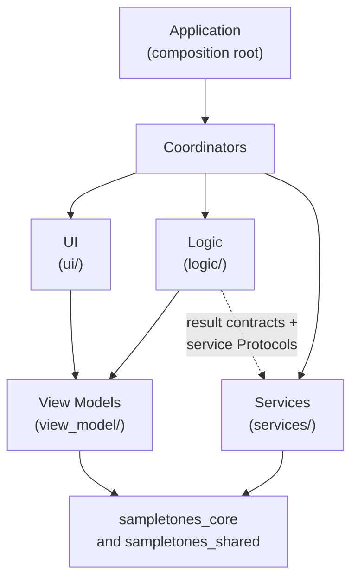

# Application Architecture

This document describes the design of `sampletones_application` — the GUI front-end of _SampleToNES_. It is prescriptive: it states the contracts each layer must honor, in the form they are enforced, and the rationale behind them. Use it as the reference when deciding where new code belongs.

Concrete classes and modules appear throughout as **examples** that anchor a rule; the rules bind every instance, named or not. Known deviations from these contracts are tracked in [`bugs-and-todos.md`](bugs-and-todos.md). The rules for code and docstrings are in [`guidelines.md`](guidelines.md), and the subsystems that carry a design document of their own are listed in [`docs/index.md`](../index.md).

---

## Overview

`sampletones_application` is a [DearPyGui](https://github.com/hoffstadt/DearPyGui) application that exposes the `sampletones_core` audio-reconstruction engine through a multi-tab GUI. Four layers with clearly bounded responsibilities structure the code — **UI** (widget construction), **view models** (immutable projections), **logic and services** (domain state and background work), and **coordinators** (orchestration) — with dependencies flowing in one direction only. A single composition root (`Application`) constructs and wires all components at startup.

---

## Design Principles

These principles govern every structural decision in the codebase.

### 1. Layering: dependencies flow inward

Each layer imports only from the layers below it. Coordinators, at the top, reach every layer they orchestrate. The UI layer knows only view models and shared utilities. Logic owns domain state and produces view models. Services, at the bottom of the application stack, know only the core libraries and thread-safe utilities — a service is driven through a logic-side `Protocol` and reports through its result-contract types, so even logic reaches a service only through inversion.

The load-bearing prohibitions: nothing in `logic/` or `services/` imports `ui/` or `coordinators/`, and `services/` imports neither `logic/` nor `view_model/`. Which layer may reach which is declared in `sampletones_config/boundaries/rules.yaml`, one rule per layer, and the boundary check holds the tree to it (see Enforcement).

### 2. DPG stays in the visual layers

Calls into `dearpygui` are confined to `ui/`, `shell.py`, and the narrow coordinator surface the Layer Contracts name. The `logic/`, `services/`, `view_model/`, and `config/` layers remain DPG-free so they can be instantiated and tested without a running GUI context. This extends past `import dearpygui`: the dpg-bound helpers (`DialogsRenderer`, the `dpg_*` wrappers, fonts, tooltips, shortcuts, keyboard routing, frame callbacks) are grouped under `utils/gui/`, and the non-visual layers may use only the dpg-free helpers that live directly under `utils/` (e.g. `utils/callbacks/`).

### 3. No UI state in logic

Managers and controllers hold domain state only: file paths, dirty flags, domain objects. Widget visibility, button labels, and progress percentages are UI state, and every UI-ready projection is computed by a view model at the moment it is built.

### 4. View models are immutable snapshots

A view model captures the exact state needed to render one panel at one moment in time — a Pydantic `frozen=True` model produced by the logic layer and consumed by a panel's `update_view()` method. Derived UI flags (button enabled, sub-panel visible) are `@property` computations on the view model, not stored fields. A frozen dataclass is acceptable where the payload does not suit Pydantic validation (`WaveformData` carries numpy arrays).

This means the UI layer can never be in an inconsistent state: it always reflects the last view model it received, and the view model is self-consistent by construction.

### 5. Panels communicate via optional callback hooks

A panel never calls coordinator or logic methods directly. Instead it exposes public optional callback attributes (`on_x: Optional[Callback] = None`) that coordinators set during wiring. The panel fires them through `CallbackMixin.call()`, which notes a hook left unset at debug and yields `None`, so partial wiring during construction reads as the expected condition it is.

A hook the panel consults for state rather than notifies of an event is read through `CallbackMixin.query()`, which preserves the hook's declared return type and takes the answer to assume while the hook is unset. A widget parameter or branch fed by such a hook therefore receives a value of its expected type at every moment, including the window before wiring completes.

This decouples widget construction (which happens during `create_panel()`) from the moment wiring takes place (which happens in the coordinator's constructor), and lets panels be instantiated without any coordinator present.

### 6. DearPyGui's context belongs to the render thread

The thread that created the DearPyGui context is the only one that may build, configure, or destroy an item, and an item freed from another thread is freed with no Python thread state — a crash rather than a glitch. So work reaching the interface from anywhere else arrives on that thread first, through a crossing named for what it carries: a background result is queued for the render loop to drain, a worker's touch of a widget goes through `on_render_thread`, and a gesture DearPyGui gathered is run at the top of a frame. A crossing that would hold the frames up puts its waiting on a thread of its own, and work that needs a drawn frame names the frame it is picked up on. The four crossings, the helpers that make them, and the hazard each one answers are in [`render-thread.md`](application/render-thread.md).

### 7. Construction flows from the composition root

`Application.__init__` constructs the application graph — managers, controllers, shared services, coordinators, the shell — and wires their callbacks. A tab coordinator in turn constructs the panels, logic objects, and tab-scoped services it owns. Beyond these two sites, no component constructs another major component: every dependency arrives as a constructor argument, and none is obtained through a global lookup.

**Where a run keeps its settings arrives the same way.** The application is given a `UserProfile` — the pair of files its configuration and its session state live in — and hands each path to the manager that reads and writes it. The entry point names the user's own profile through `UserProfile.user()`, which leaves one place that knows the shipped locations and lets a run be pointed at a location of its own.

### 8. All display text comes from `LanguageManager`

Every user-visible string is looked up on `LanguageManager` by the key the language file spells — `page.panel.text_type.element` — and resolves at the point of use, so a language change takes effect on the next read. `en.yaml` is a flat map keyed exactly this way, which makes the text system the single source of truth, lets a reader hold a key against the language file by eye, and enables future localization. A lookup states its key in a form the `language-keys` hook can read, so every key the code spells names an entry and every entry the file holds is reached. The grammar, the forms a lookup takes, and where each element enum lives are in [`vocabularies.md`](application/vocabularies.md). Log messages are developer-facing and exempt.

### 9. `tags/` holds only DPG identifiers

The `tags/` package contains only DPG widget string identifiers: `TAG_*` whole tags, and `SUF_*`/`PRE_*` fragments that compose into them. Dimensions, colors, timings, and display strings live in YAML configuration loaded at startup (`layout/`). Every tag reaches its final spelling through one composer, and a constant's name states the tag it composes, which the `tag-names` hook holds it to. The composer, the `TagName` spelling, and the rules a fragment follows are in [`vocabularies.md`](application/vocabularies.md).

### 10. Exclusive operations expose a lifecycle-accurate active state

Some operations are mutually exclusive — typically because they are resource-intensive (background worker pools) and running two at once would exhaust memory or contend for a device. Each such operation exposes an `is_active` signal derived from its **own state machine**, true from the moment the operation is *requested* through to its teardown, including any preparatory phase before the background work begins. A signal that starts at the moment of request is the only one that covers the operation's full span; anything derived downstream (such as whether a worker has actually started) opens a window in which a competing operation can slip in.

The composition root composes the per-operation signals into a single *busy authority* — the one source of truth, consulted in two places:

- **UI enablement** — panels disable the controls that would start a competing operation.
- **Start-time guards** — each operation's entry point consults the authority and declines to start while another operation is active, so exclusivity holds even when a control is reached outside the normal UI path.

A new exclusive operation joins by contributing its `is_active` to the authority and adding a start-time guard; no per-call-site bookkeeping is needed. The authority stores nothing — it is recomputed from the live operations on demand.

### 11. Platform and external-tool differences hide behind a backend Protocol

Where behavior depends on the operating system, the desktop environment, or an external command-line tool, that variation is expressed as a `Protocol` with one implementation per target, chosen by a runtime factory — never as platform branches scattered through the callers. The factory probes availability (`locate_program`) and environment (`System.current()`, `XDG_CURRENT_DESKTOP`) and returns the implementation that fits; callers depend only on the Protocol and read identically on every platform.

Each tool's quirks stay sealed inside its own implementation and are named in that class's docstring, where a reader meets them beside the code they explain; the guarantee callers depend on — that a saved file carries one of the offered extensions — is enforced once in the API layer above every backend. `utils/file_dialogs/` applies this to native file dialogs: a `FileDialogBackend` Protocol in `protocol.py`, with desktop-portal, `kdialog`, `zenity`, and `tkinter` implementations under `backends/`, selected by `select_file_dialog_backend()`. `sampletones_tools/calibration/referee/` follows the same shape with its `build_referees()` factory.

Ordering the implementations is part of the factory's job: where several are available, the one that expresses the most wins. A save offering several file types is answered by the portal because it alone reports which type was chosen, so an export names its format in the type selector; a backend answering with a name alone leaves the extension to be read from the name, and the API layer settles it either way.

### 12. One dispatcher owns the keyboard

DearPyGui gives every key handler the same global reach, so priority and consume semantics exist where the application builds them. A single `KeyRouter` (`utils/gui/keyboard/`) owns the one `add_key_press_handler` for the whole application and offers each press to registered **scopes** from highest priority to lowest; the first active scope that claims the press ends the walk. Three priorities order the application — a modal dialog above a sequencer sub-panel above the application shortcuts — and each consumer registers one scope stating when it wants keys and which presses it claims.

A binding is declared once and read by everyone who prints or fires it: `ShortcutId` names the action together with the category that answers it, and the scheme under `sampletones_config/keybindings/` decides the combination, so a printed key and the handler behind it stay in step by construction.

The router is constructed at the composition root and injected into every consumer (principle 7). The scopes, the focus query, the modal stack, the key vocabulary, and how a scheme is chosen, layered, and edited are in [`keyboard.md`](application/keyboard.md).

### 13. A color is a token, resolved where it is drawn

A color is written as a palette token and stays one until it reaches DearPyGui. `BaseColor` (`utils/palette/colors/`) carries what was written, and its `rgba` property answers with the palette active at the moment of the read, so whoever holds the color follows a palette swap. Every annotation names `BaseColor`; the read happens where the value is handed to a widget, and what a consumer keeps is the token. What DearPyGui has already taken a copy of is registered with `PaletteBindings` rather than remembered by whoever set it, so a palette change is one switch. The `palette-colors` hook holds all three rules (see Enforcement); the color forms and the switch itself are in [`palette.md`](application/palette.md).

### 14. An action is declared once; whoever shows it prints it

An **action** is one `ShortcutId` — the name a key press, a menu item, and a context item all reach one behavior by. Declaring one is a chain of four links: the action and the category that answers it, its keys in every shipped scheme, the one call it makes, and the label the keybindings editor lists it by. The `shortcut-actions` check holds every link (see Enforcement).

A menu item is a view of an action: `ShortcutManager.add_menu_item(shortcut_id, ...)` takes both the accelerator and the call from the action and keeps the item under it, so a rebind re-prints the key already on screen. A set of actions several menus show is stated by one builder belonging to whoever owns them, and each door decides where to print it. A menu whose contents follow a selection states them when it is opened. The four links, the kinds of action that state their call differently, and the mechanism behind a restated menu are in [`keyboard.md`](application/keyboard.md).

---

## Enforcement

Two mechanisms keep the codebase aligned with this document.

**Import-expressible contracts are enforced by a check.** `sampletones_config/boundaries/rules.yaml` declares one rule per layer — the prefixes it may reach, and the ones it may not. That file states where each boundary runs, and this document says what the boundary is for. The same domain holds the order the repository's packages import each other in, and the layering inside `sampletones_player`; [`packages.md`](packages.md) states what those boundaries mean. A rule names the prefixes it reaches through the groups `boundaries/general.yaml` declares, so the interface several layers stay clear of is written once and each rule names it. Where a layer may consume another layer's data contract while its implementation stays out of reach — logic and the service result types — the rule names the contracts group that stays in reach.

Three parts share the work: `sampletones_config/boundaries/` declares what the boundaries are, `sampletones_tools/checks/boundary/` holds how they are read and reported, and `sampletones check import-boundary` runs them over the source and scripts trees. The hook audits the entire source tree on every commit (`--all`), so strengthening a rule surfaces violations in files a commit never touched. That property sets the working idiom for structural refactors: turn the stricter rule on first, and let the failing hook enumerate the remaining work.

**The identifier vocabularies, the declarations that complete them, and the shapes a case may not take are enforced the same way.** Each is a `sampletones check <name>` command under `sampletones_tools/checks/`, run whole-tree as a pre-commit hook, and the principle a check holds names it where that principle is stated. The checks read the source as an AST through the source layer in `sampletones_tools/checks/source/`, which discovers modules, resolves the receiver a subscript sits on, and expands an enum-annotated key part to its members; the palette and shortcut checks read the shipped YAML beside it. That layer derives each package directory from its own location and reports a root it finds nothing at, so a check that sweeps nothing fails loudly where it would otherwise pass clean. Because the checks are global by nature — a dead entry and an unread fragment are both absences — the hooks pass whole-tree rather than filenames.

**Behavioral contracts are enforced by review.** Contracts a grep cannot see — where state lives, which methods touch DPG, how errors travel — are upheld in code review against this document. A change that alters one of them lands with the edit stating the new contract, and one that knowingly leaves a distance behind lands with an entry in [`bugs-and-todos.md`](bugs-and-todos.md) § Architecture; [`documentation.md`](documentation.md) § Upkeep holds that rule. The ledger, rather than the codebase, is the memory of what is currently out of line.

---

## Layer Contracts

### `ui/` — View layer

Constructs and updates the DearPyGui widget tree. A panel owns its DPG tags and the widget subtree rooted at `self.tag`.

- A panel creates its entire widget tree in one call to `create_panel(parent)`, rooting its subtree at `self.tag` inside the coordinator-injected `parent`, and calls DPG afterward only in `update_view()`, `update_*` methods, and event callbacks wired by DPG itself.
- Panels hold only visual state: their tag, their child widget references, and layout dimensions. Domain objects stay in logic; panels receive projections of them.
- A panel never encodes its own placement: it does not compose a column tag (`SUF_PANEL_*`) as its parent, and it never hosts a sibling panel. Tab layout belongs to the coordinator. Where a section is a card, one card is one panel is one module; the coordinator declares which cards a tab contains and how they are arranged.
- Structural depth themes are bound only by the layout primitives. The `TabColumns` scaffold binds each column its declared depth theme — recessed GROUND for a column hosting a stack of floating cards, raised SURFACE for a full-height column that is itself a single docked surface (a file tree, an instrument list) — the `card()` context manager binds SURFACE to a card, and `well()` binds recessed GROUND to a padded region sunk inside one, so a list reads as one body rather than as content loose on its card. Panels and coordinators bind the semantic and content themes alone (a per-channel checkbox tint, the player toolbar).
- Every mutation from outside goes through `update_view(view_model)` or through a direct DPG call (`dpg_configure_item`, `dpg_set_value`) triggered by an `update_*` method.
- Callback wiring from coordinators sets public `on_x` attributes *after* construction, so a panel tolerates unset hooks until wiring completes.
- Hooks and view models are how a panel reaches state. A widget that queries per-item state *while it draws*, where projecting the whole collection per repaint would be disproportionate, declares one consumer-owned `Protocol` of exactly the queries that draw makes (e.g. `TreeLogicProtocol`, through which the file trees query per-node favorite and playability state); the owning coordinator constructs the real logic object and injects it, and the panel types against the Protocol. One panel holds one such Protocol: a second is the sign that the panel holds two jobs, and the panel divides.
- Dialog presentation belongs to coordinators: a panel fires an intent hook, and the owning coordinator renders the dialog via `DialogsRenderer` with text resolved there. Reusable modal *editing* windows subclass `GUIWindow`, follow the ordinary panel contracts, and hold to the geometry contract in [dialogs](application/dialogs.md).

---

### `view_model/` — Projection layer

A view model is the UI's contract with the logic layer: it states exactly what data a panel needs to render itself, pre-computed and immutable.

- All view model classes are frozen (see principle 4). A new instance is produced on each logical state change.
- Derived UI flags (`button_enabled`, `panel_visible`, `is_done`) are `@property` computations rather than stored fields, so two readings of one state agree by construction.
- A view model carries what a panel renders, and hands out projections a panel can read alone.
- Edit payloads — frozen `*Update` models a panel emits through its `on_*_changed` hooks — also live here: they are the UI's outbound contract, the mirror of view models.
- Domain data containers (frozen dataclasses that wrap core types and are used across logic and services) belong in `logic/`. A type belongs in `view_model/` only if its purpose is to carry data across the UI boundary — a panel-feeding snapshot, an edit payload, or a projection a display renders (`WaveformData`).

---

### `logic/` — Domain layer

Owns domain state and implements the state-machine transitions that govern it, knowing nothing of the UI framework.

*Managers* own a domain object's lifecycle (load, save, close). They hold the current object, a `Session` that tracks dirty state, and fire `CallbackMixin` callbacks when the state changes.

*Controllers* are thin mutation façades over a manager. `ProjectController` exposes named, typed mutation methods (`set_title`, `add_sample`, …) and emits a finer-grained callback per mutation kind (`on_info_changed`, `on_samples_changed`, …), so the UI answers exactly what changed. `ProjectController.batch()` widens that grain to a whole gesture: each mutation still applies the moment it is made, while the callbacks it raises wait for the scope to close and then arrive once each, so a gesture writing hundreds of rows rebuilds its subscribers once.

*Logic objects* (e.g. `ConverterLogic`) orchestrate multi-step workflows within a feature area. They subscribe to services and translate service results into view model updates.

- Logic classes produce view models and may therefore import `view_model/`. They call no DPG.
- Callbacks are declared as optional attributes and invoked via `CallbackMixin.call()`.
- Session objects are simple state machines; they fire `on_state_changed` when they transition, without knowing who listens.
- A logic object that drives a service declares a logic-side `Protocol` of exactly the calls it needs (e.g. `ConversionServiceProtocol`) and receives the real service from its coordinator or the composition root, so structural typing keeps the dependency inverted.

---

### `services/` — Async worker layer

Runs long operations (file conversion, waveform regeneration, export, playback synthesis) on background threads and delivers typed results to the render thread.

- Every service inherits `ServiceBase[ResultType]`, which provides `subscribe(handler)`, `unsubscribe(handler)` and `_emit(result)`.
- `_emit` posts the result to `CallbackQueue`, which is what puts every handler on the render thread (principle 6).
- Result types are a tagged union of `ServiceStarted`, `ServiceProgress`, `ServiceIntermediate`, `ServiceSuccess`, `ServiceError` and `ServiceCanceled`, so a subscriber matches exhaustively.
- A service is one subpackage holding `service.py` and `result.py`, so its implementation and the contract its subscribers type against are reached separately; the generic contracts every service reports through are `services/result.py`. `ServiceProgress.fraction` is the one reading a bar draws — see [`progress.md`](progress.md).
- A service knows no panel, view model or logic object.

---

### `coordinators/` — Orchestration layer

Coordinators are the glue between the UI, logic and service layers. Each owns the panels and logic objects for one feature area, wires their callbacks, and handles the cross-cutting concerns around them: dialogs, navigation, session state.

*Domain coordinators* manage a concern that spans the whole application lifecycle: `ProjectCoordinator` (project file I/O, save confirmations), `PlaybackRouter` (the single transport over the shared output device, acting on the active tab's source or the engaged one — see [`playback.md`](application/playback.md)), `EditRouter` (the single edit surface behind the menu bar's Edit menu, which shows the actions of the grid holding the cursor — see [`sequencer-blocks.md`](application/sequencer-blocks.md)).

*Tab coordinators* own everything for one tab: they instantiate its panels, logic objects and tab-scoped services, wire their callbacks together, and provide `create_tab()`. Each presents a narrow public API of intent-level methods (`set_input_path`, `display_reconstruction`, …) and keeps its panels and logic objects private.

`create_tab()` is the sole authority for the tab's layout: it declares the column and card arrangement through the shared `ui/elements/layout` primitives and injects each panel's parent container via `create_panel(parent)`. It builds widgets alone — pushing the first view models and refreshing trees runs afterward, from the coordinator's post-build initialization, once the whole tree exists.

- A coordinator touches DPG on a narrow, closed surface: inside `create_tab()`, and when building dialog content inside a closure passed to `DialogsRenderer.show_modal`. A dialog that must wait for the next frame is deferred through `FrameCallbackManager`. All other presentation goes through `DialogsRenderer`.
- File selection runs through OS-native dialogs, which live outside DPG. A coordinator opens one via `utils/file_dialogs` — a synchronous call that returns once the user picks a path or cancels — resolves the dialog title and filter name from `LanguageManager`, and routes the returned path through a handler decorated with `@ignore_none_path`, so each handler body runs with a real path and a canceled dialog passes quietly. The backend is chosen at runtime, so a coordinator names no platform (principle 11).
- A coordinator holds no domain state. It delegates reads and writes to the managers and controllers it was given; what it caches is presentation wiring — resolved language strings, panels, logic objects, callbacks.
- Callbacks received from `Application` as constructor parameters are stored and forwarded as they stand. A wrapper is sanctioned where a contract requires an intent-level guard — a busy-authority start-time guard (principle 10) wrapping an operation's entry point — and that guard is the whole of what the wrapper holds. A wrapper that renames a call, reorders its arguments, or adds a step of its own is the coordinator taking on work that belongs to the logic object the call reaches.
- Error dialogs, confirmations and notices are presented here, with text resolved from `LanguageManager` here (see the Error Handling Policy).
- An export format with choices of its own opens its setup where the save dialog would otherwise ask for the file. The composition root builds one mapping from each such format to its `ExportSetup` (`coordinators/export/setup.py`), and every surface offering an export consults it first, so a surface names no format and a format gains a setup in one place.

---

### `application.py` and `shell.py` — The root and the frame

`Application` creates every object in the application and wires all callbacks, and does nothing besides. It is the only constructor that may create several kinds of coordinator (principle 7). It delegates every domain decision: each of its private methods either forwards an event to a coordinator or joins two coordinators that hold no reference to each other.

`ApplicationShell` owns the DearPyGui context lifecycle, the primary window, the tab bar, the shortcut system and the utilities around them — status bar, FPS timer, audio settings window. It carries out no domain operation, and imports neither `logic/` nor `services/`: it reaches domain behavior through the coordinators and callbacks it was handed.

---

### Supporting packages

`config/` holds `ConfigManager` (the domain generation configuration) and `SessionManager` (the runtime session: last paths, audio device, window geometry). A session file outlives the files and folders it names, so each path it holds is read against the disk where it is used: a dialog opens at the nearest folder still standing, and a file that fails to open is let go of as it fails. The package is presentation-free — it records a load outcome as domain data (`ConfigLoadOutcome`) for `ConfigCoordinator` to present.

`categories/` holds `LanguageManager` and the vocabulary a lookup is spelled in (principle 8). It also holds the message bundles that resolve a whole conversation's words in one place, so a coordinator reads its texts once and hands the bundle to whoever phrases the outcome.

`constants/` holds application-scope facts that carry no behavior, one module per subject. A fact shared beyond the application belongs to `sampletones_shared/constants/`.

---

## Error Handling Policy

Each layer has a distinct role in the error-handling chain. The rule of thumb is: **errors propagate up until they reach a layer that can recover meaningfully and communicate the result to the user.**

### Logic and managers — propagate

Logic classes and managers catch an exception only when they can take a concrete recovery action in place (e.g. retrying with a fallback path). I/O errors (`OSError` and subclasses) from file operations propagate directly to the caller. Catching and repackaging an exception without recovery is forbidden by the coding guidelines.

When a manager does recover, it records *what happened* as domain data and lets a coordinator present it. For example `ConfigManager` recovers a malformed configuration by loading defaults and appending a `ConfigLoadOutcome` carrying only domain values; `ConfigCoordinator.present_pending_load_outcomes()` later turns each outcome into the matching dialog with text from `LanguageManager`.

### Services — the only legitimate broad catch

Services run tasks on background threads. If an unhandled exception escapes the worker, the thread dies silently and `CallbackQueue` never delivers the result. For this reason, `ServiceBase` subclasses must catch the exception at the outer boundary of the async task, wrap it in `ServiceError`, and emit it through `CallbackQueue`. This is the **only** place where catching non-specific exception types is permitted, and it must sit in the top-level task wrapper rather than in helper methods.

### Coordinators — the recovery boundary

Coordinators own the decision of what to do when an operation fails. They:

- Catch **specific exception types** named by the domain or I/O layer (`OSError`, `LoadReconstructionError`, etc.).
- Present failures to the user via `DialogsRenderer` rather than propagating them further.
- Handle `ServiceError` results from the tagged union returned by async services.

A coordinator must catch precisely: broad catches (`except Exception`, bare `except`) and deferred typing (`# TODO: specify exception type`) are guideline violations.

### UI layer — errors arrive as data

Panels perform no error handling. All error conditions arrive as data through coordinator-wired callbacks (`on_error: Optional[Callable[[Exception], None]]`), and a panel may display an error state derived from a view model. Dialog presentation likewise belongs to the coordinator: the panel fires an intent hook, the coordinator presents (see the `ui/` contracts). The one catch permitted inside `ui/` is the widget-level input-validation guard — parsing user keystrokes into a value or `None`. Classifying a rendering failure into a typed domain error, and recovering from it, is a coordinator concern: `InstructionsTabCoordinator._render_instruction` catches the concrete plotting failures (`KeyError`, `IndexError`, `ValueError`) and re-raises them as one `LibraryDisplayError`, which its recovery boundary `_on_instruction_loaded` presents.

---

## Naming Conventions

| Kind | Convention | Example |
|------|-----------|---------|
| Panel class | `GUI<Feature><Role>Panel` | `GUIConverterPanel` |
| Window class | `GUI<Feature>Window` | `GUIAudioSettingsWindow` |
| ViewModel class | `<Feature><Component>ViewModel` | `ConverterViewModel` |
| Coordinator class | `<Feature>Coordinator` or `<Feature>TabCoordinator` | `ProjectCoordinator`, `MainTabCoordinator` |
| Manager class | `<Domain>Manager` | `ReconstructionManager` |
| Controller class | `<Domain>Controller` | `ProjectController` |
| Service class | `<Domain>Service` | `ConversionService` |
| DPG widget tag | `TAG_` + the composed tag, upper-cased | `TAG_MAIN_CONFIG_TABLE_CONFIG_ROW` (`main.config.table.config_row`) |
| Tag suffix | `SUF_<ROLE>` | `SUF_PANEL_LEFT` |
| Tag prefix | `PRE_<ROLE>` | `PRE_RECONSTRUCTION_CHANNEL` |
| Text key | `page.panel.text_type.element` | `global.dialog.label.ok` |
| Panel callback hook | `on_<event>` attribute | `on_convert_requested` |
| Panel state hook | `can_<action>` or `<action>_<subject>` attribute | `can_add_to_sequencer`, `replace_in_sequencer_label` |
| Logic callback | `on_<event>` attribute | `on_view_changed` |
