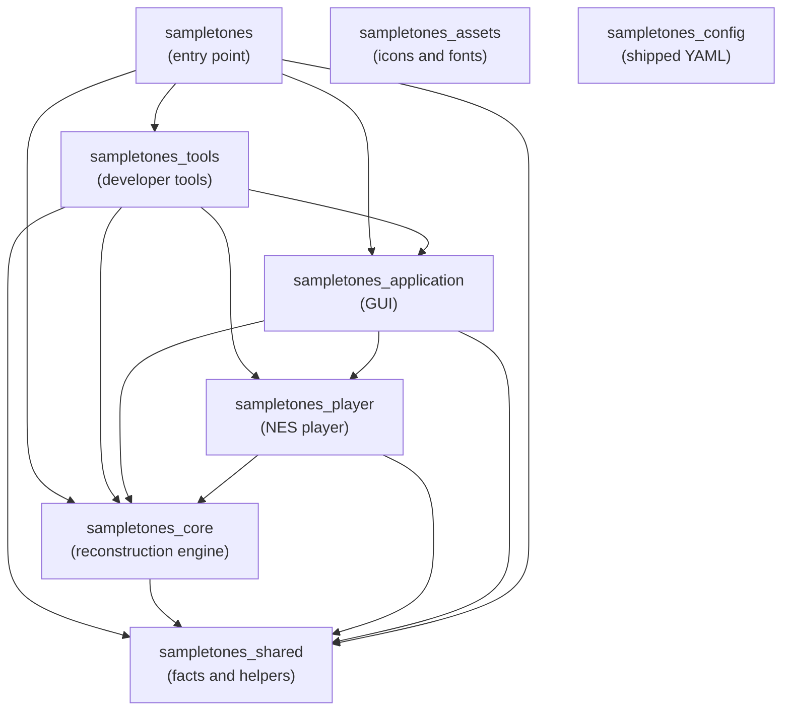

# Package Layers

_SampleToNES_ is one repository holding several packages under `src/`, ordered so that dependencies run
one way. This document says what each package is for and why the order runs as it does. Read it when
deciding where a module belongs. `sampletones_config/boundaries/graphs.yaml` declares the order itself, in
the form the import-boundary check runs on every commit.

The layering of `sampletones_application` has its own document, [`architecture.md`](architecture.md), which
the same check enforces. [`progress.md`](progress.md) describes how a long operation reports how far it has
come, inside one process and across worker processes.

---

## The package graph

| Package | What it holds |
|---------|---------------|
| `sampletones_shared` | Facts and helpers any package holds: constants, exception families, paths, the logger, the array backend, and the command type the entry and the tools share |
| `sampletones_config` | The shipped YAML — layout, palettes, themes, keybindings, language, behavior, deployment, and these boundaries themselves — reached as package data and not by import |
| `sampletones_assets` | The application icons and the bundled fonts, reached as package data |
| `sampletones_core` | The reconstruction engine, the project model, playing a song out into instructions, and the tracker export formats |
| `sampletones_player` | The NES player: the register model, the re-clocking schedule, the 6502 driver and the NSF file |
| `sampletones_application` | The DearPyGui front end |
| `sampletones_tools` | Everything a developer runs and the application does not: the calibration harness, the driver toolchain and the register trace, the source checks, the synthetic corpus, and the developer commands that run them |
| `sampletones` | The command-line entry: the dispatcher, the commands and the startup self-check |

**Only the command line reaches the tools package.** `sampletones_tools` has what a developer runs and the
application never imports: the developer commands and the libraries behind them. `sampletones` is its one
importer. It appends the developer commands to the user commands, so the wheel and the bundle carry the
tools and no shipped package depends on them. [Tooling](tooling.md) says what a tool is and what a
developer command does in an installed copy.

**The reconstruction engine sits below the console player.** A reconstruction is produced, saved and
exported to a tracker with `sampletones_player` absent from the process. That lets the player's format move
while the engine holds still. An export backend that reaches the console (the interface described in
`sampletones_core/exports/backend.py`) is therefore registered from above and not from the engine's own
registry.

**A song is played out once, for every reader of it.** `sampletones_core/performance/` turns an
arrangement into the instruction each channel sounds on each engine tick. It walks the order frame by
frame. A row's note column starts a voice, and the row's transpose and volume bend what that voice carries.
A voice with a loop point circles, and one without falls silent. One reading answers for both kinds of
voice: a sample plays the frames its conversion found for the channel, and a hand-written instrument plays
the frames its envelopes make of it.

The sequencer renders those instructions to audio, and the player encodes them into register values. What
a listener hears and what the console plays are therefore the same walk read two ways, and not two
implementations of one rule. A voice sounded on its own, such as a preview or an audition at a note a key
names, takes the same two steps a row takes. It lives in `performance/` too, and not beside whichever
surface asked.

**Equal temperament sits at the bottom.** The MIDI pitch limits and the A4 reference are in
`sampletones_shared/constants/music.py`, and the pitch-to-frequency conversion they govern is in
`sampletones_shared/utils/frequencies.py`. The synthesis package can therefore read them without reaching
up into the engine. `sampletones_core/utils/frequencies.py` keeps what is the engine's own: the project's
usable pitch range, the noise periods, and the note and period names.

---

## Inside `sampletones_player`

The player divides into units layered the same way, and for the same reason: a register value, a clock and
a song exist independently of the file they are written into or the driver that reads them.

- The specification sits at the bottom. It holds the addresses, control bits and offsets the format is
  written by.
- The clock, the per-tick register values and the codec stand on it.
- `Song` gathers what a file carries into one value.
- `builder.py` is the one place a song is made, whatever asked for it.
- `nsf/`, `driver/` and `export/` sit at the top, where a song becomes the file the console loads.

[The console player](player.md) says what the player is for and what holds it correct.

### The toolchain and the oracle live with the tools

The driver's assembler and the register trace live in `sampletones_tools/player/`, because exporting needs
neither. The assembler builds the committed `driver/binary/driver.bin` from the assembly sources beside it.
The tests rebuild the sources wherever cc65 is installed and hold the committed image to them.
`RegisterTrace` says what the driver is expected to write, call by call, and the emulator tests hold the
assembled driver to it. Exporting reads the assembled binary. The wheel carries the assembly sources
beside it, inside the tools package. [`dependencies.md`](release/dependencies.md) describes the toolchain
the build needs.

---

## Enforcement

`sampletones_config/boundaries/graphs.yaml` declares both graphs as layer tables: each unit and the units it
may import. The rule the check runs derives from them. Every unit a table leaves out is out of reach, so an
edge is declared before it is taken. Adding an edge to a table opens a new dependency, and removing one
lists the work of closing it. A graph names the repository's own packages, and a third-party import is the
package author's own choice. [Architecture](architecture.md#enforcement) describes the mechanism and the
working idiom that follows from a whole-tree check.

A graph is checked for well-formedness as it is read. A unit reaching a unit the graph leaves undeclared is
refused. So is a graph whose units reach themselves, since a unit's layers state a level only where the
units stand in an order.

Token rules hold the shipped packages to the tools edge a second way. A module of
`sampletones_application`, `sampletones_core`, `sampletones_player`, `sampletones_shared` or
`sampletones_assets` that spells `sampletones_tools` at all is reported, so the edge is closed in words as
well as in imports.

A bootstrap script runs on the system interpreter, so the scripts tree has a rule of its own,
`boundaries/standalone.yaml`. A script imports the standard library and the scripts tree itself. A name in
that tree that stands in for a standard-library module is reported too, since the tree sits on the import
path. [Tooling](tooling.md) states the principle.
