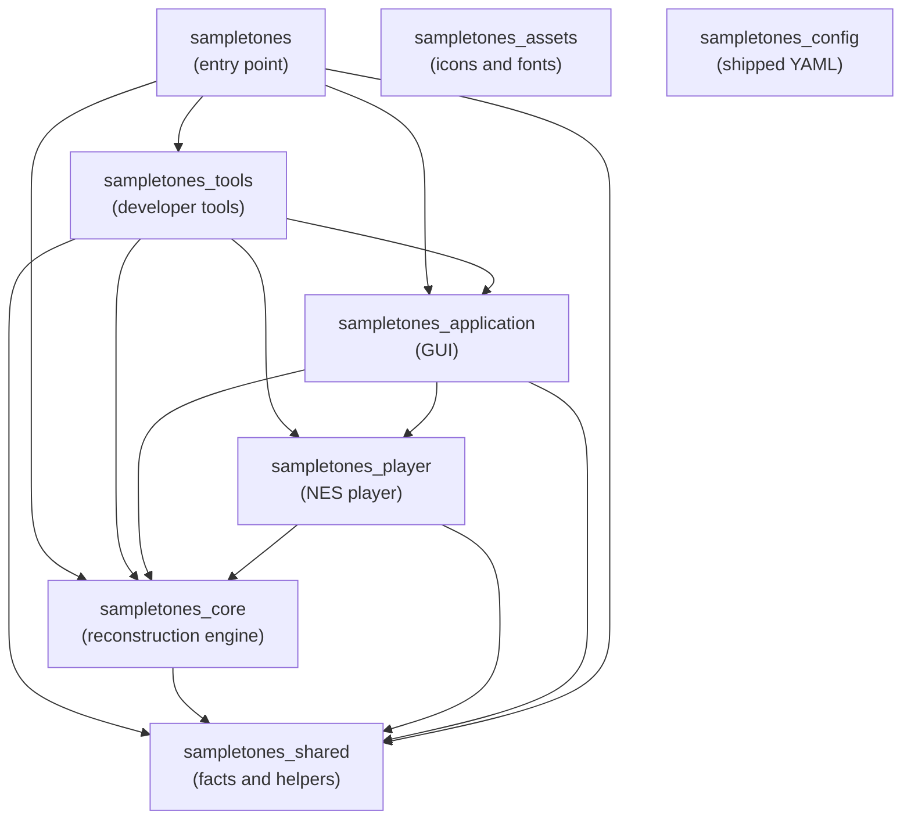

# Package Layers

_SampleToNES_ is one repository holding several packages under `src/`, ordered so that dependencies
run one way. This document states what each package is for and why the order runs as it does.
`sampletones_config/boundaries/graphs.yaml` declares the order itself, in the form the
import-boundary check runs on every commit.

The layering of `sampletones_application` has its own document,
[`architecture.md`](architecture.md), which the same check enforces. How a long operation reports how
far it has come — inside one process and across the pool's workers — is [`progress.md`](progress.md).

---

## The package graph

| Package | What it holds |
|---------|---------------|
| `sampletones_shared` | Facts and helpers any package holds: constants, exception families, paths, the logger, the array backend, and the command type the entry and the tools share |
| `sampletones_config` | The shipped YAML — layout, palettes, themes, keybindings, language, behavior, deployment, and these boundaries themselves — reached as package data rather than by import |
| `sampletones_assets` | The application icons and the bundled fonts, reached as package data |
| `sampletones_core` | The reconstruction engine, the project model, playing a song out into instructions, and the tracker export formats |
| `sampletones_player` | The NES player: the register model, the re-clocking schedule, the 6502 driver and the NSF file |
| `sampletones_application` | The DearPyGui front end |
| `sampletones_tools` | Everything a developer runs and the application does not: analytic waveform synthesis, the calibration harness, the driver toolchain and the register trace, the mark the icons are drawn from, the source checks, the synthetic corpus with its sample emitters, and the developer commands that run them |
| `sampletones` | The command-line entry: the dispatcher, the commands and the startup self-check |

**The tools package is reached from the command line alone.** `sampletones_tools` holds what a
developer runs and the application never imports: the developer commands and the libraries behind
them. `sampletones` is its one importer, appending the developer commands to the user commands, so
the wheel and the bundle carry the tools and no shipped package depends on them.
[Tooling](tooling.md) states what a tool is and what a developer command does in an installed copy.

**The reconstruction engine stands below the console player.** A reconstruction is produced, saved
and exported to a tracker with `sampletones_player` absent from the process, which is what lets the
player's format move while the engine holds still. The consequence is that an export backend
reaching the console — the seam `sampletones_core/exports/backend.py` describes — is registered
from above rather than from the engine's own registry.

**A song is played out once, for every reader of it.** Turning an arrangement into the
instruction each channel sounds on each engine tick — the order walked frame by frame, a row's note
column starting a voice, its transpose and volume bending what that voice carries, a voice with a
loop point circling where one without falls silent — is `sampletones_core/performance/`. One
reading answers for both kinds of voice: a sample plays the frames its conversion found for the
channel, a hand-written instrument the frames its envelopes make of it. The sequencer renders
those instructions to audio and the player encodes them into register values, so what a listener
hears and what the console plays are the same walk read two ways rather than two implementations of
one rule. A voice sounded on its own — a preview, an audition at a note a key names — takes the
same two steps a row takes, so it lives there too rather than beside whichever surface asked.

**Equal temperament sits at the bottom.** The MIDI pitch limits and the A4 reference are
`sampletones_shared/constants/music.py`, and the pitch-to-frequency conversion they govern is
`sampletones_shared/utils/frequencies.py` — so the synthesis package reads them without reaching up
into the engine, and `sampletones_core/utils/frequencies.py` keeps what is the engine's own: the
project's usable pitch range, the noise periods, and the note and period names.

---

## Inside `sampletones_player`

The player divides into units layered the same way, and for the same reason: a register value, a
clock and a song exist independently of the file they are written into or the driver that reads
them. The specification sits at the bottom, holding the addresses, control bits and offsets the
format is written by; the clock, the per-tick register values and the codec stand on it; `Song`
gathers what a file carries into one value; `builder.py` is the one place a song is made, whatever
asked for it; and `nsf/`, `driver/` and `export/` sit at the top, where a song becomes the file the
console loads. What the console player is for, and what holds it correct, is
[the console player](player.md).

### The toolchain and the oracle live with the tools

`sampletones_tools/player/assembler/` runs `ca65` and `ld65` over the assembly sources, their
includes and the linker configuration in `sampletones_tools/player/assembly/`, read as package
data, to produce the committed `driver/binary/driver.bin`; `uv run sampletones driver` runs it,
and the tests rebuild the sources and hold the committed image to them wherever cc65 is
installed. `sampletones_tools/player/trace/` holds `RegisterTrace`, what the driver is expected
to write call by call, which the emulator tests hold the assembled driver to. Exporting reads the
assembled binary; the wheel carries the assembly sources beside it, inside the tools package. The
toolchain the build needs is described in [`dependencies.md`](release/dependencies.md).

---

## Enforcement

`sampletones_config/boundaries/graphs.yaml` declares both graphs as layer tables — each unit and the
units it may import — and the rule the check runs derives from them: every unit a table leaves out is
out of reach, so an edge is declared before it is taken. Adding an edge to a table is how a new
dependency is opened, and removing one enumerates the work of closing it. A graph names the
repository's own packages, and a third-party import is the package author's own choice. The
mechanism, and the working idiom that follows from a whole-tree check, are in
[architecture](architecture.md#enforcement).

A graph answers for its own well-formedness as it is read: a unit reaching a unit the graph leaves
undeclared is refused, and so is a graph whose units reach themselves, since a unit's layers state a
level only where the units stand in an order.

Token rules hold the shipped packages to the tools edge a second way: a module of
`sampletones_application`, `sampletones_core`, `sampletones_player`, `sampletones_shared` or
`sampletones_assets` that spells `sampletones_tools` at all is reported, so the edge is closed in
words as well as in imports.

The scripts tree is held to a rule of its own, `boundaries/standalone.yaml`. A bootstrap script runs
on the system interpreter, so it imports the standard library and the scripts tree itself, and a name
in that tree that stands in for a standard-library module is reported too, since the tree sits on the
import path. [Tooling](tooling.md) states the principle.
