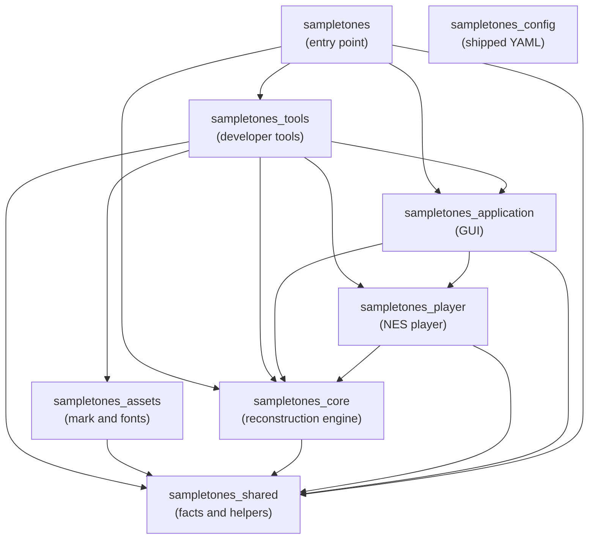

# Package Layers

_SampleToNES_ is one repository holding several packages under `src/`, ordered so that dependencies
run one way. This document states that order, what each package is for, and how the console player
is layered inside it. It is prescriptive: `sampletones_config/boundaries/graphs.yaml` restates these
tables in the form the import-boundary check runs on every commit, and a divergence between this
document and that configuration is itself a defect.

The layering of `sampletones_application` has its own document,
[`architecture.md`](architecture.md), which the same check enforces. How a long operation reports how far it
has come — inside one process and across the pool's workers — is [`progress.md`](progress.md).

---

## The package graph

| Package | Purpose | May import |
|---------|---------|------------|
| `sampletones_shared` | Facts and helpers any package holds: constants, exception families, paths, the logger, the array backend, the source layer the checks read the tree through, and the schema these boundaries are declared in | — |
| `sampletones_config` | The shipped YAML — layout, palettes, themes, keybindings, language, calibration, and these boundaries themselves — reached as package data rather than by import | — |
| `sampletones_assets` | The application mark and the bundled fonts, with the code that draws the mark | `sampletones_shared` |
| `sampletones_core` | The reconstruction engine, the project model, playing a song out into instructions, and the tracker export formats | `sampletones_shared` |
| `sampletones_player` | The NES player: the register model, the re-clocking schedule, the 6502 driver and the NSF file | `sampletones_shared`, `sampletones_core` |
| `sampletones_application` | The DearPyGui front end | `sampletones_shared`, `sampletones_core`, `sampletones_player` |
| `sampletones_tools` | Everything a developer runs and the application does not: analytic waveform synthesis, the calibration harness, the driver toolchain and the register trace, and the developer commands that run them | `sampletones_shared`, `sampletones_assets`, `sampletones_core`, `sampletones_player`, `sampletones_application` |
| `sampletones` | The command-line entry: the dispatcher, the commands and the startup self-check | `sampletones_shared`, `sampletones_core`, `sampletones_application`, `sampletones_tools` |

Third-party imports are the package author's own choice and stand outside this table.

**The tools package is reached from the command line alone.** `sampletones_tools` holds what a
developer runs and the application never imports: the developer commands and the libraries behind
them. `sampletones` is its one importer, appending the developer commands to the user commands, so
the wheel and the bundle carry the tools and no shipped package depends on them.
[Tooling](tooling.md) states what a tool is and what a developer command does in an installed copy.

**The reconstruction engine stands below the console player.** A reconstruction is produced, saved
and exported to a tracker with `sampletones_player` absent from the process, which is what lets the
player's format move while the engine holds still. The consequence is that an export backend
reaching the console — the seam `sampletones_core/exports/backend.py` describes — is registered
from above rather than from the engine's own registry.

**A song is played out once, for every reader of it.** Turning an arrangement into the
instruction each channel sounds on each engine tick — the order walked frame by frame, a row's note
column starting a voice, its transpose and volume bending what that voice carries, a voice with a
loop point circling where one without falls silent — is `sampletones_core/performance/`. One
reading answers for both kinds of voice: a sample plays the frames its conversion found for the
channel, a hand-written instrument the frames its envelopes make of it. The sequencer renders
those instructions to audio and the player encodes them into register values, so what a listener
hears and what the console plays are the same walk read two ways rather than two implementations of
one rule. A voice sounded on its own — a preview, an audition at a note a key names — takes the
same two steps a row takes, so it lives there too rather than beside whichever surface asked.

**Equal temperament sits at the bottom.** The MIDI pitch limits and the A4 reference are
`sampletones_shared/constants/music.py`, and the pitch-to-frequency conversion they govern is
`sampletones_shared/utils/frequencies.py` — so the synthesis package reads them without reaching up
into the engine, and `sampletones_core/utils/frequencies.py` keeps what is the engine's own: the
project's usable pitch range, the noise periods, and the note and period names.

---

## Inside `sampletones_player`

The player divides into units layered the same way, and for the same reason: a register value, a
clock and a song exist independently of the file they are written into or the driver that reads
them.

| Unit | Purpose | May import |
|------|---------|------------|
| `specification/` | The register addresses, control bits, offsets and address constants the format is written by, one module per subject | — |
| `clock/` | `PlaySchedule` and `FixedPointStep` — the engine ticks one play call advances a stream by | `specification/` |
| `registers/` | The per-tick register values each channel plays, and the four streams together | `specification/` |
| `compression/` | The planes a song separates into, the dictionary its tokens name, and the codec that reads them both ways | `specification/`, `registers/` |
| `song.py` | `Song` — the compressed planes, the timer table, the schedule and the loop point as one value | `clock/`, `registers/`, `compression/` |
| `builder.py` | The song a reconstruction or an export request plays as, its instructions encoded, its planes compressed and its rate scheduled | `song.py`, `registers/`, `clock/`, `compression/` |
| `nsf/` | The song block, the header and the `.nsf` file the console loads | `song.py`, `specification/`, `compression/`, `driver/` |
| `driver/` | The assembled 6502 driver and the addresses its build reports | `specification/` |
| `export.py` | `NSFBackend` — the export seam answered in `.nsf` files, holding the driver every one of them carries and saying which stage a run is in | `builder.py`, `nsf/`, `driver/`, `compression/` |

### The toolchain and the oracle live with the tools

`sampletones_tools/player/assembler/` runs `ca65` and `ld65` over the assembly sources, their
includes and the linker configuration in `sampletones_tools/player/assembly/`, read as package
data, to produce the committed `driver/binary/driver.bin`; `uv run sampletones driver` runs it,
and the tests rebuild the sources and hold the committed image to them wherever cc65 is
installed. `sampletones_tools/player/trace/` holds `RegisterTrace`, what the driver is expected
to write call by call, which the emulator tests hold the assembled driver to. The application
ships the binary alone. The toolchain the build needs is described in
[`dependencies.md`](dependencies.md).

---

## Enforcement

`sampletones_config/boundaries/graphs.yaml` declares both graphs as layer tables — each unit and the
units it may import — and the rule the check runs derives from them: every unit a table leaves out is
out of reach, so an edge is declared before it is taken. The hook audits the whole source tree on
every commit (`make check-import-boundary`), which means adding an edge to a table is how a new
dependency is opened, and removing one enumerates the work of closing it.

Five token rules hold the shipped packages to the tools edge a second way: a module of
`sampletones_application`, `sampletones_core`, `sampletones_player`, `sampletones_shared` or
`sampletones_assets` that spells `sampletones_tools` at all is reported, so the edge is closed in
words as well as in imports.

A graph answers for its own well-formedness as it is read: a unit reaching a unit the graph leaves
undeclared is refused, and so is a graph whose units reach themselves, since a unit's layers state a
level only where the units stand in an order.

Three parts share the work. `sampletones_config/boundaries/` states what the boundaries are.
`sampletones_shared/meta/import_boundary/` validates that statement and holds the mechanism —
reading a module line by line, resolving a unit to the modules it owns, deriving a rule from a graph
and reporting what crosses it — beside the source layer the other checks read the tree through.
`scripts/checks/import_boundary.py` runs them over the source and scripts trees and prints what
they find.

The scripts tree is held to a rule of its own, `boundaries/standalone.yaml`. A bootstrap script
runs on the system interpreter, so it imports the standard library and the scripts tree itself,
and a name in that tree that stands in for a standard-library module is reported too, since the
tree sits on the import path. The tool scripts still under `scripts/` are excluded by name until
each moves into the project, and an exclusion naming no file fails the tests, so a move takes its
exclusion with it. [Tooling](tooling.md) states the principle.
