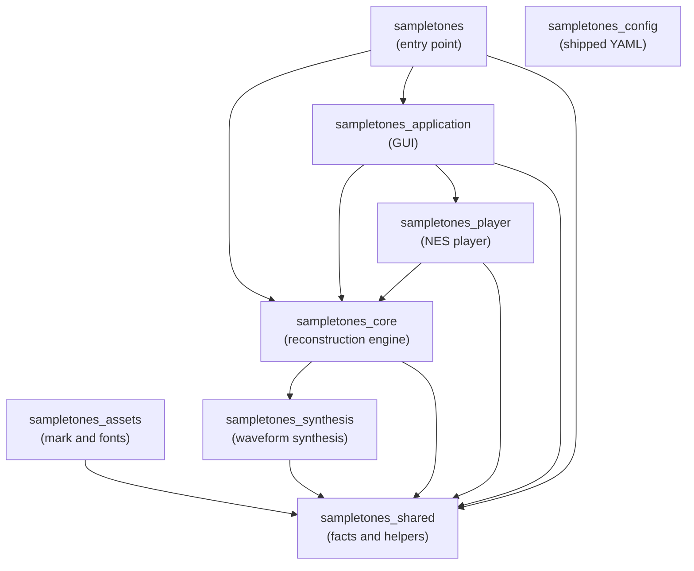

# Package Layers

_SampleToNES_ is one repository holding several packages under `src/`, ordered so that dependencies
run one way. This document states that order, what each package is for, and how the console player
is layered inside it. It is prescriptive: `sampletones_config/boundaries/graphs.yaml` restates these
tables in the form the import-boundary check runs on every commit, and a divergence between this
document and that configuration is itself a defect.

The layering of `sampletones_application` has its own document,
[`architecture.md`](architecture.md), which the same check enforces.

---

## The package graph

| Package | Purpose | May import |
|---------|---------|------------|
| `sampletones_shared` | Facts and helpers any package holds: constants, exception families, paths, the logger, the array backend, the source layer the checks read the tree through, and the schema these boundaries are declared in | — |
| `sampletones_config` | The shipped YAML — layout, palettes, themes, keybindings, language, calibration, and these boundaries themselves — reached as package data rather than by import | — |
| `sampletones_assets` | The application mark and the bundled fonts, with the code that draws the mark | `sampletones_shared` |
| `sampletones_synthesis` | Analytic waveform synthesis: oscillators, envelopes, layers and voices | `sampletones_shared` |
| `sampletones_core` | The reconstruction engine, the project model, playing a song out into instructions, and the tracker export formats | `sampletones_shared`, `sampletones_synthesis` |
| `sampletones_player` | The NES player: the register model, the re-clocking schedule, the 6502 driver and the NSF file | `sampletones_shared`, `sampletones_core` |
| `sampletones_application` | The DearPyGui front end | `sampletones_shared`, `sampletones_core`, `sampletones_player` |
| `sampletones` | The command-line entry point and the startup self-check | `sampletones_shared`, `sampletones_core`, `sampletones_application` |

Third-party imports are the package author's own choice and stand outside this table.

**The reconstruction engine stands below the console player.** A reconstruction is produced, saved
and exported to a tracker with `sampletones_player` absent from the process, which is what lets the
player's format move while the engine holds still. The consequence is that an export backend
reaching the console — the seam `sampletones_core/exports/backend.py` describes — is registered
from above rather than from the engine's own registry.

**A song is played out once, for every reader of it.** Turning an arrangement into the
instruction each channel sounds on each engine tick — the order walked frame by frame, a row's note
column starting a sample, its transpose and volume bending what the sample carries, a looping sample
wrapping where a one-shot falls silent — is `sampletones_core/performance/`. The sequencer renders
those instructions to audio and the player encodes them into register values, so what a listener
hears and what the console plays are the same walk read two ways rather than two implementations of
one rule.

**Equal temperament sits at the bottom.** The MIDI pitch limits and the A4 reference are
`sampletones_shared/constants/music.py`, and the pitch-to-frequency conversion they govern is
`sampletones_shared/utils/frequencies.py` — so the synthesis package reads them without reaching up
into the engine, and `sampletones_core/utils/frequencies.py` keeps what is the engine's own: the
project's usable pitch range, the noise periods, and the note and period names.

---

## Inside `sampletones_player`

The player divides into units layered the same way, and for the same reason: a register value, a
clock and a song exist independently of the file they are written into or the driver that reads
them.

| Unit | Purpose | May import |
|------|---------|------------|
| `specification/` | The register addresses, control bits, offsets and address constants the format is written by, one module per subject | — |
| `clock/` | `PlaySchedule` and `FixedPointStep` — the engine ticks one play call advances a stream by | `specification/` |
| `registers/` | The per-tick register values each channel plays, and the four streams together | `specification/` |
| `song.py` | `Song` — the streams, the schedule and the loop point as one value | `clock/`, `registers/` |
| `builder.py` | The song a reconstruction or an export request plays as, its instructions encoded and its rate scheduled | `song.py`, `registers/`, `clock/` |
| `trace/` | `RegisterTrace` — what the driver is expected to write, call by call | `song.py`, `specification/` |
| `nsf/` | The song block, the header and the `.nsf` file the console loads | `song.py`, `registers/`, `specification/`, `driver/` |
| `driver/` | The assembled 6502 driver and the addresses its build reports | `specification/` |
| `driver/assembler/` | The cc65 build: the layout, the toolchain, the linker map reader and the builder | `driver/`, `specification/` |
| `export.py` | `NSFBackend` — the export seam answered in `.nsf` files, holding the driver every one of them carries | `builder.py`, `nsf/`, `driver/` |

### The build toolchain is a developer tool

`driver/assembler/` runs `ca65` and `ld65` over `driver/assembly/` to produce the committed
`driver/binary/driver.bin`. It is reached from `scripts/player.py` and from the tests, and the wheel
carries the binary alone — so a module of the shipped tree that imported it would break an installed
copy, and no unit above declares it. The developer toolchain it needs is described in
[`dependencies.md`](dependencies.md).

---

## Enforcement

`sampletones_config/boundaries/graphs.yaml` declares both graphs as layer tables — each unit and the
units it may import — and the rule the check runs derives from them: every unit a table leaves out is
out of reach, so an edge is declared before it is taken. The hook audits the whole source tree on
every commit (`make check-import-boundary`), which means adding an edge to a table is how a new
dependency is opened, and removing one enumerates the work of closing it.

A graph answers for its own well-formedness as it is read: a unit reaching a unit the graph leaves
undeclared is refused, and so is a graph whose units reach themselves, since a unit's layers state a
level only where the units stand in an order.

Three parts share the work. `sampletones_config/boundaries/` states what the boundaries are.
`sampletones_shared/meta/import_boundary/` validates that statement and holds the mechanism —
reading a module line by line, resolving a unit to the modules it owns, deriving a rule from a graph
and reporting what crosses it — beside the source layer the other checks read the tree through.
`scripts/checks/import_boundary.py` runs them over a source tree and prints what they find.
