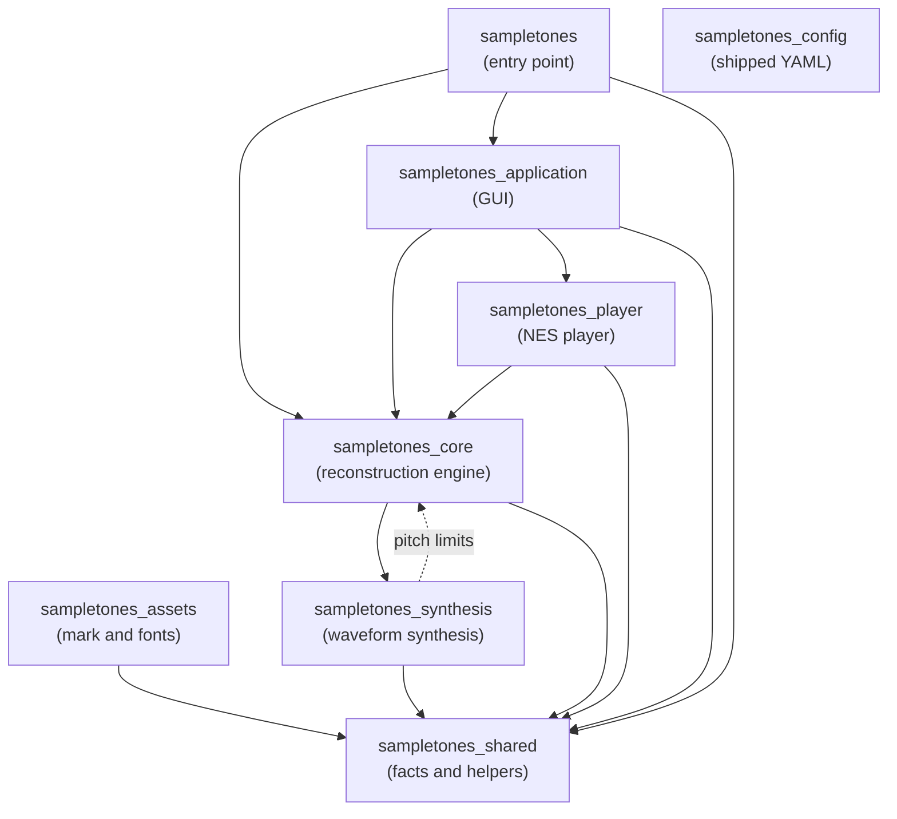

# Package Layers

_SampleToNES_ is one repository holding several packages under `src/`, ordered so that dependencies
run one way. This document states that order, what each package is for, and how the console player
is layered inside it. It is prescriptive: `scripts/checks/import_boundary.py` holds the source tree
to these tables on every commit, and a divergence between them and the script is itself a defect.

The layering of `sampletones_application` has its own document,
[`architecture.md`](architecture.md), which the same check enforces.

---

## The package graph

| Package | Purpose | May import |
|---------|---------|------------|
| `sampletones_shared` | Facts and helpers any package holds: constants, exception families, paths, the logger, the array backend, and the AST layer the checks read source through | — |
| `sampletones_config` | The shipped YAML — layout, palettes, themes, keybindings, language, calibration — reached as package data rather than by import | — |
| `sampletones_assets` | The application mark and the bundled fonts, with the code that draws the mark | `sampletones_shared` |
| `sampletones_synthesis` | Analytic waveform synthesis: oscillators, envelopes, layers and voices | `sampletones_shared` |
| `sampletones_core` | The reconstruction engine, the project model, and the tracker export formats | `sampletones_shared`, `sampletones_synthesis` |
| `sampletones_player` | The NES player: the register model, the re-clocking schedule, the 6502 driver and the NSF file | `sampletones_shared`, `sampletones_core` |
| `sampletones_application` | The DearPyGui front end | `sampletones_shared`, `sampletones_core`, `sampletones_player` |
| `sampletones` | The command-line entry point and the startup self-check | `sampletones_shared`, `sampletones_core`, `sampletones_application` |

Third-party imports are the package author's own choice and stand outside this table.

**The reconstruction engine stands below the console player.** A reconstruction is produced, saved
and exported to a tracker with `sampletones_player` absent from the process, which is what lets the
player's format move while the engine holds still. The consequence is that an export backend
reaching the console — the seam `sampletones_core/trackers/backend.py` describes — is registered
from above rather than from the engine's own registry.

### The pitch back-edge

`sampletones_synthesis/frequency.py` reaches back up to `sampletones_core` for the pitch limits and
the pitch-to-frequency conversion, which is the one edge running against the order above. The check
narrows it to exactly the two modules it needs, `sampletones_core.constants.general` and
`sampletones_core.utils.frequencies`, so the rest of the engine stays out of reach from below.
Moving those facts into `sampletones_shared` closes the edge; it is listed in
[`bugs-and-todos.md`](bugs-and-todos.md) until then.

---

## Inside `sampletones_player`

The player divides into units layered the same way, and for the same reason: a register value, a
clock and a song exist independently of the file they are written into or the driver that reads
them.

| Unit | Purpose | May import |
|------|---------|------------|
| `specification/` | The register addresses, control bits, offsets and address constants the format is written by, one module per subject | — |
| `clock/` | `PlaySchedule` and `FixedPointStep` — the engine ticks one play call advances a stream by | `specification/` |
| `registers/` | The per-tick register values each channel plays, and the four streams together | `specification/` |
| `song.py` | `Song` — the streams, the schedule and the loop point as one value | `clock/`, `registers/` |
| `trace/` | `RegisterTrace` — what the driver is expected to write, call by call | `song.py`, `specification/` |
| `nsf/` | The song block and the NSF file the console loads | `song.py`, `registers/`, `specification/`, `driver/` |
| `driver/` | The assembled 6502 driver and the addresses its build reports | `specification/` |
| `driver/assembler/` | The cc65 build: the layout, the toolchain, the linker map reader and the builder | `driver/`, `specification/` |

### The build toolchain is a developer tool

`driver/assembler/` runs `ca65` and `ld65` over `driver/assembly/` to produce the committed
`driver/binary/driver.bin`. It is reached from `scripts/player.py` and from the tests, and the wheel
carries the binary alone — so a module of the shipped tree that imported it would break an installed
copy, and no unit above declares it. The developer toolchain it needs is described in
[`dependencies.md`](dependencies.md).

---

## Enforcement

`scripts/checks/import_boundary.py` declares both graphs as layer tables — each unit and the units
it may import — and derives the rule it runs from them: every unit a table leaves out is out of
reach, so an edge is declared before it is taken. The hook audits the whole source tree on every
commit (`make check-import-boundary`), which means adding an edge to a table is how a new dependency
is opened, and removing one enumerates the work of closing it.
