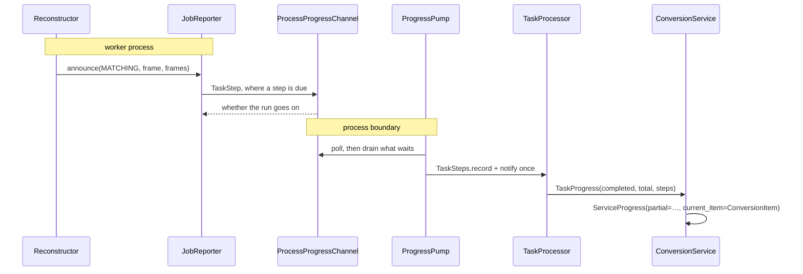

# Progress

This document governs how a long operation says how far it has come, and how that account reaches
the reader watching it. Consult it when adding an operation that takes long enough to be watched,
when changing what one reports, or when the report has to cross a process boundary.

The subsystem spans three packages: the operations that report live in `sampletones_core` and
`sampletones_player`, the line a report crosses between processes is
`sampletones_core/parallelization/channel/`, and the layer that draws it is
`sampletones_application/services/` and `logic/`. Layering between those packages is
[`packages.md`](packages.md); the application's own layers are
[`architecture.md`](architecture.md).

---

## Principles

### 1. A run reports where it stands and hears whether it is still wanted

Every long operation reports through one shape: a callable taking what the run has reached and
answering whether the run goes on.

```python
ExportReporter = Callable[[ExportProgress], bool]
```

Each domain names its own progress type — `ExportProgress`, `WalkProgress`, `CodecProgress`,
`ReconstructionProgress` — and its own `announce`, which builds that type, offers it, and raises
`OperationCanceled` where the answer is no. One reporter therefore carries both directions: an
operation is watched and withdrawn over the same line, and a caller that wants neither passes
`silent_reporter` (`sampletones_shared/utils/progress.py`) and hears the run through to its end.

### 2. A stage names the unit its counts are in

A run passes through stages counting in units of their own — a song's ticks, a dictionary's bytes,
a recording's frames, a batch's files. A report therefore names its stage, and what the counts mean
is read from that name. `ExportStage` and `ReconstructionStage` are the two vocabularies today.

Where the stages differ in what they cost, the enum states what each is worth against the others
(`STAGE_WEIGHTS`), so one reading spans a run that changes what it is counting several times over.
The weights are approximations measured over whole runs, justified by what they achieve: a bar that
tracks the time a run actually takes. They are counts rather than fractions, and a reading divides
them once at the point of use, which is what lets a finished run arrive exactly at its end.

### 3. A report is filed as often as the run moves, and carried as often as it is worth reading

An operation announces every step it makes — every frame, every row — because that is what it
knows. Deciding how often that is worth passing on belongs to whoever carries it: `ReportRate`
(`sampletones_shared/utils/progress.py`) spaces reports over `PROGRESS_STEPS` whatever the stage
counts in, always takes a stage's first reading and its last, and treats a count that falls as a
step the same way one that rises.

Both carriers use it: `StageProgress` in the application services, and `JobReporter` in the
conversion, which throttles on the worker side so the line between processes carries only what a
bar can be redrawn at.

### 4. A run reads as the items it finished plus the part of the one under way

An operation counts the items it is measured in — files, samples, jobs. An item that reports its own
progress makes the count alone a poor reading: a conversion of one recording stands at nothing out
of one for its whole length. Both layers therefore carry the same pair:

| Layer | Type | The counts | The work under way |
|-------|------|-----------|--------------------|
| Core | `TaskProgress` | `completed` / `total` | `steps`, one per running task |
| Application | `ServiceProgress` | `completed` / `total` | `partial`, in items |

and both derive `fraction` from them. The counts keep naming the items a reader recognizes — a
status line still reads *Progress: 2/5 files* — while every bar in the application draws
`fraction`, so one reading answers for a batch of files and for a single reconstruction alike.

### 5. A task reaching another process reports over a channel

Where an operation runs in a worker process, its reports reach the run over a `ProgressChannel`
(`sampletones_core/parallelization/channel/`). The channel carries both directions of principle 1
across the boundary, and callers depend on the Protocol rather than on any one way of crossing it.

```python
class ProgressChannel(Protocol):
    def reporter(self, index: int) -> StepReporter: ...
    def poll(self, timeout: float) -> Optional[TaskReport]: ...
    def withdraw(self) -> None: ...
    def close(self) -> None: ...
```

`ProcessProgressChannel` is the implementation. A manager stands beside the pool and owns both
ends — a queue reports travel up and a flag a withdrawal travels down — under the same spawn
context the pool's workers run in. Each end reaches a task as an ordinary value it is built with,
so a worker started as a fresh interpreter reconnects to them on its own, which is what makes one
channel serve every platform.

---

## Mechanics

### The conversation a run has with its tasks



A run's monitor thread waits on the results the pool hands back, so reading the channel belongs
to a thread of its own: `ProgressPump`. It takes everything already waiting in one turn and
announces once, which holds the announcements to the rate it reads at however many steps the tasks
file in between.

### Who owns what

| Concern | Owner |
|---------|-------|
| The reporter shape, the silent one, and the spacing between reports | `sampletones_shared/utils/progress.py` |
| A reconstruction's stages, their shares, and its own `announce` | `sampletones_core/reconstructions/{stage,progress}.py` |
| Weighing a job's stage and carrying it to the run | `JobReporter` (`reconstructions/converter/progress.py`) |
| The line between a run and its tasks | `sampletones_core/parallelization/channel/` |
| Where the running tasks stand, and dropping a finished one | `TaskSteps` (`parallelization/steps.py`) |
| Opening the channel, reading it, and reaping it | `TaskProcessor` (`parallelization/processor.py`) |
| How long a run has left, from what it has covered | `ETAEstimator` (`parallelization/progress.py`) |
| Turning a run's account into a result the application reads | `ConversionService` (`services/conversion/`) |
| The bar, the status line, and the stage's name | `ConverterLogic` (`logic/main/converter.py`) |

### A finished task stays finished

A task's reports travel a line the run reads at its own pace, so one filed before its result
arrived may be read after it. `TaskSteps` records the tasks the run has counted and lets their
later reports go, which is what keeps a task's own progress and the run's completed count from
describing the same work twice — and keeps the reading inside the run it describes.

### The channel's lifetime

The channel is a process of its own, opened on the first task that asks for a line and reaped once
the run ends, whatever became of it. A run whose tasks report nothing never opens one.

### Adding an operation that reports

1. Give the domain a stage enum and a progress type, with an `announce` beside them, following
   `sampletones_core/exports/progress.py`.
2. Thread the reporter through the calls that know how far the work has come, and announce every
   step they make.
3. Where the work runs in this process, hand it a carrier that throttles and emits — `StageProgress`
   for a service. Where it runs in a worker, ask `TaskProcessor._task_reporter` for a line and hand
   the task a reporter built on it.
4. Read the run through `fraction`, and name the stage from `LanguageManager` in the logic layer.

---

## Testing

Progress is one path with two halves, and each is tested where it is cheap to test:

| What | Where |
|------|-------|
| A stage's share, and a run read as a fraction | `tests/unit/sampletones_core/reconstructions/test_progress.py` |
| The spacing between reports | `tests/unit/sampletones_shared/utils/test_progress.py` |
| Where the running tasks stand, and a late report | `tests/unit/sampletones_core/parallelization/test_steps.py` |
| A job's stage weighed and throttled | `tests/unit/sampletones_core/reconstructions/converter/test_progress.py` |
| The real pipeline reporting its stages, in this process | `tests/integration/reconstruction/test_conversion_jobs.py` |
| The line carrying steps and a withdrawal between real processes | `tests/integration/sampletones_core/parallelization/test_progress_channel.py` |
| A conversion reporting itself end to end | `tests/integration/reconstruction/test_conversion_progress.py` |

The two cross-process suites run real worker processes and stand something cheap in for the work —
counting in one, a walk through the stages in the other — so what they measure is the wiring rather
than a reconstruction. Both hold their worker at a chosen point until the test has taken the reading
it is asserting on (`tests/suite/release.py`), so an assertion about work under way is made while
that work is provably under way rather than resting on the scheduler.
