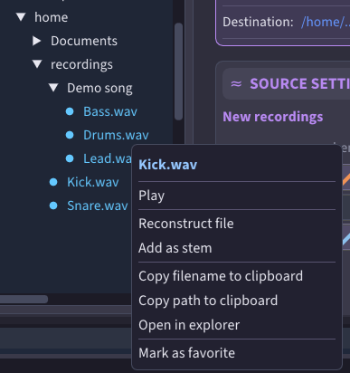
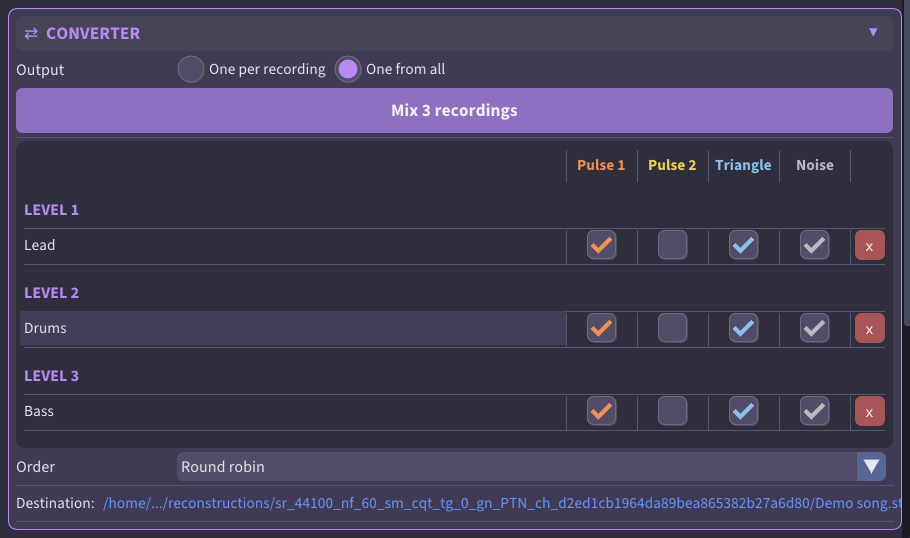
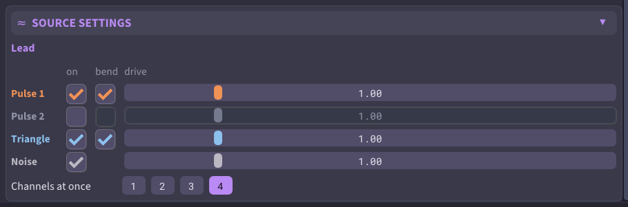
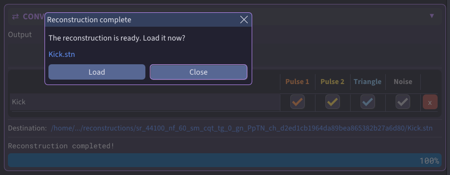
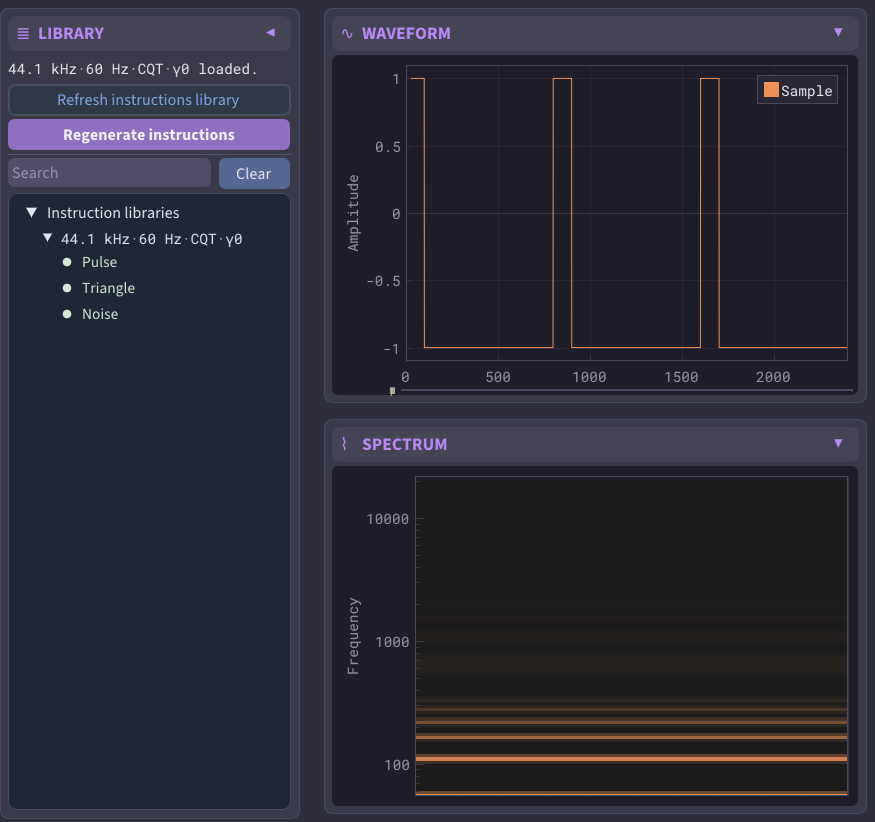

# Converting audio

The **Main** tab (`F1`) turns audio files into [reconstructions](../concepts/reconstruction.md). You
gather the recordings you want on the **Converter** card, decide whether each one becomes its own
reconstruction or they all mix into one, choose which NES channels each recording may use, and start
the conversion.

## Choosing what to convert

The **Converter** card lists the recordings a conversion uses. Add them from the **Filesystem**
browser:

- Double-click an audio file, or Ctrl-click it, to add it. You can also right-click it and choose
  **Add as stem**. A [stem](../glossary.md#stem) is one recording that goes into a reconstruction.
- Ctrl-click a folder, or right-click it and choose **Add folder**, to add every recording inside it,
  including those in subfolders.
- **Reconstruction ▸ Reconstruct file...** and **Reconstruct directory...** (also in the browser's
  right-click menu) put the chosen files in the list so that each becomes its own reconstruction. If
  the list held a mix, the app asks first.

    

Turn on **Playback ▸ Autoplay** (`Ctrl+P`) to play a recording with a single click. This lets you
listen through a folder before adding anything from it. With Autoplay off, right-click a recording and
choose **Play**.

**x** removes a row from the list. Removing a folder removes every recording in it.

Click a row to select it, and the **Source settings** card shows that recording. Press `Del` to
remove the selected row.

## One reconstruction each, or one mix from all

**Output**, at the top of the **Converter** card, sets what the conversion makes:

- **One per recording** — each recording in the list becomes its own reconstruction. Recordings added
  with a folder keep that layout in the saved files.
- **One from all** — all recordings are mixed into a single reconstruction. Folders are replaced by
  the recordings inside them.

A mix can hold up to eight recordings. If you switch to **One from all** with more than eight
recordings in the list, a dialog asks which ones to mix. The same dialog opens when you add a folder
with more recordings than the mix has room for. Double-click a row in the dialog to hear the
recording.

When a mix has two or more recordings, the rows are grouped into [**levels**](../glossary.md#level-stems).
Levels decide which recordings get channels first: recordings on level 1 choose before those on
level 2, so a lead melody can take what it needs before a background part.

    

Drag a row onto another row to put them on the same level. Drag it into the gap between levels to give
it a level of its own. You can also right-click a row to use the same commands.

**Order** sets how the levels take turns:

- **Round robin** — the levels take channels in turns.
- **Strict** — one level gets all its channels before the next level chooses.

## Choosing which channels a recording uses

The NES has four sound [channels](../glossary.md#channel): **Pulse 1**, **Pulse 2**, **Triangle** and
**Noise**. Every recording in the list has a checkbox for each channel. Check the channels that the
recording may use. Press `1` to `4` to switch a channel on or off for the selected row.

A folder's checkboxes act on every recording inside it: clicking one sets the channel for all of them. To change one recording on its own, open the folder first — click the marker
next to the folder name, or double-click the name — and each recording inside has its own checkboxes.

## Settings for one recording

The **Source settings** card sets how the recording you selected uses its channels. It has one line
per channel:

- **on** repeats the checkbox in the list, so you can also switch a channel there.
- [**bend**](../glossary.md#bend) tunes each note to the recording's exact pitch (not available on noise).
- [**drive**](../glossary.md#drive) sets how hard the recording pushes that channel while it converts. `1.00` is the
  original level. Higher values give louder, more distorted notes, up to `5.00`. Ctrl-click the slider
  to type a value.

    

**Channels at once**, below the lines, sets how many of its channels the recording may sound in a
single frame. Set it to 1 to hear the recording on one channel at a time. It never sounds more
channels than it uses.

A folder shows the setting its recordings share, and **mixed** where they differ.

With no row selected, the card sets the starting settings for recordings you add.

## Running a conversion

Click the button under **Output** to start the conversion. It reads **Cancel** while the conversion
runs.

**Destination:** shows where the result is saved. Reconstructions go into folders named after the
channels their recordings use. Click the path to open the location in your file manager. If the
conversion would replace an existing reconstruction, the app asks you first.

When the conversion finishes, click **Load** to open the result on the **Reconstruction** tab, where
you can [listen to it and export it](reconstruction.md). After several reconstructions, the
button reads **Open**. It takes you to the **Reconstruction** tab, where you pick one in the **Browser**.

    

If the open reconstruction has unsaved changes, **Load** asks what to do with them. If the conversion
replaced that same file, click **Cancel** and use **Save reconstruction as...** to keep your changes.

The first conversion with new settings takes longer, because it builds the [instruction
library](../concepts/instruction-library.md) for them.

## Building a library yourself

The **Instructions** tab (`F4`) builds and browses the [instruction
library](../concepts/instruction-library.md), the catalog of NES tones that a conversion searches. A
conversion builds the library it needs by itself, so you rarely need this tab. Use it to build a
library before a long session, or to explore the sounds your settings can make.

    

**Generate library** builds a library for your current settings. A library marked **[!]** comes from
another version of _SampleToNES_. Click it to rebuild.

Select an [instruction](../glossary.md#instruction) to see and hear a single NES tone. Click the
waveform to play the tone from that point.
