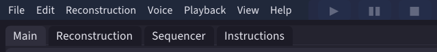

# The interface

_SampleToNES_ has four tabs. Use `F1` to `F4` to switch between them:

- [**Main**](converting.md) (`F1`) — turn audio files into [reconstructions](../concepts/reconstruction.md).
- [**Reconstruction**](reconstruction.md) (`F2`) — listen to a reconstruction, edit its instruments, and export it.
- [**Sequencer**](sequencer.md) (`F3`) — arrange reconstructions into a song.
- [**Instructions**](converting.md#building-a-library-yourself) (`F4`) — build and browse the [instruction library](../concepts/instruction-library.md) a conversion uses.

    

You usually work through the tabs in this order. Convert your files on **Main**. When the conversion finishes, click **Load** to open the result on **Reconstruction**. From there, **Add to Sequencer** adds the reconstruction to a song.

The **Instructions** tab is optional. Use it to explore single [instructions](../glossary.md#instruction), the smallest sounds the chip makes.

## The menus

Two menu items are easy to miss:

- **View ▸ Show advanced settings** adds the **Advanced settings** card to the **Main** tab. See [Configuration](configuration.md).
- **Playback ▸ Audio settings...** sets the device you listen through. Its sample rate is separate from **Sample rate** on the **Main** tab, which sets how audio is converted.

Project properties belong to a project and are covered in the [sequencer guide](sequencer.md).

## Keyboard shortcuts

**View ▸ Keyboard shortcuts...** (`Ctrl+K`) lists every shortcut and lets you change any of them. Click a shortcut and press the keys you want. If another action already uses those keys, the app asks before reassigning them. **Reset to defaults** restores the original shortcuts.

On macOS, the shortcuts use Command where other platforms use Control.
