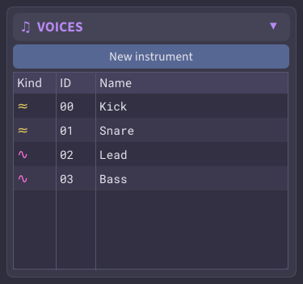
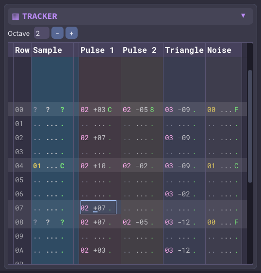
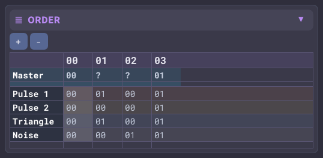
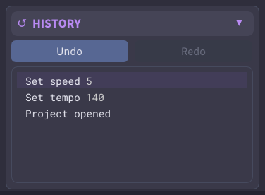
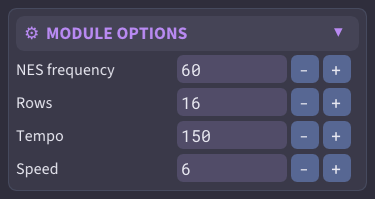
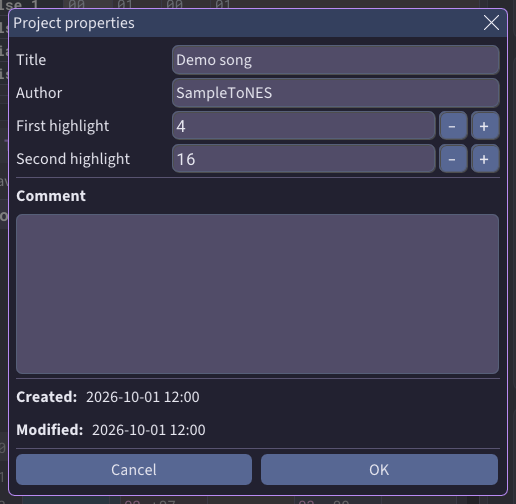
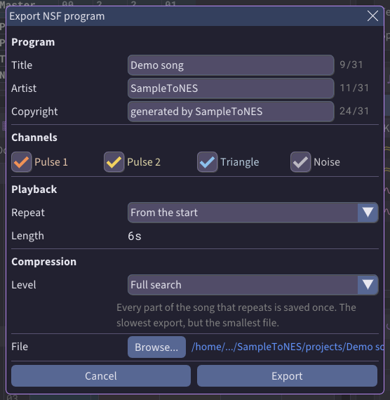
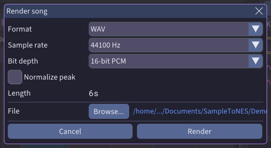

# The sequencer

The **Sequencer** tab (`F3`) is a [tracker](../glossary.md#tracker--sequencer). You use it to arrange
voices into a song on the four NES [channels](../glossary.md#channel). You can play the song back,
export it, or render it to audio.

The sequencer works on a [project](../formats/projects.md). Choose **File ▸ New project** to start
one, or open an existing `.stp` file.

## Voices: samples and instruments

A song plays [**voices**](../glossary.md#voice). There are two kinds:

- A **sample** is a reconstruction that the song plays.
- An **instrument** is a sound you shape yourself. Use instruments for melodies and bass lines.

Both kinds are in the **Voices** list, numbered together.

    

The **Voice** menu adds a voice in four ways:

| Menu item | What it adds |
|-----------|--------------|
| **New instrument** | An instrument that plays a note at full volume, ready to place and hear |
| **Add sample from file...** | A reconstruction file from anywhere on your disk, as a sample |
| **Import instrument...** | A FamiTracker instrument file (`.fti`), as an instrument |
| **Add to Sequencer** | The reconstruction open on the **Reconstruction** tab, as a sample |

Right-click below the rows of the **Voices** list to open the same menu. **Add to Sequencer** is also
on the **Reconstruction** tab and in the right-click menu of any reconstruction in the **Browser**.

If a reconstruction's [NES frequency](../glossary.md#nes-frequency) differs from the project's, the
app asks you to confirm with **Add anyway**.

Right-click a voice to rename, duplicate, move or remove it. Three commands need a word:

- **Edit** opens the voice on the **Reconstruction** tab, where you change how it sounds. See
  [editing instruments](reconstruction.md#editing-instruments).
- **New instrument from**, on a sample, copies what the sample plays on one channel into a new
  instrument you can edit.
- **Export instrument...** saves the voice as an `.fti` file. A sample has one instrument per
  channel, so the app asks which channel to export.

The same commands are on the **Edit** menu.

Removing a voice clears every row that uses it.

Importing an `.fti` file keeps its volume, arpeggio and duty cycle sequences. A message lists any
other settings the file carried. See [reading an instrument
file](../formats/famitracker.md#c-reading-an-instrument-file).

## Writing a pattern

The **Tracker** grid is the [pattern](../glossary.md#pattern) editor. Each row is one step in time.
The grid has a **Sample** column and a column for each channel: **Pulse 1**, **Pulse 2**,
**Triangle** and **Noise**.

    

Click a cell and type its value. Right-click a cell for the same commands as a menu, including
**Note off**.

Click a voice in the **Voices** list, then type pitches: each pitch you type places that voice in
the cell too. Click below the list to stop placing the voice.

Dimmed rows belong to the neighboring frames. To change them, click that frame in the **Order** grid.

The [**Sample** column](../glossary.md#sample-column) places a sample on every channel the sample
uses, and clears the other channels of the row. It takes samples only. To place an instrument, use
the column of the channel you want it on.

A pitch or a volume typed in the **Sample** column applies to the channels playing a sample.

A `?` in the **Sample** column means the channels of that row play different voices.

## Typing a pitch

A pitch cell holds a note, such as `C-4`, or a step, such as `+03`. A step counts semitones above (`+`) or
below (`-`) the voice's own pitch: `+00` plays a sample as recorded and `+12` plays it an octave
higher. Either kind of cell works with either kind of voice.

Type a note on your keyboard like a piano. The bottom two rows of keys play one octave: `Z` `S` `X`
`D` `C` and so on. The row above plays the white keys of the next octave: `Q` `W` `E` `R` `T` `Y`
`U`. **Octave**, above the grid, sets the octave of the bottom row.

Type a step with the digit keys: `0` `3` writes `+03`, and `-` `1` `2` writes `-12`.

The noise channel has sixteen sounds instead of notes. A note key picks one, and a step moves to
another.

## Arranging the song

A song plays patterns in a sequence. The [**Order**](../glossary.md#order) grid sets that sequence.
Each column is one position in the song, called a **frame**. The grid has a row for the **Master**
and a row for each channel.

    

Type a pattern number in the **Order** grid to place a pattern. Right-click a frame to insert, clear
or remove frames, and to repeat one:

- **Duplicate** repeats the frame with the same patterns, so a change to one shows in both.
- **Clone** repeats the frame with new copies of its patterns, so you can change them separately.

## Playing the song

The play controls beside the menus play the song. These keys work anywhere on the tab:

| Key | Action |
|-----|--------|
| `Space` | Play, or pause and resume |
| `Shift+Space` | Play from the start |
| `Ctrl+Space` | Play from the frame on screen |
| `Ctrl+Shift+Space` | Play from the cursor's row |
| `Esc` | Stop |
| `Ctrl+L` | **Loop song**: start the song again when it ends |

    

`Esc` also stops a sample preview. A grid's right-click menu plays from the row or frame you clicked.

## Following the playback

**Playback ▸ Follow playback** chooses whether the view moves with the song. The app remembers your
choice.

| Mode | Key | What the view does |
|------|-----|---------------------|
| **Follow rows** | `Ctrl+F` | Keeps the playing row in the middle of the tracker, and shows the playing frame |
| **Follow patterns** | `Ctrl+Shift+F` | Shows the playing frame, and keeps your scroll position |
| **Don't follow** | `Ctrl+Alt+F` | Stays where you put it |

Use **Follow patterns** or **Don't follow** to type while the song plays.

## Muting channels

| Gesture | Action |
|---------|--------|
| Click a channel's name, in either grid | Mute or unmute the channel |
| `Ctrl`+click a channel's name | Solo the channel: silence the rest. `Ctrl`+click again to restore the previous mix |
| Click **Sample** (tracker) or **Master** (order) | Mute or unmute every channel |
| Right-click a name | The same commands as a menu |

Keys `1` to `4` mute and unmute a channel when the cursor is outside the grids. Inside the grids the
digit keys type values, so use `Ctrl+1` to `Ctrl+4`, which work everywhere.

Muting changes only what you hear. Exports and renders include every channel.

## Selecting, copying and pasting

You can select a block of cells in both grids, then copy, cut, paste or delete it.

To select cells:

- Hold `Shift` and press the arrow keys.
- Drag across the cells with the mouse.
- `Shift`+click a cell to extend the selection to it.

Any plain arrow key, or `Esc`, clears the selection.

| Key | Action |
|-----|--------|
| `Shift`+arrows | Extend the selection by one cell |
| `Shift+Home` / `Shift+End` | Extend the selection to the first or last row (tracker) or position (order) |
| `Ctrl+A` | Select the whole frame, or the whole order |
| `Ctrl+Shift+A` | Select your column (tracker), or your channel's row (order) |
| `Ctrl+Alt+A` | Select the part of the column the cursor is in (tracker) |
| `Ctrl+C` | Copy |
| `Ctrl+X` | Cut |
| `Ctrl+V` | Paste at the cursor |
| `Del` | Empty the selection |

With nothing selected, these commands act on the cell under the cursor. Each grid's right-click
menu has them too.

Each grid pastes only what was copied in that grid.

A paste starts at the cursor and fills down and to the right:

- In the **Tracker**, each cell keeps its kind. A volume pastes into a volume column, wherever you
  paste. Cells past the last row or column are dropped.
- In the **Order**, a paste past the last frame adds frames to the song. A paste stops at the
  **Noise** row.

A copy also goes to your clipboard as text, so you can paste a block into another open window of
_SampleToNES_. Voices are copied by number, so check that the other project has the same voices.

## Transpose and volume

In the **Tracker**, transpose and volume keys change every cell in the selection.

| Key | Action |
|-----|--------|
| `Ctrl+Up` / `Ctrl+Down` | Transpose by a semitone |
| `Ctrl+Shift+Up` / `Ctrl+Shift+Down` | Transpose by an octave |
| `Alt+Up` / `Alt+Down` | Change the volume by one step |
| `Alt+Shift+Up` / `Alt+Shift+Down` | Change the volume by four steps |

The right-click menu has the same commands.

## Undoing a change

You can undo every change. The **History** panel lists your changes, and a click on one goes back to
that point. Undo also covers voice edits on the **Reconstruction** tab.

    

## Timing and properties

**Module options** sets the song's timing: **Rows** per pattern, **Speed** (the number of [ticks](../glossary.md#tick)
each row lasts), **Tempo**, and the **NES frequency** the song plays at. Speed and tempo together set how fast
the rows go by. Changing **NES frequency** changes how existing voices play, so the app asks first.

    

**File ▸ Project properties...** sets the title, the author and the comment. The exported module
includes them. It also sets the [meter](../glossary.md#metric-highlight):

- **First highlight** is the number of rows in a beat.
- **Second highlight** is the number of rows in a bar.

    

The defaults, 4 and 16, give four beats of four rows in a bar. For waltz time, set **Second highlight** to 12, which gives three beats.

The tempo counts beats, so the meter also changes how fast the song feels. A row lasts a whole number of
ticks, so the app makes some rows a tick longer than others, on the strong beats. A tempo that asks
for rows shorter than one tick plays slower than set, as in FamiTracker and Bitphase. [Song
timing](../concepts/timing.md) has the details.

## Exporting the song

**File ▸ Export** writes the song in three formats:

- **FamiTracker module...** saves an `.ftm` file. See [FamiTracker
  export](../formats/famitracker.md) for its contents and limits.
- **Bitphase project...** saves a `.btp` file.
- **NSF program...** saves an `.nsf` file, which the NES or an NSF player plays directly.

A voice plays only on the channels it covers. If a row places it on another channel, the
FamiTracker and Bitphase files cut the note there, and the export dialog lists those rows.

A transpose on a playing note is exported too. FamiTracker moves a note by at most 15 semitones in
one row, and the dialog lists the rows that stay at the old pitch.

Sequences longer than FamiTracker and Bitphase allow are cut short, and the dialog says how many
instruments were shortened.

An NSF program holds 32 KB, and the app warns you when a song is too long. See [NSF
export](../formats/nsf.md) and [song compression](../concepts/compression.md).

**NSF program...** opens the **Export NSF program** window. Click **Export** without changing
anything to save the whole song, repeating from the start.

    

| Setting | What it does |
|---------|--------------|
| **Title**, **Artist**, **Copyright** | The text an NSF player shows. Each one holds up to 31 characters |
| **Channels** | The channels the program plays. A channel you clear stays silent. Select at least one |
| **Repeat** | **Play once** stops at the end. **From the start** plays the song again. **From a frame** goes back to the order frame you type in **Frame** |
| **Level** | How much the song is compressed. **None** exports fastest and makes the largest file. **Full search** is the slowest and makes the smallest file |

## Rendering to audio

**File ▸ Render song...** (`Ctrl+Shift+E`) saves the whole song as an audio file that any player
opens.

    

| Setting | What it does |
|---------|--------------|
| **Format** | **WAV** for full quality, **MP3** for a smaller file |
| **Sample rate** | Samples per second. 44100 Hz is the usual choice |
| **Bit depth** (WAV) | How much detail each sample carries. 16-bit is the usual choice; 8-bit sounds rougher, like the NES |
| **Bitrate** (MP3) | How much data a second of audio takes. A higher bitrate sounds better and makes a larger file. The choices depend on the sample rate |
| **Normalize peak** | Makes the song louder until its loudest moment reaches full volume, keeping the balance between channels |

Click **Render** to start. When the render finishes, click the path to open its folder.

A render plays the song once with every channel, ignoring mutes and loops.
