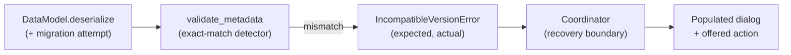
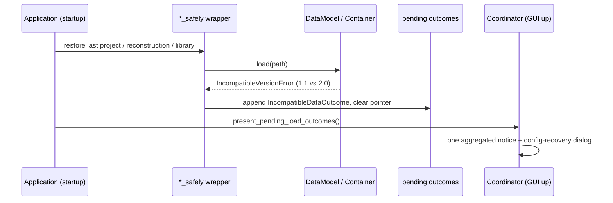

# Backward Compatibility and Version Transitions

This document defines how SampleToNES treats **user data files** across versions. It
is prescriptive: it states the compatibility policy, the load-time flow that keeps
every version mismatch from becoming a crash, the migration framework for the jumps
that can be upgraded, and the UX-friendly discard/quarantine flow for the jumps that
cannot. Its immediate driver is the **0.2.4 → 0.3.0** release, where the app starts to
have real users and libraries/reconstructions genuinely change shape; §5 is the runbook
for that transition.

Version single-sourcing (the four data/version constants and how they are declared once)
is owned by `docs/releasing.md`; the behavioral-test conventions this document leans on
are owned by `docs/testing.md`. Layer responsibilities and the error-handling chain come
from `docs/architecture.md`; coding rules come from `docs/guidelines.md`. This document
adds the compatibility contract on top of them.

---

## The moment, and the ask

Until now the project has not carried backward compatibility, and coding guideline #14
states the default plainly:

> Do not preserve backward compatibility for internal APIs, configs, or data shapes
> unless the user explicitly asks for it.

The maintainer is now asking, explicitly and narrowly, for **user-facing persisted data**.
The goal, in the maintainer's words: make the transition to a new version smooth and
**free of breaking errors**. Libraries and reconstructions are genuinely incompatible
between versions and there is no realistic mechanism to transfer them, so the target is
not "always migrate" — it is "always handle: detect, inform, and offer a clean action,
never crash and never destroy a file without consent."

---

## 1. Policy: the compatibility boundary

Two zones, one boundary. The boundary is drawn at what the **user** owns on disk.

### 1.1 The two zones

**User data zone — covered by this document.** Every artifact a user creates, saves,
shares, or reopens gets: an explicit version stamp, crash-proof detection at load, a
populated dialog on mismatch, migration where feasible, and a UX-friendly
discard/quarantine choice where not.

**Internal zone — unchanged, per guideline #14.** Internal APIs, function signatures,
view models, service result contracts, layout YAML shapes, and in-memory data structures
stay free to change without a compatibility promise. A refactor of `logic/` or a rename
of a view-model field carries no migration obligation. This zone is deliberately excluded
so the codebase keeps moving.

Application **config and session state** sit at the edge and get a precise, lighter rule
(§1.4): they are covered by the *no-breaking-error* guarantee but are **exempt from
field-level migration**. That keeps them consistent with #14 (their shapes stay free to
change) while still never crashing an upgraded launch.

### 1.2 The versioned artifacts

| Artifact | Extension | Container | Version stamp | Owner of the stamp |
| --- | --- | --- | --- | --- |
| Project | `.stp` | Zip: `project.json` + `reconstructions/<id>.stn` | `ProjectDocument.format_version` (frozen) plus embedded `Metadata` | `sampletones_core/project/document.py`, `.../project/container.py` |
| Reconstruction | `.stn` | msgpack `DataModel` | `Metadata.reconstruction_data_version` | `sampletones_core/reconstructions/reconstruction/reconstruction.py` |
| Library | `.ins` | msgpack `DataModel` | `Metadata.library_data_version` | `sampletones_core/library/data.py` |
| App config | `config.json` | JSON `Config` | `Metadata.version` (via `Config.metadata`) | `sampletones_application/config/managers/config.py` |
| App state | `state.yaml` | YAML `ApplicationState` | unversioned (recovered structurally) | `sampletones_application/config/managers/state.py` |
| App preferences | `config.yaml` | YAML `ApplicationConfig` | unversioned (recovered structurally) | `sampletones_application/config/managers/application.py` |

`.fti` and `.ftm` are **export-only** FamiTracker files (`docs/famitracker.md`); SampleToNES
never reads them back, so they carry no inbound compatibility policy — only the forward
format contract already documented.

The embedded provenance in every `DataModel` file is `sampletones_core/data/metadata.py`:
a `frozen` `Metadata` carrying `application_name`, `version`, `library_data_version`, and
`reconstruction_data_version`. Detection keys off exactly these fields.

### 1.3 What "incompatible" means, and the target behavior

The compatibility contract per artifact, and how each mismatch class must behave:

| Situation | Meaning | Current behavior | Target behavior |
| --- | --- | --- | --- |
| **Older, migratable** (minor bump, chain exists) | File predates this version but its shape can be upgraded | raise → caught → error dialog | migrate silently, load, log the upgrade |
| **Older, non-migratable** (major bump) | File predates this version and cannot be transferred | raise → caught → error dialog | detect → inform → offer discard/quarantine/skip |
| **Newer** (file version > app version) | File was written by a future release | raise → caught → error dialog | detect → inform "made by a newer version"; never guess |
| **Corrupt / truncated / wrong type** | Bytes do not deserialize | raise → caught → error dialog | detect → inform; offer the same discard/quarantine choice |
| **Wrong application** (`application_name` mismatch) | Foreign or misidentified file | `InvalidMetadataError` → dialog | unchanged (already correct) |

The version comparison primitive is `compare_versions()` (returns `-1/0/1`). Today the
policy is **exact match or raise**: e.g. `InstructionLibraryData.validate_metadata()` does
`if compare_versions(library_version, SAMPLETONES_LIBRARY_DATA_VERSION) != 0: raise
IncompatibleLibraryDataVersionError(...)`, and `Reconstruction.validate_metadata()` mirrors
it. The target keeps exact-match at the deserialization boundary as the *detector*, and adds
a *migration attempt before* that boundary plus a *recovery action after* it (§2, §3, §4).

### 1.4 The config/state exemption, stated precisely

App config, session state, and app preferences must never crash an upgraded launch, but
they do **not** get field-level migration. The mechanism is **structural graceful
degradation**, already implemented via `validate_with_recovery()`
(`sampletones_shared/utils/validation.py`): it keeps the maximal valid subset of a stored
mapping, drops the leaves that no longer fit the schema, and reports which were dropped.
An older `config.json` therefore loads with its still-valid values preserved and its
incompatible values reset to defaults — no crash, no migration table to maintain. This
respects #14 (the config shape stayed free to change) while honoring the smooth-transition
ask. Data files (`.stp`/`.stn`/`.ins`) get the stronger treatment because their content is
the user's creative work, not a bag of preferences.

---

## 2. Detection and graceful handling

The principle from `docs/architecture.md § Error Handling Policy` holds unchanged: errors
propagate up until a layer can recover meaningfully and tell the user. Compatibility adds
one rule on top — **no load path may surface an unhandled exception for a version or shape
mismatch.** The mismatch is detected at the deserialization boundary, classified into a
typed error, and turned into a populated dialog (title, message, and the two version
numbers) at the coordinator.

### 2.1 The deserialization boundary is the detector

`DataModel.deserialize()` unpacks msgpack and calls `deserialize_inner()`, which threads an
optional `validation` callback across the fields. Library and reconstruction pass
`validation=cls.validate_metadata`; that callback fires on the `Metadata` field and raises a
typed `IncompatibleVersionError` subclass on mismatch. This is the single detection point
for binary artifacts, and §3 inserts the migration attempt immediately before it.

The project path detects differently and has **two gaps to close in Phase 1**:

1. `ProjectContainer.load()` validates `ProjectDocument` via Pydantic but **never checks
   `format_version`**, even though the field is described as "the upgrade hook." A 0.2.4
   project therefore validates structurally and may load with subtly wrong data instead of
   being cleanly rejected.
2. `ProjectContainer._read_reconstructions()` calls `Reconstruction.deserialize_data(...)`
   **without** `validation=Reconstruction.validate_metadata`, so reconstructions embedded in
   a project skip the version gate that standalone `.stn` files get.

Phase 1 adds an explicit project version gate and threads validation into embedded reads
(§5.1).

### 2.2 The typed error hierarchy already carries version numbers

`IncompatibleVersionError(message, expected_version, actual_version)` is the shared base
(`sampletones_shared/exceptions/version.py`); `IncompatibleLibraryDataVersionError` and
`IncompatibleReconstructionVersionError` inherit it (and their respective `LoadXError`
bases). The two version fields are exactly what a dialog needs. **Project lacks the
analogue** — Phase 1 adds:

```python
# sampletones_shared/exceptions/project.py
from .base import SampleToNESError
from .validation import InvalidDataError, InvalidValuesError
from .version import IncompatibleVersionError


class ProjectError(SampleToNESError):
    """Base class for project errors."""


class LoadProjectError(ProjectError):
    """Raised when a project cannot be loaded."""


class IncompatibleProjectVersionError(IncompatibleVersionError, LoadProjectError):
    """Raised when the project format version cannot be read by this release."""
```

### 2.3 Three entry points, three treatments

A load reaches the user through three doors, and "graceful" means something different at
each:

| Entry point | Where | Today | Target |
| --- | --- | --- | --- |
| **Interactive open** | `ReconstructionsTabCoordinator.load_reconstruction()`, `LibraryLogic._load_library()`, `ProjectCoordinator._load()` | reconstruction + library already detect→inform with the incompatible-version template; project catches `(LoadProjectError, OSError)` generically | per-file dialog with version numbers **and** an offered action (§4); project gains the version gate |
| **Startup auto-restore** | `load_project_safely()`, `load_reconstruction_safely()`, `load_library_safely()` | swallows `(SampleToNESError, OSError)`, logs a warning, clears the session pointer — **silent** | records the outcome as data and surfaces **one aggregated notice** after the GUI is up |
| **Project-embedded reconstruction** | `ProjectContainer._read_reconstructions()` | unvalidated (gap) | version-gated; a bad member fails the whole project load with `IncompatibleProjectVersionError` context |

The interactive reconstruction path is the reference implementation to generalize — it
already classifies each error type to its own message and formats the incompatible-version
template `reconstructions.browser.template.incompatible_version_template`
("Incompatible reconstruction version: {}, expected {}.") with `actual_version` and
`expected_version`. The library path mirrors it with
`instructions.library.template.incompatible_version_template`.

### 2.4 The gold-standard pattern already in the repo

`ConfigManager` shows the pattern to generalize for the startup door. The manager loads
before the GUI exists, so it records each outcome as **domain data** —
`ConfigRecovered(source_version, dropped)` or `ConfigLoadFailure(exception, reason)` — into
`pending_load_outcomes`. Once a window can be drawn, `ConfigCoordinator.present_pending_load_outcomes()`
turns each into the matching dialog (`show_config_recovery` or `show_error`) with text from
`LanguageManager`. Nothing crashes; nothing is presented from a thread that cannot draw.

Startup restore of data files should adopt the same shape: the `*_safely` wrappers stop
being silent and instead append a typed outcome that a coordinator presents after
`present_pending_load_outcomes()` (which already runs at the right point in
`Application._setup_gui`).



---

## 3. Migration framework

The framework upgrades the jumps that *can* be upgraded — additive fields, renames,
reshaped-but-recoverable structures — and declares the jumps that cannot as unavailable,
handing them to §4. It operates on the **deserialized-but-unvalidated mapping**, before
Pydantic sees it, so a migration is a pure dictionary transform and never depends on a model
that no longer matches the data.

### 3.1 Semantic versioning of the data stamps

Give the data versions a semver reading so the framework has a rule instead of a lookup for
every pair:

- **Minor bump** (e.g. `1.1 → 1.2`): additive or mechanically reshapeable. A migration step
  is expected to exist; the file is migratable.
- **Major bump** (e.g. `1.1 → 2.0`): a genuine break with no transfer path. No step is
  registered; the load reports the jump as unavailable and §4 takes over.

`compare_versions()` already compares component-by-component, so "same major" is a cheap
predicate. This is the rule that makes 0.2.4 → 0.3.0 clean: the data stamps go to `2.0`
(§5), no steps are registered for the major jump, and every old file routes to
discard/quarantine without a bespoke branch.

### 3.2 The types

```python
# sampletones_core/data/migration/framework.py
from __future__ import annotations

from enum import StrEnum
from typing import Dict, List, Optional, Protocol, Tuple, runtime_checkable

from sampletones_shared.constants.application import compare_versions
from sampletones_shared.types.data import SerializedData


class ArtifactKind(StrEnum):
    LIBRARY = "library"
    RECONSTRUCTION = "reconstruction"
    PROJECT = "project"


@runtime_checkable
class Migration(Protocol):
    """One upgrade step over a deserialized-but-unvalidated mapping.

    A step reads a mapping stamped ``from_version`` and returns one stamped
    ``to_version``. It is a pure function of its input: it neither reads the
    filesystem nor mutates shared state, so a chain of steps is replayable and
    testable in isolation.
    """

    kind: ArtifactKind
    from_version: str
    to_version: str

    def apply(self, data: SerializedData) -> SerializedData: ...
```

A concrete step for a trivial additive/rename change:

```python
# sampletones_core/data/migration/steps/reconstruction.py
from dataclasses import dataclass

from sampletones_core.data.migration.framework import ArtifactKind
from sampletones_shared.types.data import SerializedData


@dataclass(frozen=True)
class RenameCoefficientField:
    """Renames ``coefficient`` to ``normalization_coefficient`` for reconstruction 1.1 → 1.2.

    The stored field kept its meaning across the release, so the step copies the
    value under the new key, drops the old key, and restamps the metadata.
    """

    kind: ArtifactKind = ArtifactKind.RECONSTRUCTION
    from_version: str = "1.1"
    to_version: str = "1.2"

    def apply(self, data: SerializedData) -> SerializedData:
        upgraded = dict(data)
        upgraded["normalization_coefficient"] = upgraded.pop("coefficient")
        metadata = dict(upgraded["metadata"])
        metadata["reconstruction_data_version"] = self.to_version
        upgraded["metadata"] = metadata
        return upgraded
```

### 3.3 The registry and the plan

```python
# sampletones_core/data/migration/registry.py
from typing import Dict, List, Tuple

from sampletones_core.data.migration.framework import ArtifactKind, Migration
from sampletones_shared.constants.application import compare_versions
from sampletones_shared.exceptions import (
    MigrationConflictError,
    MigrationUnavailableError,
)
from sampletones_shared.types.data import SerializedData


class MigrationRegistry:
    """Holds the upgrade steps and composes them into an ordered plan on demand."""

    def __init__(self) -> None:
        self._steps: Dict[Tuple[ArtifactKind, str], Migration] = {}

    def register(self, migration: Migration) -> None:
        key = (migration.kind, migration.from_version)
        if key in self._steps:
            raise MigrationConflictError(
                f"A migration for {key[0]} from {key[1]} is already registered."
            )
        self._steps[key] = migration

    def plan(self, kind: ArtifactKind, *, from_version: str, to_version: str) -> List[Migration]:
        chain: List[Migration] = []
        version = from_version
        while compare_versions(version, to_version) != 0:
            step = self._steps.get((kind, version))
            if step is None:
                raise MigrationUnavailableError(
                    f"No migration path for {kind} from {from_version} to {to_version}.",
                    kind=str(kind),
                    from_version=from_version,
                    to_version=to_version,
                )
            chain.append(step)
            version = step.to_version
        return chain

    def migrate(
        self,
        kind: ArtifactKind,
        data: SerializedData,
        *,
        from_version: str,
        to_version: str,
    ) -> SerializedData:
        for step in self.plan(kind, from_version=from_version, to_version=to_version):
            data = step.apply(data)
        return data
```

`MigrationUnavailableError` and `MigrationConflictError` join the shared hierarchy under a
new `MigrationError(SampleToNESError)` base (`sampletones_shared/exceptions/migration.py`),
so a coordinator catches `MigrationUnavailableError` as one specific type and routes it to
§4.

### 3.4 Where it plugs in

The migration attempt sits between raw parse and validation, keyed off the version already
embedded in the mapping (the same read `ConfigManager._extract_version()` performs today):

- **Binary (`.stn`, `.ins`)** — inside `DataModel.deserialize()`, after `msgpack.unpackb`
  and before `deserialize_inner`: read `data["metadata"][<field>]`, call
  `registry.migrate(kind, data, from_version=stored, to_version=current)`, then let
  `validate_metadata` confirm the stamp now matches. A migratable file passes the exact-match
  gate because migration restamped it; a non-migratable file raises `MigrationUnavailableError`
  before the gate.
- **Project (`.stp`)** — in `ProjectContainer.load()`, after `archive.read(PROJECT_DOCUMENT_NAME)`
  is parsed to a dict and before `ProjectDocument.model_validate(...)`, using
  `document["format_version"]`.

The registry is constructed once at the composition root and injected; no module reaches it
through a global. For 0.2.4 → 0.3.0 the registry is **empty of cross-major steps by design**,
which is the correct outcome, not a missing feature.

---

## 4. The non-migratable case: UX-friendly discard and quarantine

This is the heart of the maintainer's ask. When a file cannot be migrated — a major-version
break, a newer-than-us file, or unrecoverable corruption — the two forbidden outcomes are a
**hard crash** and a **silent deletion**. The user's file is their work; it stays untouched
unless the user consents to move it.

### 4.1 The choices to offer

| Action | Effect | Recommended default |
| --- | --- | --- |
| **Keep it in place** | Leave the file exactly where it is; skip loading it | Default for interactive open |
| **Move to a backup folder...** | Relocate the file to a versioned quarantine directory, then continue | Offered, never automatic |
| **Open fresh** | Start with a clean document; the old file is left in place | Default for startup restore of a project/reconstruction |

The recommended posture is **conservative**: the default action never touches the disk. The
only destructive-looking action (move) is explicit, labelled with a trailing "..." to signal
it acts, and reversible because the file is moved, never deleted.

### 4.2 The quarantine location

Quarantine relocates rather than deletes, under the app's data directory so it is out of the
user's working folders yet discoverable:

```
USER_PATH_DATA / "quarantine" / <artifact_version> / <original_filename>
```

`USER_PATH_DATA` already exists in `sampletones_core/paths.py`. The move uses `pathlib` and
never overwrites: on a name clash it appends a numeric suffix. This "look before you
overwrite" posture matches the project's own care around user data.

```python
# sampletones_core/data/migration/quarantine.py
import shutil
from pathlib import Path

from sampletones_core.paths import USER_PATH_DATA


def quarantine_file(source: Path, *, artifact_version: str) -> Path:
    """Moves an unreadable file into a versioned backup folder and returns its new path.

    The destination lives under the application data directory so the file leaves the
    user's working folders while staying recoverable. A name already taken gains a
    numeric suffix, so an existing backup is preserved rather than replaced.
    """
    destination_directory = USER_PATH_DATA / "quarantine" / artifact_version
    destination_directory.mkdir(parents=True, exist_ok=True)

    destination = destination_directory / source.name
    counter = 1
    while destination.exists():
        destination = destination_directory / f"{source.stem}-{counter}{source.suffix}"
        counter += 1

    shutil.move(str(source), str(destination))
    return destination
```

### 4.3 The outcome type and the coordinator flow

Following the `ConfigLoadOutcome` precedent, the load records what happened as data and the
coordinator decides the presentation:

```python
# sampletones_application/logic/shared/compatibility.py
from dataclasses import dataclass
from enum import StrEnum
from pathlib import Path
from typing import Optional


class IncompatibleDataReason(StrEnum):
    OLDER_NON_MIGRATABLE = "older_non_migratable"
    NEWER = "newer"
    CORRUPT = "corrupt"


@dataclass(frozen=True)
class IncompatibleDataOutcome:
    """Records that a data file could not be read, for a coordinator to present.

    Attributes:
        path: The file that could not be read; it stays untouched on disk.
        reason: The category that selects the explanatory message.
        source_version: The version stamped in the file, when it could be read.
        expected_version: The version this release reads.
    """

    path: Path
    reason: IncompatibleDataReason
    source_version: Optional[str]
    expected_version: str
```

The coordinator presents a dedicated dialog modelled on `show_config_recovery` (same
version-emphasis rendering, same path element). It offers the three actions from §4.1:

```python
def _present_incompatible_data(self, outcome: IncompatibleDataOutcome) -> None:
    def on_quarantine() -> None:
        moved_to = quarantine_file(outcome.path, artifact_version=outcome.source_version or "unknown")
        logger.info(f"Quarantined incompatible file to {logger.format_path(moved_to)}")

    self._dialogs.show_incompatible_data(
        tag=TAG_GLOBAL_DIALOG_INCOMPATIBLE_DATA,
        source_version=outcome.source_version,
        expected_version=outcome.expected_version,
        path=outcome.path,
        on_quarantine=on_quarantine,
    )
```

### 4.4 The dialog text

Text lives in `LanguageManager`; UI labels use three dots ("...") because the interface font
is monospace. A concrete English draft:

- **Title** — "Incompatible file"
- **Body** — "This file was made with SampleToNES {source}, and this version reads
  version {expected}. It cannot be opened automatically. Your file stays where it is until
  you choose."
- **Path** — the file path, rendered with the clickable `GUIPathText` element so the user can
  open its folder.
- **Buttons** — "Keep it in place" (default, closes) · "Move to backup folder..." (quarantines)

For the **newer** reason the body swaps to "This file was made with a newer version of
SampleToNES ({source}). Update SampleToNES to open it." — no quarantine is pushed, because a
newer file is the user's current work seen from an older install.

### 4.5 Startup versus interactive

- **Interactive open** — one dialog per file, blocking that open. Default button keeps the
  file in place.
- **Startup restore** — the `*_safely` wrappers append one `IncompatibleDataOutcome` each
  instead of only logging, and after the GUI is ready a single aggregated notice lists them:
  "Some items from your last session were made with an earlier version and could not be
  restored: <names>. They are unchanged on disk. [Move all to backup folder...] [Dismiss]".
  The session pointers are still cleared so the next launch is clean, exactly as today.

---

## 5. The 0.2.4 → 0.3.0 transition runbook

### 5.1 Recommendation: bump the data versions and close the project gaps

Because libraries and reconstructions genuinely change shape and cannot be transferred,
0.3.0 should signal a clean break with a **major** data-version bump:

| Constant | 0.2.4 | 0.3.0 | Reason |
| --- | --- | --- | --- |
| `SAMPLETONES_VERSION` | `0.2.4` | `0.3.0` | Application release |
| `SAMPLETONES_LIBRARY_DATA_VERSION` | `1.1` | `2.0` | Incompatible library shape |
| `SAMPLETONES_RECONSTRUCTION_DATA_VERSION` | `1.1` | `2.0` | Incompatible reconstruction shape |
| `SAMPLETONES_PROJECT_DATA_VERSION` | `1.1` | `2.0` | Projects embed reconstructions |

A major bump means §3.1 registers **no** cross-major step, so every 0.2.4 file routes to the
detect→inform→discard/quarantine flow with no special-casing. Bumping the constants is owned
by `docs/releasing.md` (they are declared once there); this document only fixes the target
values and their meaning.

Alongside the bump, Phase 1 closes the two project gaps from §2.1:

```python
# sampletones_core/project/container.py — inside load(), before build
document_mapping = json.loads(archive.read(PROJECT_DOCUMENT_NAME))
stored = document_mapping.get("format_version")
if stored is None or compare_versions(stored, SAMPLETONES_PROJECT_DATA_VERSION) != 0:
    raise IncompatibleProjectVersionError(
        f'Project "{Path(path)}" uses format version {stored}, expected '
        f"{SAMPLETONES_PROJECT_DATA_VERSION}.",
        expected_version=SAMPLETONES_PROJECT_DATA_VERSION,
        actual_version=str(stored),
    )
```

and embedded reconstructions are read with the metadata gate:

```python
Reconstruction.deserialize_data(
    archive.read(name),
    source=name,
    validation=Reconstruction.validate_metadata,
)
```

`ProjectCoordinator._load()` then adds an `IncompatibleProjectVersionError` branch beside its
existing `(LoadProjectError, OSError)` catch, presenting the incompatible-data dialog (§4)
instead of the bare error dialog.

### 5.2 End-to-end: what a 0.3.0 user with 0.2.4 files experiences

**A. First launch of 0.3.0.** The startup sequence runs `_restore_current_items(...)`, which
routes each remembered path to a `*_safely` wrapper.

1. **Last project (`.stp`, format `1.1`)** — `load_project_safely()` calls the controller,
   which reaches `ProjectContainer.load()`. The new gate raises
   `IncompatibleProjectVersionError`; the wrapper catches `(SampleToNESError, OSError)`, clears
   the session project pointer, and appends an `IncompatibleDataOutcome`. No crash; the app
   opens to a clean workspace.
2. **Last reconstruction (`.stn`, `1.1`)** — `load_reconstruction_safely()` reaches
   `validate_metadata`, which raises `IncompatibleReconstructionVersionError`; the wrapper
   clears the reconstruction pointer and appends an outcome.
3. **Last library (`.ins`, `1.1`)** — `load_library_safely()` reaches `validate_metadata`,
   which raises `IncompatibleLibraryDataVersionError`; the wrapper appends an outcome.
4. **`config.json` (`0.2.4`)** — `ConfigManager.load_config_from_file()` runs
   `validate_with_recovery`: still-valid values load, incompatible values reset to defaults,
   and a `ConfigRecovered(source_version="0.2.4", ...)` is recorded. The config-recovery
   dialog fires ("Your configuration was updated from 0.2.4 to version 0.3.0.").
5. **`state.yaml`** — `ApplicationStateManager._load()` recovers structurally and logs any
   dropped keys; no dialog.

Once the GUI is up, `present_pending_load_outcomes()` (already invoked in
`Application._setup_gui`) shows the config-recovery dialog **and** the aggregated
incompatible-data notice for the project/reconstruction/library. Two dialogs, zero crashes,
nothing deleted.

**B. Opening an old library interactively.** The user picks a `1.1` `.ins`. `LibraryLogic._load_library()`
catches `IncompatibleLibraryDataVersionError` and presents the incompatible-data dialog with
`actual_version="1.1"`, `expected_version="2.0"`, offering keep-in-place or move-to-backup.

**C. Opening an old reconstruction or project interactively.** Same shape, via the
reconstruction coordinator and the new project branch respectively.



---

## 6. Testing the compatibility behavior

These behaviors are prime **behavioral-test** material; `docs/testing.md` owns the
conventions and this section maps compatibility onto them.

### 6.1 Frozen old-version fixtures

Keep a small corpus of files written by prior versions under
`tests/fixtures/compatibility/<artifact>/<version>/`: at minimum one `1.1` `.stn`, one `1.1`
`.ins`, one `1.1` `.stp`, and one `0.2.4` `config.json`. These are checked-in binary/JSON
fixtures, never regenerated by the test run, so they preserve exactly the bytes a released
version produced. New releases add their own frozen samples rather than replacing the old.

### 6.2 The scenarios

| Scenario | Fixture | Assertion |
| --- | --- | --- |
| Incompatible reconstruction → informative, no crash | `1.1` `.stn` | `load()` raises `IncompatibleReconstructionVersionError` with `actual_version="1.1"`, `expected_version="2.0"` |
| Incompatible library → informative, no crash | `1.1` `.ins` | analogous `IncompatibleLibraryDataVersionError` |
| Incompatible project → informative, no crash | `1.1` `.stp` | `ProjectContainer.load()` raises `IncompatibleProjectVersionError` with both versions |
| Embedded reconstruction gate | `.stp` with a mixed-version member | project load rejects rather than loading a bad member |
| Coordinator surfaces a populated dialog | any incompatible fixture | the load path yields a dialog carrying title, message, and both version numbers — never an unhandled exception |
| Startup restore self-heals | session pointing at a `1.1` file | app starts, pointer cleared, one outcome recorded, no crash |
| Config graceful degradation | `0.2.4` `config.json` with a since-removed field | `validate_with_recovery` keeps valid values, records the dropped location, no crash |
| Migration round-trip (Phase 2+) | a `1.1 → 1.2` fixture, once such a minor step exists | migrated model validates and its restamped metadata matches the current data version |
| Round-trip metadata contract | freshly created artifact | after save/load the metadata **matches** (asserted, never hardcoded to a version string — guideline #78) |

Per guideline #80, a fixture load that behaves unexpectedly is evidence of a production bug
first; the fixture is trusted because it is a real prior-version file.

---

## 7. Phased rollout

Each phase is independently shippable and verifiable, matching the project's preference for
phased, verifiable change.

### Phase 1 — Crash-proof and informative (no migration yet)

Make every load path handle every mismatch gracefully, with discard/quarantine UX, before
any migration exists.

- Add `IncompatibleProjectVersionError` and the project `format_version` gate; thread
  `validation=Reconstruction.validate_metadata` into embedded reconstruction reads (§5.1).
- Add the `IncompatibleDataOutcome` type and the `show_incompatible_data` dialog with the
  keep/quarantine actions and the `quarantine_file` helper (§4).
- Turn the three `*_safely` wrappers from silent to outcome-recording, and present the
  aggregated startup notice through the existing `present_pending_load_outcomes()` seam (§2.4).
- Route the interactive project branch through the new dialog.

**Verify:** load each frozen `1.1`/`0.2.4` fixture through both doors; confirm a populated
dialog and zero unhandled exceptions; confirm quarantine moves (never deletes) and never
overwrites.

### Phase 2 — Migration framework and trivial steps

- Land `ArtifactKind`, the `Migration` protocol, `MigrationRegistry`, and the
  `MigrationError` hierarchy (§3.2–§3.3).
- Insert the migration attempt into `DataModel.deserialize()` and `ProjectContainer.load()`,
  keyed off the embedded version (§3.4).
- Adopt the semver reading (§3.1): register minor-bump steps as they arise; leave major bumps
  unregistered so they route to Phase 1's discard/quarantine flow.

**Verify:** a synthetic `1.1 → 1.2` step upgrades a fixture and the result validates with a
matching restamped version; an unregistered major jump raises `MigrationUnavailableError` and
lands in the discard/quarantine dialog.

### Phase 3 — Fixtures and behavioral tests

- Commit the frozen fixtures from §6.1 and the scenario suite from §6.2.
- Add the metadata round-trip contract assertions per guideline #78.
- Wire the compatibility scenarios into the behavioral-test suite named by `docs/testing.md`.

**Verify:** the suite passes on a clean checkout; deleting or downgrading the project version
gate turns a compatibility test red, proving the guard is load-bearing.

---

## Summary

- **Boundary.** User data files (`.stp`, `.stn`, `.ins`) and app config/state get a
  compatibility policy; internal APIs, view models, and data shapes stay free per guideline
  #14. Config/state are covered by the no-crash guarantee through structural graceful
  degradation, and are exempt from field-level migration.
- **Detection.** The deserialization boundary stays the exact-match detector; a migration
  attempt runs before it and a recovery action after it. Every load path is crash-proof and
  informative — no version mismatch reaches the user as an unhandled exception.
- **Migration.** A registry of `(ArtifactKind, from_version) → step` composes pure dict
  transforms into a chain; minor bumps migrate, major bumps declare themselves unavailable.
- **Non-migratable.** Detect → inform → offer keep-in-place / move-to-backup / open-fresh.
  Never crash, never delete without consent; quarantine relocates into a versioned backup
  folder.
- **0.3.0.** Bump the data stamps to `2.0`, close the project version gaps, and every 0.2.4
  file routes cleanly to the discard/quarantine flow — startup restore self-heals and surfaces
  one aggregated notice, config recovers with its dialog, nothing crashes.
