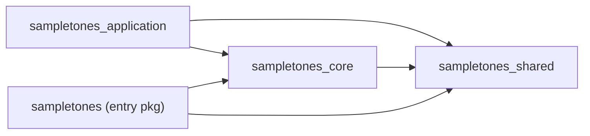
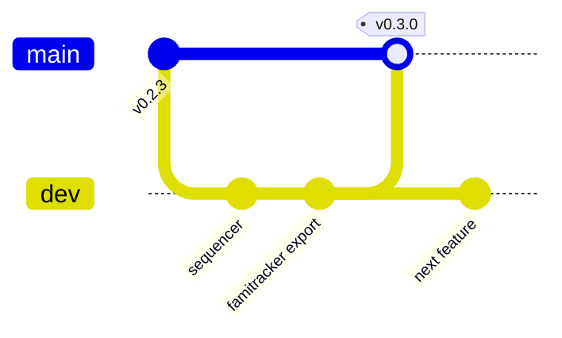

# Releasing SampleToNES

This document is the reference for preparing and shipping a SampleToNES release and
for automating version management. It is prescriptive: it states which version
streams exist, where each one lives, how they collapse to a single source of truth,
how a release build stays production-safe, and how tagging and continuous
integration are wired. Use it as the plan when cutting the `0.3.0` release and every
release after it.

The work is organised into phases so a large change lands in verifiable steps, the
way the maintainer prefers. Each phase names the files it touches and a concrete
verification. Packaging mechanics (PyInstaller, binary layout) live in the sibling
`docs/packaging.md`; data-format compatibility rules live in `docs/compatibility.md`;
both are cross-referenced where the release process depends on them.

---

## Version streams

SampleToNES carries several version numbers that advance on their own schedules. The
application version follows [Semantic Versioning](https://semver.org/) and is what a
user sees. The three data-format versions advance only when a stored file's shape
changes, and each is compared for **exact equality** on load — a loader accepts a
file when its stored version matches the running version, and raises otherwise. The
FamiTracker container versions are fixed by the external format and stay pinned.

| Version | Lives in | A bump means | Consumed by |
| --- | --- | --- | --- |
| **Application** `0.2.4` → `0.3.0` | `pyproject.toml` `[project] version`; `SAMPLETONES_VERSION` in `src/sampletones_shared/constants/application.py` **and** the duplicate `src/sampletones_core/constants/application.py` | A user-facing release: features, fixes, GUI changes. SemVer semantics. | `sampletones_shared.constants.application` (name/version banner, `Metadata.version`), the config-recovery dialog `target_version` (`coordinators/config.py`), the `--version` flag (`src/sampletones/__main__.py`), and the packaged binary name |
| **Library data** `1.1` | Both `constants/application.py` copies (`SAMPLETONES_LIBRARY_DATA_VERSION`) | The `.ins` instruction-library on-disk shape changed. | `Metadata.library_data_version` (`src/sampletones_core/data/metadata.py`); enforced by `src/sampletones_core/library/data.py`, which raises `IncompatibleLibraryDataVersionError` on mismatch |
| **Reconstruction data** `1.1` | Both `constants/application.py` copies (`SAMPLETONES_RECONSTRUCTION_DATA_VERSION`) | The reconstruction on-disk shape changed. | `Metadata.reconstruction_data_version`; enforced by `src/sampletones_core/reconstructions/reconstruction/reconstruction.py`, which raises `IncompatibleReconstructionVersionError` on mismatch |
| **Project data** `1.1` | `src/sampletones_shared/constants/application.py` only (`SAMPLETONES_PROJECT_DATA_VERSION`) | The `.stn` project (`Document.format_version`) shape changed. | `src/sampletones_core/project/document.py`; the document model keeps `extra="ignore"`, so it tolerates older or unknown fields and treats `format_version` as the upgrade hook |
| **FamiTracker module** `0x0440` | `FTM_VERSION` in `src/sampletones_core/famitracker/specification/file.py` | Owned by the external FamiTracker 0.4.6 format. Stays pinned. | `.ftm` writer (`sampletones_core/famitracker/ftm.py`) |
| **FamiTracker instrument** `b"2.4"` | `FTI_VERSION` in the same file | Owned by the external `.fti` format. Stays pinned. | `.fti` writer (`sampletones_core/famitracker/fti.py`) |

The release tooling in this document owns the first four rows. The FamiTracker rows
are the external contract described in `docs/famitracker.md`; a release leaves them
exactly as the target format defines them.

The comparison rule matters for the release checklist: `compare_versions()` (defined
in both constants modules) returns `-1 / 0 / 1`, and both data-version guards accept
only the `0` (exact-match) case. A data-format change is therefore a breaking change
for existing files, and belongs in `docs/compatibility.md` alongside a migration
note whenever one of those three versions advances.

---

## Single source of truth for the application version

### Import-boundary finding

The task's motivating question is whether the duplicated version constants are forced
by the layer rules. They are not.

`scripts/check_import_boundary.py` scopes **every** rule to `APP_ROOT =
src/sampletones_application` (line 22) — its `RULES` govern imports *inside* the GUI
package only (`config/`, `logic/`, `view_model/`, `services/`, `ui/`, `coordinators/`,
`shell.py`). It states nothing about `sampletones_core` or `sampletones_shared`, so it
places no constraint on those two packages importing each other.

The real dependency direction, measured from the source:



`sampletones_core` imports `sampletones_shared` freely (`paths.py`, `project/document.py`,
`data/model.py`, `data/metadata.py`, and more); `sampletones_shared` imports nothing
from `sampletones_core`. **`sampletones_shared` is the foundation layer**, so it is the
natural owner of any constant that both packages read.

The duplication is therefore accidental drift, and the evidence is decisive: the
`sampletones_core/constants/application.py` copy has **exactly one importer left** —
the lazy `__version__` accessor in `src/sampletones/__init__.py` (lines 6 and 32).
Every other consumer, *including code inside `sampletones_core` itself*
(`data/metadata.py`, `reconstructions/.../reconstruction.py`, `library/data.py`,
`project/document.py`), already imports from `sampletones_shared.constants.application`.
The core copy is also already out of sync: it lacks `SAMPLETONES_PROJECT_DATA_VERSION`,
which only the shared copy defines.

**Conclusion:** `sampletones_shared.constants.application` is already the de-facto
single source of truth. Collapsing to it is safe and small.

### Recommendation

Make `pyproject.toml` `[project] version` the canonical application version, and have
the shared constants module derive `SAMPLETONES_VERSION` from installed package
metadata at import time. The data versions stay as explicit `Final[str]` constants in
the same shared module, because they advance independently of the application version
and carry their own meaning.

```python
# src/sampletones_shared/constants/application.py  (target shape)
from importlib.metadata import version
from typing import Final

SAMPLETONES_NAME: Final[str] = "SampleToNES"
SAMPLETONES_PACKAGE_NAME: Final[str] = "sampletones"
SAMPLETONES_VERSION: Final[str] = version(SAMPLETONES_PACKAGE_NAME)
SAMPLETONES_NAME_VERSION: Final[str] = f"{SAMPLETONES_NAME} v{SAMPLETONES_VERSION}"

SAMPLETONES_LIBRARY_DATA_VERSION: Final[str] = "1.1"
SAMPLETONES_RECONSTRUCTION_DATA_VERSION: Final[str] = "1.1"
SAMPLETONES_PROJECT_DATA_VERSION: Final[str] = "1.1"
SAMPLETONES_AUTHOR: Final[str] = "Jakim"
SAMPLETONES_GROUP: Final[str] = "Stage Magician"
```

`importlib.metadata.version` reads the version of the *installed* `sampletones`
distribution, which is exactly what `uv sync` / `uv tool install` records from
`pyproject.toml`. A development checkout reflects the newest number after the next
`uv sync`; that is the standard, honest behaviour of metadata-derived versions.

**Packaging caveat (owned by `docs/packaging.md`).** A PyInstaller `--onefile` binary
carries its own metadata only when the build collects it. The release build therefore
adds `--copy-metadata sampletones` to `scripts/linux/build/build.sh` and the Windows
counterpart, so `version("sampletones")` resolves inside the frozen app. This keeps a
single source across both the `uv`-installed app and the shipped binary.

An alternative worth evaluating later is `hatch-vcs`, which derives the version from
the git tag and removes the literal from `pyproject.toml` entirely. It couples the
build to git state, which suits tag-triggered CI well; it is a Phase-4 option rather
than a prerequisite, and the migration below keeps `pyproject.toml` authoritative so
either path stays open.

### Migration phases

**Phase A — collapse the duplicate (mechanical, no behaviour change).**
1. Repoint `src/sampletones/__init__.py` (both the `TYPE_CHECKING` import and the
   `__getattr__` branch) at `sampletones_shared.constants.application`.
2. Delete `src/sampletones_core/constants/application.py`.
3. *Verify:* `rg "sampletones_core.constants.application"` returns nothing; `make test`
   and `make check-import-boundary` pass. Guidelines allow this cleanup directly —
   internal APIs carry no backward-compatibility obligation.

**Phase B — derive the application version from metadata.**
1. Replace the `SAMPLETONES_VERSION` literal in the shared module with the
   `importlib.metadata.version(...)` derivation shown above.
2. Add `--copy-metadata sampletones` to the build scripts (tracked in
   `docs/packaging.md`).
3. *Verify:* `uv run sampletones --version` prints the `pyproject.toml` value; a built
   binary prints the same; `Metadata.default().version` round-trips through a saved
   `.stn` / `.ins` and matches (per the guidelines' project-metadata contract test).

**Phase C — keep data versions explicit.** The three `*_DATA_VERSION` constants
remain `Final[str]` literals in the shared module. `scripts/release.py` (below) is the
sanctioned way to edit them, so a bump is a deliberate, reviewed act tied to a
`docs/compatibility.md` entry.

---

## Keeping release builds production-safe

`src/sampletones_config/behavior/deployment.yaml` currently reads:

```yaml
log_level: DEBUG
strict_history: true
```

`build.sh` bundles the whole `sampletones_config` tree into the binary via
`--add-data "src/sampletones_config:config"`, and `sampletones_application/paths.py`
resolves `DEPLOYMENT_CONFIG_PATH` to `config/behavior/deployment.yaml` (from
`sys._MEIPASS` when frozen). `DeploymentConfig` (a frozen Pydantic model with every
field required) is loaded at `application.py:140`; the level reaches the logger at
`application.py:360` via `logger.set_level(self.deployment.log_level.to_logging_level())`,
and `strict_history` reaches the history engine at `application.py:181`. So the file's
values ship verbatim to users, and today that means a release would run at `DEBUG`.

### What each setting should be in a release

- **`log_level`** — a release ships at `INFO`. Users benefit from a readable log that
  captures milestones and warnings; `DEBUG` is a development verbosity that floods the
  log with per-frame detail.
- **`strict_history`** — a release ships at `false`. Per the `DeploymentConfig`
  docstring, `strict_history: true` turns an untracked domain mutation into an
  immediate `UntrackedMutationError`, which surfaces completeness gaps at once — a
  fail-fast aid for developers building new mutations. With it `false` the history
  self-heals by recording the mutation as its own entry, which is the forgiving
  behaviour an end user should get. `true` is a development setting; the release
  default is `false`.

The shipped `deployment.yaml` is therefore the production flavour: `INFO` and
`false`. Developers raise verbosity locally through the layered defenses below.

### Three layered defenses

**Defense 1 — the shipped default is production-safe, with a dev override.**
Change the bundled file to the release values and let developers opt into `DEBUG`
through an environment variable, so the same file serves every branch and every build:

```yaml
# src/sampletones_config/behavior/deployment.yaml  (shipped)
log_level: INFO
strict_history: false
```

The loader layers environment overrides on top of the shipped file. Each field's
variable name derives from `SAMPLETONES_ENV_PREFIX` and the field name, so a new field on
`DeploymentConfig` gains an override automatically:

```python
# src/sampletones_application/config/deployment/deployment.py  (shipped)
class DeploymentConfig(BaseModel, frozen=True):
    log_level: LogLevel
    strict_history: bool

    @staticmethod
    def _environment_overrides() -> Dict[str, str]:
        return {
            field: value
            for field in DeploymentConfig.model_fields.keys()
            if (value := os.getenv(f"{SAMPLETONES_ENV_PREFIX}{field.upper()}"))
        }

    @classmethod
    def load(cls, deployment_path: Path) -> DeploymentConfig:
        raw = load_yaml(deployment_path)
        if not isinstance(raw, dict):
            raise TypeError(f"Deployment config {deployment_path} must contain a mapping, got {type(raw)}")

        return cls.model_validate({**raw, **cls._environment_overrides()})
```

`SAMPLETONES_ENV_PREFIX` is `"SAMPLETONES_"`, so the fields resolve to `SAMPLETONES_LOG_LEVEL`
and `SAMPLETONES_STRICT_HISTORY`. A set variable overrides the file value; an unset or empty
variable leaves the file value in place. Merging the raw strings into `model_validate` lets
Pydantic coerce and validate once: `SAMPLETONES_STRICT_HISTORY` accepts Pydantic's boolean
spellings (`1`/`0`, `true`/`false`, `yes`/`no`, `on`/`off`), and an unrecognised level or
boolean raises a `ValidationError` at load.

A developer runs `SAMPLETONES_LOG_LEVEL=DEBUG SAMPLETONES_STRICT_HISTORY=true make run`.
The tracked file, and therefore every build, stays production-safe.

**Defense 2 — a guard that fails the build on an unsafe file.** A small check reads
the shipped `deployment.yaml` and exits non-zero when it holds development values. It
runs in `make release`, in `release.yml`, and as a pre-commit hook.

```python
# scripts/check_deployment_safe.py
import sys
from pathlib import Path
from typing import Final

from sampletones_application.config.deployment.deployment import DeploymentConfig
from sampletones_application.config.deployment.logs import LogLevel

DEPLOYMENT_PATH: Final[Path] = (
    Path(__file__).parent.parent
    / "src"
    / "sampletones_config"
    / "behavior"
    / "deployment.yaml"
)
RELEASE_LOG_LEVELS: Final[frozenset[LogLevel]] = frozenset(
    {LogLevel.INFO, LogLevel.WARNING, LogLevel.ERROR, LogLevel.CRITICAL}
)


def check_deployment(deployment_path: Path) -> list[str]:
    """Report each shipped setting that carries a development-only value.

    A release build ships ``deployment.yaml`` at an ``INFO``-or-quieter level with a
    self-healing history; this returns the problems found so the caller can fail.
    """
    problems: list[str] = []
    deployment = DeploymentConfig.load(deployment_path)
    if deployment.log_level not in RELEASE_LOG_LEVELS:
        problems.append(f"log_level is {deployment.log_level.value}; release ships INFO or quieter")
    if deployment.strict_history:
        problems.append("strict_history is true; release ships false")
    return problems


def main() -> None:
    problems = check_deployment(DEPLOYMENT_PATH)
    if problems:
        print(f"Unsafe deployment.yaml at {DEPLOYMENT_PATH}:", file=sys.stderr)
        for problem in problems:
            print(f"  - {problem}", file=sys.stderr)
        sys.exit(1)


if __name__ == "__main__":
    main()
```

Reading the value through `DeploymentConfig.load` keeps the guard honest: it validates
the same way the app does. Because the guard imports the app package, run it with
`uv run scripts/check_deployment_safe.py`, and give it a `Makefile` target
(`check-deployment`) mirroring `check-import-boundary`.

**Defense 3 — the release checklist.** The final section makes the deployment review a
named step, so the human tagging the release confirms it even if the automation is
bypassed.

---

## Branching model

The maintainer proposed a `main` + `dev` split. That split works; the failure mode to
avoid is encoding the deployment flavour in branch divergence — a long-lived `dev`
with `DEBUG` and a `main` with `INFO` would collide on `deployment.yaml` at **every**
release merge and eventually leak the wrong value across.

**Recommended model — GitFlow-lite with tag-defined releases:**

- **`main`** holds released, tagged commits only. Every commit on `main` is a state
  that has shipped or is about to; `main` is what `release.yml` builds from.
- **`dev`** is the integration branch. Feature branches (`feature/...`, `fix/...`) branch
  from `dev` and merge back through PRs that pass `ci.yml`.
- A **release** is a PR from `dev` into `main`, followed by an annotated tag
  `vX.Y.Z` created by `scripts/release.py`. The tag on `main` is the release event.



**Deployment config across branches stays identical.** Because Defense 1 makes the
tracked `deployment.yaml` the production flavour on *every* branch, `dev` and `main`
carry byte-identical config, and the merge is always clean. Verbosity is a per-session
environment choice, not a branch property. This is the argument for config-layering
over branch divergence: the difference between a developer run and a user run is an
exported variable, so there is nothing to merge and nothing to leak.

Tag format stays `vX.Y.Z`, matching the existing tags `v0.0.1 ... v0.2.3`. `v0.2.4`
appears in `CHANGELOG.md` as an unreleased entry; `0.3.0` supersedes it, and
`release.py` writes the first tag since `v0.2.3`.

---

## Automated version bumping and tagging

### Tool choice

| Option | Fit |
| --- | --- |
| `uv version --bump <part>` | Edits `pyproject.toml` cleanly and is already the repo's package manager. Good primitive for the application version, but unaware of the three data versions and the CHANGELOG. |
| `hatch version` | Reads/writes the hatchling version. Same single-file scope as `uv version`. |
| `commitizen` / `bump-my-version` | Multi-file bumping via config. Powerful, but adds a dependency and config surface to express project-specific rules (independent data streams, exact-equality guards) that a small script states more directly. |
| **Repo-native `scripts/release.py`** | **Recommended.** Owns all four streams with explicit flags, updates the CHANGELOG date, runs the guards, and tags — in the repo's own typed, `pathlib`, `Final`-constant style. It *wraps* `uv version` for the `pyproject.toml` edit. |

A repo-native script wins because the release rules here are project-specific: three
independent data versions, an exact-equality compatibility contract, a deployment-safety
guard, and a CHANGELOG convention. Expressing those in a script keeps the logic
readable and reviewable next to the code it governs.

### `scripts/release.py`

```python
import argparse
import re
import subprocess
import sys
from datetime import date
from pathlib import Path
from typing import Final, Optional

REPO_ROOT: Final[Path] = Path(__file__).parent.parent
CONSTANTS_PATH: Final[Path] = (
    REPO_ROOT / "src" / "sampletones_shared" / "constants" / "application.py"
)
CHANGELOG_PATH: Final[Path] = REPO_ROOT / "CHANGELOG.md"
SEMVER_RE: Final[re.Pattern[str]] = re.compile(r"^\d+\.\d+\.\d+$")
DATA_VERSION_RE: Final[re.Pattern[str]] = re.compile(r"^\d+\.\d+$")


def run_guard(command: list[str], failure: str) -> None:
    """Run a release precondition and stop the release when it fails."""
    result = subprocess.run(command, cwd=REPO_ROOT, check=False)
    if result.returncode != 0:
        sys.exit(f"Release aborted: {failure}")


def assert_clean_tree() -> None:
    result = subprocess.run(
        ["git", "status", "--porcelain"],
        cwd=REPO_ROOT,
        capture_output=True,
        text=True,
        check=True,
    )
    if result.stdout.strip():
        sys.exit("Release aborted: working tree has uncommitted changes")


def bump_application_version(version: str) -> None:
    """Set the canonical application version in pyproject.toml via uv."""
    subprocess.run(["uv", "version", version], cwd=REPO_ROOT, check=True)


def bump_data_version(constant_name: str, version: str) -> None:
    """Rewrite one ``*_DATA_VERSION`` Final constant in the shared module."""
    source = CONSTANTS_PATH.read_text(encoding="utf-8")
    pattern = re.compile(rf'({constant_name}: Final\[str\] = ")[^"]+(")')
    updated, count = pattern.subn(rf"\g<1>{version}\g<2>", source)
    if count != 1:
        sys.exit(f"Release aborted: {constant_name} not found exactly once")
    CONSTANTS_PATH.write_text(updated, encoding="utf-8")


def stamp_changelog(version: str, release_date: date) -> None:
    """Attach today's date to the unreleased ``## vX.Y.Z`` heading."""
    source = CHANGELOG_PATH.read_text(encoding="utf-8")
    heading = f"## v{version}"
    dated = f"{heading} [{release_date.isoformat()}]"
    if dated in source:
        return
    if heading not in source:
        sys.exit(f"Release aborted: CHANGELOG has no '{heading}' section")
    CHANGELOG_PATH.write_text(source.replace(heading, dated, 1), encoding="utf-8")


def create_tag(version: str) -> None:
    """Commit the version edits and create an annotated tag ``vX.Y.Z``."""
    subprocess.run(["git", "add", "-A"], cwd=REPO_ROOT, check=True)
    subprocess.run(
        ["git", "commit", "-m", f"Release: v{version}"], cwd=REPO_ROOT, check=True
    )
    subprocess.run(
        ["git", "tag", "-a", f"v{version}", "-m", f"SampleToNES v{version}"],
        cwd=REPO_ROOT,
        check=True,
    )


def parse_arguments() -> argparse.Namespace:
    parser = argparse.ArgumentParser(description="Bump versions, stamp the changelog, and tag a release.")
    parser.add_argument("version", help="Application version, e.g. 0.3.0")
    parser.add_argument("--library-data", dest="library_data", default=None, help="New library data version")
    parser.add_argument("--reconstruction-data", dest="reconstruction_data", default=None, help="New reconstruction data version")
    parser.add_argument("--project-data", dest="project_data", default=None, help="New project data version")
    parser.add_argument("--skip-tests", action="store_true", help="Trust an already-green CI run")
    return parser.parse_args()


def validate(version: str, data_versions: dict[str, Optional[str]]) -> None:
    if not SEMVER_RE.match(version):
        sys.exit(f"Release aborted: '{version}' is not a X.Y.Z application version")
    for name, value in data_versions.items():
        if value is not None and not DATA_VERSION_RE.match(value):
            sys.exit(f"Release aborted: {name} '{value}' is not an X.Y data version")


def main() -> None:
    args = parse_arguments()
    data_versions = {
        "SAMPLETONES_LIBRARY_DATA_VERSION": args.library_data,
        "SAMPLETONES_RECONSTRUCTION_DATA_VERSION": args.reconstruction_data,
        "SAMPLETONES_PROJECT_DATA_VERSION": args.project_data,
    }
    validate(args.version, data_versions)

    assert_clean_tree()
    run_guard(["uv", "run", "scripts/check_deployment_safe.py"], "deployment.yaml holds development values")
    run_guard(["uv", "run", "scripts/check_import_boundary.py", "--all"], "import-boundary violations")
    if not args.skip_tests:
        run_guard(["make", "test"], "test suite failed")

    bump_application_version(args.version)
    for constant_name, value in data_versions.items():
        if value is not None:
            bump_data_version(constant_name, value)
    stamp_changelog(args.version, date.today())
    create_tag(args.version)
    print(f"Tagged v{args.version}. Push with: git push origin main --follow-tags")


if __name__ == "__main__":
    main()
```

Expose it as a `Makefile` target for parity with the other developer entry points:

```makefile
release:
	uv run scripts/release.py $(VERSION) $(ARGS)
```

so `make release VERSION=0.3.0` bumps the application version only, and
`make release VERSION=0.3.0 ARGS="--project-data 1.2"` also advances the project data
stream. The script stamps the CHANGELOG date and pushes the tag creation to the
maintainer, keeping the network step a deliberate act.

The guards realise the "refuse to run" contract: the release stops when the tree is
dirty, when `deployment.yaml` holds development values, when the import boundary is
violated, or when the tests fail.

---

## Continuous integration

`.github/` currently holds only `copilot-instructions.md`; there is no `workflows/`
directory. Two workflows establish CI, both driven by `uv` to match the local
toolchain (Python `>=3.12`).

### `.github/workflows/ci.yml` — every push and pull request

Runs the same gates a developer runs locally, so `dev` and feature branches stay
mergeable.

```yaml
name: CI
on:
  push:
    branches: [main, dev]
  pull_request:

jobs:
  check:
    runs-on: ubuntu-latest
    strategy:
      matrix:
        python-version: ["3.12"]
    steps:
      - uses: actions/checkout@v4
      - name: Install uv
        uses: astral-sh/setup-uv@v5
      - name: Set up Python
        run: uv python install ${{ matrix.python-version }}
      - name: Sync
        run: uv sync --group dev
      - name: Import boundary
        run: uv run scripts/check_import_boundary.py --all
      - name: Deployment safety
        run: uv run scripts/check_deployment_safe.py
      - name: Lint (pylint + mypy)
        run: make lint
      - name: Tests
        run: make test
```

The matrix names a single Python today (`3.12`, the floor in `pyproject.toml`); it is
the seam where a future `3.13` row slots in. `make lint` already fans out to pylint
and mypy through `scripts/linux/dev/lint.sh`, and `make test` runs the coverage gate
(`fail_under = 80`).

### `.github/workflows/release.yml` — on a `v*` tag

Runs the release guards, builds the binary (mechanics in `docs/packaging.md`), and
attaches the artifact to a GitHub Release.

```yaml
name: Release
on:
  push:
    tags: ["v*"]

jobs:
  build:
    runs-on: ubuntu-latest
    steps:
      - uses: actions/checkout@v4
      - name: Install uv
        uses: astral-sh/setup-uv@v5
      - name: Sync
        run: uv sync --group dev
      - name: Deployment safety
        run: uv run scripts/check_deployment_safe.py
      - name: Version matches tag
        run: |
          TAG="${GITHUB_REF_NAME#v}"
          PKG="$(uv version --short)"
          test "$TAG" = "$PKG" || { echo "tag $TAG != pyproject $PKG"; exit 1; }
      - name: Build binary
        run: make build
      - name: Publish release
        uses: softprops/action-gh-release@v2
        with:
          files: sampletones
          body_path: CHANGELOG.md
```

The **version-matches-tag** step is the guard that the tag and the packaged version
agree, closing the loop on the single-source-of-truth design: a mismatch means the
tag was cut by hand, and the build stops. A Windows build job is added in
parallel once `docs/packaging.md` settles the `.exe` packaging path.

---

## Release checklist for 0.3.0

Run top to bottom. Steps marked *(auto)* are performed by `make release VERSION=0.3.0`;
the rest are human review.

1. **Land all `0.3.0` work on `dev`** and open the release PR `dev` → `main`; confirm
   `ci.yml` is green.
2. **Application version** — confirm the intended number is `0.3.0` and that the
   duplicate constant is already gone (Phase A/B of the single-source migration).
   *(auto: `uv version 0.3.0`.)*
3. **Data versions** — for each of library / reconstruction / project data, decide
   whether the on-disk shape changed this cycle:
   - No change → leave at `1.1`.
   - Changed → pass the matching `--library-data` / `--reconstruction-data` /
     `--project-data` flag, and **add a migration note to `docs/compatibility.md`**,
     because the loaders compare for exact equality and will reject older files.
4. **Deployment safety** — confirm `src/sampletones_config/behavior/deployment.yaml`
   reads `log_level: INFO` and `strict_history: false`. *(auto: the release aborts
   otherwise via `check_deployment_safe.py`.)*
5. **CHANGELOG** — confirm the `## v0.3.0` bullets read well; the current `## v0.2.4`
   heading is unreleased and its content rolls into `0.3.0`. *(auto: the release
   stamps `## v0.3.0 [2026-MM-DD]` with today's date.)*
6. **FamiTracker versions untouched** — confirm `FTM_VERSION` (`0x0440`) and
   `FTI_VERSION` (`b"2.4"`) in `src/sampletones_core/famitracker/specification/file.py`
   are unchanged; they track the external format.
7. **Tag** — `vX.Y.Z`, annotated, on the `main` merge commit. *(auto.)*
8. **Push** — `git push origin main --follow-tags`; the tag triggers `release.yml`,
   which re-runs the guards, verifies tag-equals-version, builds the binary, and
   publishes the GitHub Release.
9. **Smoke-test the artifact** — download the published binary and confirm
   `sampletones --version` prints `SampleToNES v0.3.0`, that a saved `.stn` / `.ins`
   round-trips, and that the log opens at `INFO`.
